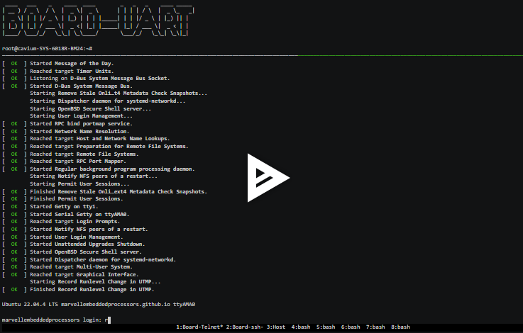
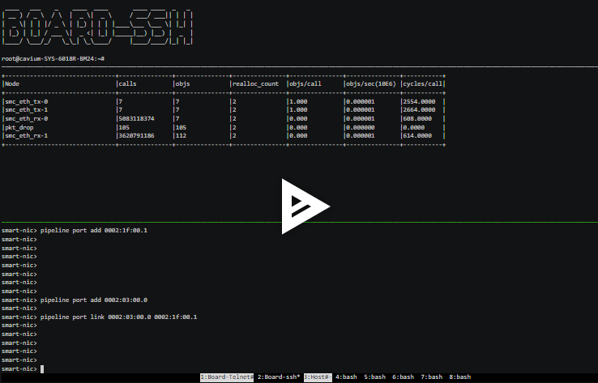

# Data Accelerator Offload(DAO)

Data Accelerator Offload(DAO) provides library interfaces which enable developers
to implement their own application on top of Marvell's OCTEON based data
processing units.
It also comes with applications aimed at supporting accelerated switching and
packet processing.

| Repository             | Ubuntu-22.04                                                                                                                                  | Status                                                                                                                                                                                                                        |
| ---------------------- | --------------------------------------------------------------------------------------------------------------------------------------------- | ----------------------------------------------------------------------------------------------------------------------------------------------------------------------------------------------------------------------------- |
| **_marvell-dao_**      |  | [](https://github.com/MarvellEmbeddedProcessors/dao/actions/workflows/build.yml)      |
| **_marvell-dpdk_**     |             | [](https://github.com/MarvellEmbeddedProcessors/marvell-dpdk-test/actions/workflows/build-cn10k.yml) |
| **_marvell-ovs_**      |              | [](https://github.com/MarvellEmbeddedProcessors/marvell-ovs/actions/workflows/build-cn10k.yml)            |
| **_marvell-vpp_**      |                      | [](https://github.com/MarvellEmbeddedProcessors/vpp/actions/workflows/build.yml)                   |
| **_marvell-oct-ep-target_**      |                      | [](https://github.com/MarvellEmbeddedProcessors/pcie_ep_octeon_target/actions/workflows/build-cn10k.yml)                   |
| **_marvell-nginx_**      |                      | [](https://github.com/MarvellEmbeddedProcessors/dao/actions/workflows/build-nginx.yml)                   |
| **_marvell-packages_** |                                                                                                                                               | [](https://github.com/MarvellEmbeddedProcessors/packages/actions/workflows/push-package.yml)  |

## Programmers Guide

https://marvellembeddedprocessors.github.io/dao/guides/

## API Reference Guide

https://marvellembeddedprocessors.github.io/dao/api/

## Release Management

https://marvellembeddedprocessors.github.io/dao/guides/contributing/release.html

## Quick start Guide

Update ubuntu repository to download dao packages

```sh

curl -fsSL https://www.marvell.com/public/repo/octeon/dao/ubuntu/v2204/dao.gpg | sudo gpg --dearmor -o /etc/apt/keyrings/dao.gpg
curl -SsL -o /etc/apt/sources.list.d/dao.list https://www.marvell.com/public/repo/octeon/dao/ubuntu/v2204/dao.list
sudo chmod 644 /etc/apt/sources.list.d/dao.list
sudo chmod 644 /etc/apt/keyrings/dao.gpg
apt-get update

```

Installing DAO package

```sh

apt-get install dao-cn10k-devel

```

Installation Demo

[](https://marvellembeddedprocessors.github.io/dao/guides/gsg/install.html#installation-demo)

Running First DAO application

[](https://marvellembeddedprocessors.github.io/dao/guides/applications/smart-nic.html#application-running-demo)


## DAO Components Status

| Domain | Component/Solutions | Status | Documentation |
|--------|---------------------|--------|---------------|
| **DPDK** | Ethernet driver |  | [Link](https://doc.dpdk.org/guides/nics/cnxk.html) |
|  | Crypto driver (Symmetric/Asymmetric) |  | [Link](https://doc.dpdk.org/guides/cryptodevs/cnxk.html) |
|  | rte_security - Inline (IPsec/MACsec) |  | [Link](https://doc.dpdk.org/guides/prog_guide/rte_security.html#inline-protocol-offload) |
|  | rte_security - lookaside protocol (IPsec/TLS record) |  | [Link](https://doc.dpdk.org/guides/prog_guide/rte_security.html#lookaside-protocol-offload) |
|  | Eventdev driver |  | [Link](https://doc.dpdk.org/guides/eventdevs/cnxk.html) |
|  | Mempool driver |  | [Link](https://doc.dpdk.org/guides/mempool/cnxk.html) |
|  | DMA driver |  | [Link](https://doc.dpdk.org/guides/dmadevs/cnxk.html) |
|  | GPIO driver |  | [Link](https://doc.dpdk.org/guides/rawdevs/cnxk_gpio.html) |
|  | Baseband driver |  | [Link](https://doc.dpdk.org/guides/rawdevs/cnxk_bphy.html) |
|  | PCIe communication driver |  | [Link](https://doc.dpdk.org/guides/nics/cnxk.html) |
|  | ML device driver |  | [Link](https://doc.dpdk.org/guides/mldevs/cnxk.html) |
|  | Graph and Node library |  | [Link](https://doc.dpdk.org/guides/prog_guide/graph_lib.html) |
| **VPP** | VPP L2-L4 Accelerated Stack with IPSec |  | [Link](https://marvellembeddedprocessors.github.io/dao/guides/applications/vpp.html) |
|  | VPP TCP/UDP Accelerated Socket Library |  | [Link](https://wiki.fd.io/view/VPP/HostStack/VCL) |
|  | VPP TLS Transport plugin |  | [Link](https://s3-docs.fd.io/vpp/24.10/aboutvpp/featurelist.html#tls-openssl) |
|  | VPP QUIC Stack |  | [Link](https://s3-docs.fd.io/vpp/24.10/developer/plugins/quic.html) |
|  | SoNiC with VPP |  | |
|  | Snort with VPP |  | |
| **OVS** | HW accelerated OVS Offload |  | [Link](https://marvellembeddedprocessors.github.io/dao/guides/applications/ovs-offload.html) |
| **VIRTIO Emulation** | VirtIO-Net |  | [Link 1](https://marvellembeddedprocessors.github.io/dao/guides/prog_guide/virtio_net_lib.html) <br> [Link 2](https://marvellembeddedprocessors.github.io/dao/guides/applications/virtio-l2fwd.html) |
|  | VirtIO-Crypto |  | |
|  | VirtIO-Block |  | |
| **OpenSSL** | SSL crypto Acceleration via Engine |  | |
|  | TLS MIM Application |  | |
|  | NGINX Proxy/TLS Proxy |  | [Link 1](https://docs.nginx.com/nginx/admin-guide/web-server/reverse-proxy/) <br> [Link 2](https://marvellembeddedprocessors.github.io/dao/guides/applications/tls-proxy-nginx.html) |
|  | NGINX Load Balancer |  | [Link](http://nginx.org/en/docs/http/load_balancing.html) |
| **AI/ML** | AI/ML Toolkit |  | |
|  | Inferencing application - Resnet50 Image classification |  | |
|  | Inferencing application - DDoS detection |  | |
| **Cloud Solutions** | Cilium CNI |  | |
|  | Calico |  | |
| **Libraries** | Netlink Helper library |  | [Link](https://marvellembeddedprocessors.github.io/dao/guides/prog_guide/netlink_lib.html) |
|  | IPsec |  | [Link](https://marvellembeddedprocessors.github.io/dao/guides/applications/secgw-graph.html#running-as-ipsec-gateway) |
|  | SmartNIC App |  | [Link](https://marvellembeddedprocessors.github.io/dao/guides/applications/smart-nic.html) |
|  | Connection Tracking Library |  | |
|  | Flow library |  | |
|  | Key Extraction Library |  | |
|  | Packet Transformation |  | |
|  | TLS offload |  | |
|  | Protocol Parser Library |  | |
|  | SNORT Integration |  | |
|  | NAT |  | |
|  | Compression App |  | |
