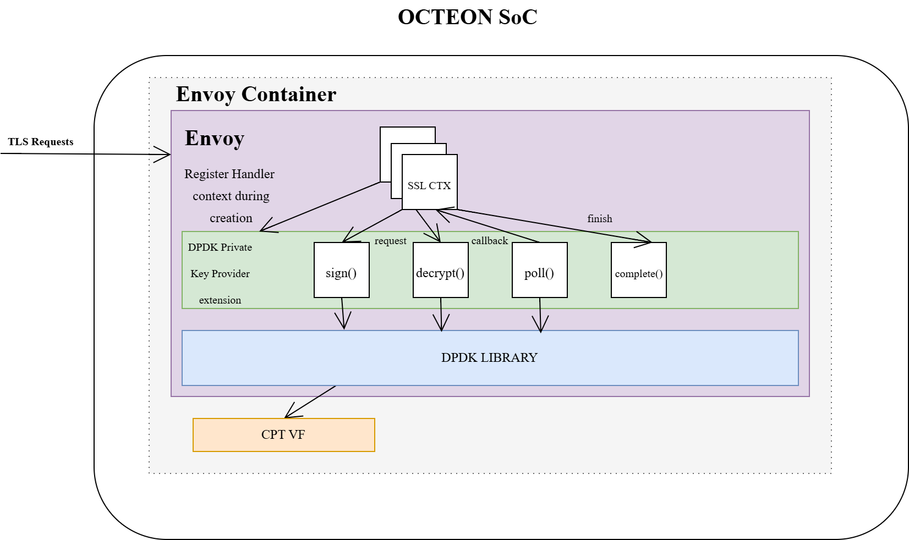

.. SPDX-License-Identifier: Marvell-MIT
	Copyright (c) 2025 Marvell.

=============================
Envoy Acceleration on OCTEON
=============================

Overview
--------

Envoy is a high-performance, open-source edge and service proxy tailored for cloud-native environments, \
especially microservices architectures. It serves as a universal data plane for service meshes like Istio, \
and can also function as an internal load balancer or ingress/egress proxy. Envoy simplifies traffic management, \
load balancing, and observability, making network operations more transparent and troubleshooting more efficient.

Architecture
------------

At its core, Envoy Proxy operates at layers 3 and 4 (L3/L4), using a configurable set of filters \
to manage TCP/UDP traffic. It also supports layer 7 (L7) HTTP filters, which are essential for \
cloud-native applications, including features like TLS termination. Envoy offers advanced load \
balancing capabilities such as circuit breaking, automatic retries, and gRPC routing. Its configuration \
is dynamically manageable via APIs, allowing updates to be pushed in real time without restarting the cluster.

Envoy uses a multi-threaded architecture within a single process. A primary thread oversees \
coordination tasks, while worker threads handle connection processing, filtering, and forwarding. \
When a listener accepts a new connection, a worker thread is assigned to manage it until the connection is closed.

Accelerating Envoy on Marvell OCTEON Platform
----------------------------------------------

Accelerating TLS handshake
---------------------------

Envoy uses BoringSSL as its default TLS library, where TLS handshakes are traditionally handled synchronously \
blocking the worker thread until the handshake completes. While this approach is straightforward, it becomes \
a performance bottleneck when integrating with hardware accelerators like OCTEON CPT, which are designed to \
offload cryptographic operations to dedicated hardware. The key advantage of such accelerators lies in their \
ability to perform encryption and decryption in parallel, allowing Envoy to continue processing other workloads. \
However, synchronous handshakes prevent Envoy from leveraging this parallelism, limiting scalability and efficiency.

Private Key Provider Extension
------------------------------

To address this, Envoy introduces the Private Key Provider extension. This mechanism \
utilizes BoringSSL's private key method hooks, enabling external handlers to perform \
cryptographic operations such as ECDSA signing and RSA signing/decryption. Crucially, \
it supports asynchronous processing, allowing the handshake function to return immediately. \
A polling mechanism monitors the status of the cryptographic task, and once complete, \
a callback is triggered to resume and finalize the handshake. This design decouples cryptographic \
processing from thread execution, enabling non-blocking behavior and unlocking the benefits of hardware acceleration.

DPDK Crypto API Integration
---------------------------

A significant enhancement to this model is the integration of the Private Key Provider \
with DPDK crypto APIs. This integration transforms TLS handshake handling by offloading \
cryptographic workloads to hardware accelerators through DPDK. As a result, Envoy's worker \
threads remain unblocked during handshakes and can continue servicing other requests. This leads to:

* Higher TLS connection throughput
* Improved system responsiveness
* Reduced CPU utilization and power consumption

The DPDK crypto APIs are generic and portable, making them suitable for deployment across \
a wide range of DPDK-supported platforms without requiring platform-specific adaptations.

Benefits
--------

Together, asynchronous handshake processing and DPDK-based hardware acceleration significantly \
enhance Envoy's performance, scalability, and energy efficiency—making it a robust solution \
for modern, high-performance, and cloud-native networking environments.

Deployment
----------

Envoy can be deployed within a Kubernetes environment on a dedicated node that runs on a \
Data Processing Unit (DPU). This setup enables enhanced performance by offloading cryptographic \
operations to specialized crypto hardware (CPT) available on the OCTEON platform, which supports \
DPDK-based crypto acceleration.

   Envoy acceleration architecture on OCTEON platform
