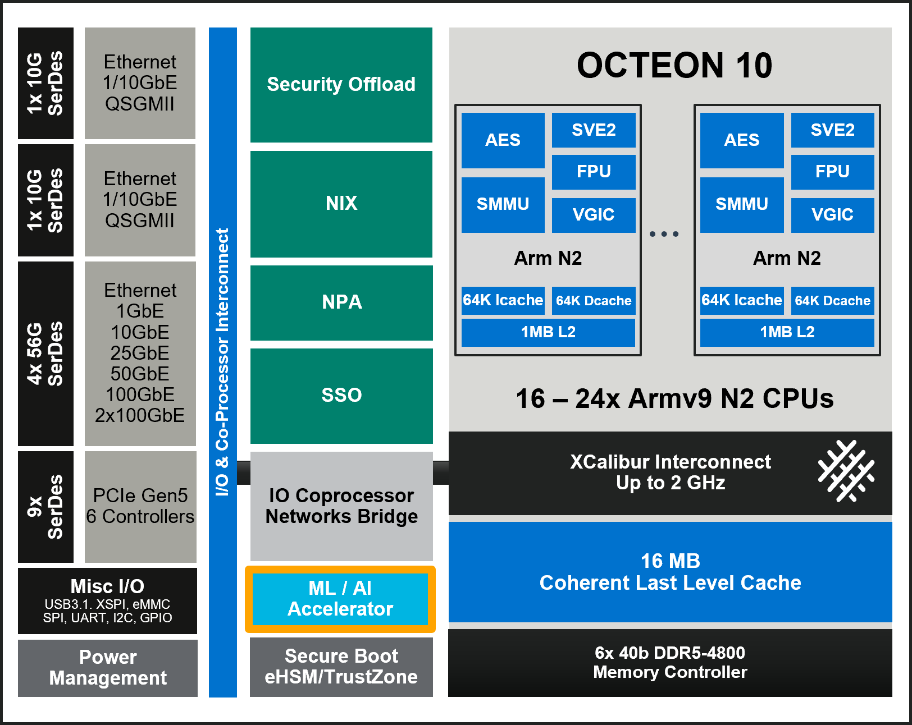

..  SPDX-License-Identifier: Marvell-MIT
    Copyright (c) 2024 Marvell.

****************
Machine Learning
****************

The Data Plane Development Kit (DPDK) is an open-source software project managed by the Linux Foundation. It is designed to offload TCP packet processing from the operating system kernel to user-space processes, thereby enhancing computing efficiency and packet throughput.

The ``dpdk-test-mldev`` tool is a DPDK application designed to test various machine learning (mldev) use cases. As part of the DAO package, it provides a way for users to run inference operations with specific inputs. The current DAO release provides steps for two example models ``Resnet50`` and ``LUCID DDoS`` to enable users to get a hands-on experience on using the Marvell's Machine Learning Accelerator and tools.

.. note::
    For detailed documentation related to dpdk-test-mldev, refer to `documentation <https://doc.dpdk.org/guides/tools/testmldev.html>`_

Introduction
============

The Marvell Machine Learning Inference Processor (MLIP) is a hardware acceleration engine designed to speed up inference workloads. TVM supports MLIP through the mrvl library, allowing models to be compiled for execution on MLIP hardware or simulator.
During compilation, the model is partitioned into MLIP and CPU executable regions (depending on the operators and other factors in the model).

.. note::
    The intention of the compiler will be to run the entire or at least the maximum part of the model on MLIP.

The figure shows the OCTEON 10 architecture, including both the ML / AI Accelerator(MLIP) and Arm Neoverse N2 CPUs. This hardware layout enables efficient hybrid execution, where supported model layers can be offloaded to the MLIP, while other parts of the model run on the CPU.

Setting Up The TVM Compiler Framework
=====================================

This section provides step-by-step instructions to set up the TVM compiler environment with Marvell's MMLC backend support. It covers prerequisites, environment setup, installation of TVM and MMLC binaries, followed by configuration and build procedures. The set up requires TVM version ``0.19.0``.

Prerequisites
-------------

The MMLC binaries are built to work with Ubuntu 20.04 or newer. Additionally, TVM requires ``CMake (>= 3.18)`` and ``LLVM (recommended >= 15)``.

Installing CMake
~~~~~~~~~~~~~~~~

Below are the steps to build and install ``CMake-3.27.8``:

.. code-block:: console

  # Get archives
  wget https://github.com/Kitware/CMake/releases/download/v3.27.8/cmake-3.27.8.tar.gz
  tar -xzf cmake-3.27.8.tar.gz

  # Build
  cd cmake-3.27.8
  ./configure --prefix=${INSTALL_PREFIX_HOST}
  make && make install

Installing LLVM
~~~~~~~~~~~~~~~

Below are the steps to install ``llvm-15``:

.. code-block:: console

    # Add LLVM repo
    apt-get install python3-venv lsb-release software-properties-common
    sh -c 'echo "deb http://apt.llvm.org/$(lsb_release -s -c)/ llvm-toolchain-$(lsb_release -s -c)-15 main" >> /etc/apt/sources.list'

    # Setup gpg key
    wget -qO- https://apt.llvm.org/llvm-snapshot.gpg.key | tee /etc/apt/trusted.gpg.d/apt.llvm.org.asc

    # Install LLVM
    add-apt-repository -y ppa:ubuntu-toolchain-r/test
    apt-get install -y llvm-15-dev

Setting up the Python Environment for TVM
~~~~~~~~~~~~~~~~~~~~~~~~~~~~~~~~~~~~~~~~~

TVM and dependencies requires ``Python >= 3.8``. Recommended version of Python is ``3.10``.

.. code-block:: console

   # Create virtual environment
   python3.8 -m venv tvm-venv
   source tvm-venv/bin/activate

   # Create `requirements.txt` containing list of all python packages with versions.
   cat > requirements.txt << EOF
   attrs==23.2.0
   cloudpickle==2.2.1
   decorator==5.1.1
   ml-dtypes==0.5.1
   numpy==1.25.0
   onnx==1.16.1
   onnxruntime==1.20.0
   graphviz==0.20.1
   protobuf==4.21.12
   psutil==5.9.7
   pybind11==2.11.1
   scipy==1.11.4
   tornado==6.2
   typing_extensions==4.9.0
   EOF

   # Install python package
   python -m pip install --upgrade pip wheel setuptool
   python -m pip install -r requirements.txt

Setting Up The Toolchain
~~~~~~~~~~~~~~~~~~~~~~~~
Install the cross-compilation toolchain.

.. code-block:: console

    #install the toolchain
    apt-get install g++-aarch64-linux-gnu

Build Variables
~~~~~~~~~~~~~~~

The build procedure assumes that the following environment variables are defined:

+---------------------------------+-------------------------------------------------------------------+
|Variable                         | Description                                                       |
+=================================+===================================================================+
|TVM_SOURCE_DIR                   |Path to the cloned TVM sources                                     |
+---------------------------------+-------------------------------------------------------------------+
|ML_TOOLS_DIR                     |Path to the cloned MMLC binaries                                   |
+---------------------------------+-------------------------------------------------------------------+
|INSTALL_PREFIX_HOST              |Path to install sources compiled for x86_64 host machine.          |
+---------------------------------+-------------------------------------------------------------------+

.. note::

   Set `TVM_SOURCE_DIR` and `ML_TOOLS_DIR` after cloning the TVM and MarvellMLTools repositories, as described in Sections 10.2.2 and 10.2.3.

Setup Base Environment
~~~~~~~~~~~~~~~~~~~~~~

To set up the common environment on x86_64 host machine, follow these steps:

.. code-block:: console

    # Add libraries to PATH and LD_LIBRARY_PATH
    export PATH=${INSTALL_PREFIX_HOST}/bin:${PATH}
    export LD_LIBRARY_PATH=${INSTALL_PREFIX_HOST}/lib:${LD_LIBRARY_PATH}

Cloning and Building TVM Sources
--------------------------------

Clone TVM source code and checkout v0.19.0 release tag from TVM's official GitHub repository.

.. code-block:: console

    git clone https://github.com/apache/tvm.git
    cd tvm
    git checkout legacy-v0.19.post
    git submodule update --init --recursive

.. note::
  Ensure that you are using tvm v0.19.0 using ``git describe --tags``.

Configure and Build TVM:

.. code-block:: console

    # Configure TVM
    cmake \
       -S ${TVM_SOURCE_DIR} \
       -B ${TVM_SOURCE_DIR}/build-x86_64 \
       -DCMAKE_INSTALL_PREFIX=${INSTALL_PREFIX_HOST} \
       -DUSE_MRVL=ON \
       -DUSE_LIBBACKTRACE=AUTO \
       -DUSE_LLVM=llvm-config-15 \
       -DSUMMARIZE=ON

    # Build and install
    make -C ${TVM_SOURCE_DIR}/build-x86_64
    make -C ${TVM_SOURCE_DIR}/build-x86_64 install

After building TVM, install the Python bindings to enable scripting and copy the configuration files required for target-specific settings:

.. code-block:: console

    # Install Python module
    cd ${TVM_SOURCE_DIR}/python
    python setup.py install

    # Install TVM configs and set TVM_CONFIGS_JSON_DIR
    mkdir -p ${INSTALL_PREFIX_HOST}/share/tvm
    cp -r ${TVM_SOURCE_DIR}/configs ${INSTALL_PREFIX_HOST}/share/tvm

Setting MMLC Binaries
---------------------

Clone MMLC binaries from the MarvellMLTools GitHub repository:

.. code-block:: console

    git clone "https://github.com/MarvellEmbeddedProcessors/MarvellMLTools"
    export ML_TOOLS_DIR=$(pwd)/MarvellMLTools

    # Copy MMLC binaries to INSTALL_PREFIX_HOST
    mkdir -p ${INSTALL_PREFIX_HOST}/bin
    cp ${ML_TOOLS_DIR}/bin/* ${INSTALL_PREFIX_HOST}/bin/

Model Compilation
=================

Model compilation for inference can be targeted either for simulation or for execution on Octeon 10 hardware. Each execution mode requires a different compilation process.

Model Layers and Operators
--------------------------

Based on the operators supported by the ML hardware accelerator, the compiler partitions the neural network graph into multiple regions. Layers that are supported on MLIP hardware accelerator are executed entirely on it, while the remaining parts of the graph are executed on the Arm Neoverse N2 CPU.

Depending on the composition of layers in a model, a model can be categorized into one of three types:

- MRVL-only: All layers are supported by MLIP and are executed exclusively on the MLIP hardware accelerator.
- LLVM-only: All layers are compiled using the LLVM backend for CPU execution.
- Hybrid: containing both MRVL and LLVM layers

The following table lists the operators currently supported by the MLIP hardware accelerator.

.. list-table::
   :widths: 20 40
   :header-rows: 1

   * - Operator
     - Relay Node
   * - Conv2d
     - nn.conv2d
   * - Gemm/FC/Matmul
     - nn.dense
   * - Maxpool2d
     - nn.max_pool2d
   * - Avgpool2d
     - nn.avg_pool2d
   * - Elementwise sum
     - add
   * - Concat
     - concatenate
   * - Relu
     - nn.relu
   * - Batch_flatten
     - nn.batch_flatten
   * - Reshape
     - reshape
   * - Squeeze
     - squeeze

Compiler Options
----------------

TVM, by default generates the compiled model in TAR format. Alternatively, the model's MRVL regions can be compiled and generated in a binary format. Set the environment variable MRVL_SAVE_MODEL_BIN=1 to enable saving the model in binary format also.
You can then compile the model for MLIP along with LLVM targets using the following tvmc command:

.. code-block:: console

    # Save model binaries for MLIP target
    export MRVL_SAVE_MODEL_BIN=1

.. code-block:: console

    # Compile model for MLIP (Simulator / Hardware) + LLVM (x86_64 / AArch64) target
    export TVM_CONFIGS_JSON_DIR=${INSTALL_PREFIX_HOST}/share/tvm/configs
    python -m tvm.driver.tvmc compile \
       --target=<target> \
       --cross-compiler <cross-compiler> \
       --target-llvm-<options> \
       --target-mrvl-<options> \
       --<tvm-generic-options> \
       model_file.onnx

TVM generic attributes needed to compile the model for MLIP target:

- ``--target=`` : Target architecture for the model compilation. To compile using a hybrid of mlip and llvm architecture, for Hardware + LLVM target, it should be set to ``mrvl, llvm -mtriple=aarch64-linux-gnu -mcpu=neoverse-n2``, whereas in case of simulator + LLVM target it should be set to ``mrvl, llvm``. To compile using only LLVM backend, use ``llvm -mtriple=aarch64-linux-gnu -mcpu=neoverse-n2`` for hardware and ``llvm`` for simulator.
- ``--cross-compiler`` : Compiling the ONNX model for HW mode requires a cross compiler. This option is not required for simulator mode.

MLIP Specific command line options:

- ``--target-mrvl-mattr=`` : Attributes specific to Marvell ML Compiler. This option is used to set different compilation options for marvell backend compiler (MMLC). The supported values for ``--target-mrvl-mattr`` are:

    - ``hw/sim=`` : Target run mode. Supported values are hw, sim. hw is for hardware target and sim is for simulator (x86_64) target. (Default: sim)
    - ``-arch=`` : Target run architecture. Supported values are cn10ka, cnf10kb. (Default: cn10ka)
    - ``-quantize=`` : Quantization mode. Supported value is fp16. (Default: fp16)
    - ``-wb_pin_ocm=`` : Weight Bias pinning to OCM. Supported values are 0, 1. (Default: 1) For large weights and biases, pinning to OCM is not possible. In such cases, set the this option to 0.

- ``--target-mrvl-num_tiles=`` : Number of tiles. Supported values are 1, 2, 4, 8. (Default: 8)

.. note::
   -wb_pin_ocm option in --target-mrvl-mattr is used to pin the weights and biases to OCM. To enable this option, please set the environment variable MRVL_ENABLE_WB_PIN_OCM=1.

FP16 Compilation Flow
---------------------

Non-quantized model files utilize 32-bit floating point (FP32) representations for network parameters, ensuring high numerical precision. In contrast, the FP16 compilation flow performs all computations using 16-bit floating point (FP16) precision. This approach offers significant advantages in both computational speed and memory efficiency, effectively halving resource usage compared to FP32. Moreover, FP16 compilation does not require a separate profiling step, streamlining the deployment process.

The FP16 flow supports two compilation scenarios: MRVL-only FP16 Compilation Flow and Hybrid FP16 Compilation Flow.

In MRVL-only flow, the entire model graph is compiled to run exclusively on the MLIP hardware accelerator. This means all supported layers are offloaded to MRVL (MLIP), and no CPU execution is involved. Similarly, in Hybrid Flow, only MLIP-compatible layers are executed on hardware, while the remaining layers are compiled using LLVM and run on the CPU. During compilation, MLIP-compatible and LLVM-only layers are identified, partitioned, and executed on the appropriate backend.
If the model contains only MLIP-supported layers, it is executed entirely on MLIP; likewise, if only LLVM-supported layers are present, the model is executed fully on the CPU. When compiling LLVM layers for hardware execution, a suitable cross-compiler must be available on the host machine to generate compatible binaries from the host system.

.. code-block::

    export TARGET_TRIPLET=aarch64-linux-gnu

Use ``-quantize=fp16`` option in the ``--target-mrvl-mattr`` during compilation to enable FP16 compilation flow.

Examples:

.. code-block:: console

    # Compile model for cn10ka Hardware + LLVM AArch64 target, with fp16 quantization
    export MRVL_SAVE_MODEL_BIN=1
    export TVM_CONFIGS_JSON_DIR=${INSTALL_PREFIX_HOST}/share/tvm/configs
    export MRVL_ENABLE_WB_PIN_OCM=1
    python -m tvm.driver.tvmc compile \
        --target="mrvl, llvm -mtriple=${TARGET_TRIPLET} -mcpu=neoverse-n2" \
        --cross-compiler="${TARGET_TRIPLET}-gcc" \
        --target-mrvl-mattr='hw -arch=cn10ka -quantize=fp16 -wb_pin_ocm=1' \
        --target-mrvl-num_tiles=4 \
        --output model.tar \
        model.onnx

.. code-block:: console

    # Compile model for cn10ka Simulator + LLVM x86_64 target, with fp16 quantization
    export MRVL_SAVE_MODEL_BIN=1
    export TVM_CONFIGS_JSON_DIR=${INSTALL_PREFIX_HOST}/share/tvm/configs
    export MRVL_ENABLE_WB_PIN_OCM=1
    python -m tvm.driver.tvmc compile \
        --target="mrvl, llvm" \
        --target-mrvl-mattr='sim -arch=cn10ka -quantize=fp16 -wb_pin_ocm=1' \
        --target-mrvl-num_tiles=4 \
        --output model.tar \
        model.onnx

Compilation Flow for CPU Execution
----------------------------------

This compilation flow is used to run the model entirely on the CPU, without using the MLIP hardware acceleration. It uses the LLVM backend and supports both x86 and AArch64 architectures. x86 is used for running simulator-based inferences, while AArch64 is for running inference on the target hardware. When compiling for AArch64, a suitable cross-compiler must be available on the host machine to generate compatible binaries from the host system.

.. code-block::

    export TARGET_TRIPLET=aarch64-linux-gnu

Use ``target= "llvm"`` to enable this compilation flow. Use only LLVM related options during compilation.

Examples :

.. code-block:: console

    # Compile model using Native LLVM AArch64 Compilation Flow for Hardware Execution
    export MRVL_SAVE_MODEL_BIN=1
    export TVM_CONFIGS_JSON_DIR=${INSTALL_PREFIX_HOST}/share/tvm/configs
    export MRVL_ENABLE_WB_PIN_OCM=1
    python -m tvm.driver.tvmc compile \
        --target="llvm -mtriple=${TARGET_TRIPLET} -mcpu=neoverse-n2" \
        --cross-compiler="${TARGET_TRIPLET}" \
        --output model.tar \
        model.onnx

.. code-block:: console

    # Compile model using Native LLVM x86_64 Compilation Flow for Simulator Execution
    export MRVL_SAVE_MODEL_BIN=1
    export TVM_CONFIGS_JSON_DIR=${INSTALL_PREFIX_HOST}/share/tvm/configs
    export MRVL_ENABLE_WB_PIN_OCM=1
    python -m tvm.driver.tvmc compile \
        --target="llvm" \
        --output model.tar \
        model.onnx

The compiler generates the following artifacts:

.. code-block:: console

    ├── bin_tvmgen_mrvl_main_0
    │   └── tvmgen_mrvl_main_0.bin
    ├── model.tar

The `model.tar` file can be used to run inference on Marvell ML hardware associated with Octeon10 or via the MLIP software simulator. If the compiled model is MRVL-only, inference can also be performed using `tvmgen_mrvl_main_0.bin`.

.. note::
    Please DO NOT use the tvmgen_mrvl_main_0.bin for LLVM only and Hybrid models.

Pre-processing and Post-processing Steps
----------------------------------------

The Marvell ML Compiler (MMLC) backend requires ONNX models to have a static shape format. In ONNX, dynamic shapes refer to models that can process input tensors with variable dimensions (e.g., varying batch sizes or sequence lengths). While dynamic shapes offer flexibility during model execution, they are not supported by the MMLC backend, which requires fixed, pre-determined dimensions for all inputs and outputs.

Additionally, running inference with MMLC involves preprocessing input data into .npz and .bin formats. The models as well as the scripts to execute these preprocessing steps are available in the ml-models branch of the MarvellMLTools GitHub repository under the models and utils folders respectively.

.. code-block:: console

    cd ${ML_TOOLS_DIR}
    git checkout ml-models

To convert a dynamic shape model into a static shape model, you can use ``convert_shape_d2s.py`` script, which ensures the model's input and output shapes are explicitly defined, enabling compatibility with the MMLC backend.

.. code-block:: console

    python ${ML_TOOLS_DIR}/utils/convert_shape_d2s.py \
   --input_onnx input_model.onnx \
   --output_onnx model.onnx

Running inference on the MLIP Simulator requires input data in NPZ format. You can use the ``generate_npz.py`` script to convert ONNX model inputs from a JSON file into an NPZ file suitable for inference.

.. code-block:: console

    python ${ML_TOOLS_DIR}/utils/generate_npz.py \
    --model_onnx model.onnx \
    --input_json_file input.json \
    --input_npz_file input.npz

Binary input file can be generated using ``convert.py`` script.

.. code-block:: console

    python ${ML_TOOLS_DIR}/utils/convert.py \
    json2bin \
    --model_onnx model.onnx \
    --io_type "input" \
    --json_file input.json \
    --bin_file input.bin

Running Inference
=================

There are two primary execution modes for running inference on machine learning models using Marvell's platform: Simulator Mode and DPDK ML Test Application Mode.

Simulator Mode
---------------

The ML Software Simulator can run the models in a simulated environment on an x86 host. This allows the user to test and tune a model as it would run on supported hardware without need of a full chip simulation or a target hardware. This mode requires the model to be compiled for the simulator.
``**MRVL_ML_ARCH**`` environment variable can be used to set hardware.

TVMC run command line options:

- ``--inputs`` : Input file in NPZ format.
- ``--outputs`` : Output file in NPZ format.
- ``--number`` : Number of inferences to run.
- ``--print-time`` : Print time taken for each inference.
- ``model.tar`` : Compiled model for MLIP simulator.

Example:

.. code-block:: console

    # Run inference on MLIP simulator for cn10ka target
    MRVL_ML_ARCH="cn10ka" \
    python -m tvm.driver.tvmc run \
        --inputs input.npz \
        --outputs output.npz \
        --number=1 \
        model.tar

DPDK ML Test Application Mode
-----------------------------

DPDK ML Test Application Mode is designed for running inference on actual hardware. Once the model is compiled, it is packaged into a model.tar archive. This archive can then be deployed using the DPDK ML test application, enabling inference on Marvell's hardware platforms.

.. code-block:: console

    # Enable hugepages
    mkdir -p /mnt/huge
    mount -t hugetlbfs -o pagesize=2M nodev /mnt/huge
    echo 4096 > /sys/kernel/mm/hugepages/hugepages-2048kB/nr_hugepages

    # Bind ML device
    dpdk-devbind.py -b vfio-pci 0000:00:10.0

    # Run inferences with dpdk-test-mldev application
    dpdk-test-mldev --lcores=4-23 -a 0000:00:10.0,fw_path=/lib/firmware/mlip-fw.bin -- \
       --test inference_ordered \
       --filelist model.tar,input.bin,output.bin,reference.bin \
       --tolerance 5 \
       --stats \
       --repetitions 1000

For models generated by TVM that have a single MRVL layer and zero LLVM layers, the ``tvmgen_mrvl_main_0.bin`` generated during the compilation stage can also be used to run inferences with DPDK test application.

.. code-block:: console

    # Enable hugepages
    mkdir -p /mnt/huge
    mount -t hugetlbfs -o pagesize=2M nodev /mnt/huge
    echo 4096 > /sys/kernel/mm/hugepages/hugepages-2048kB/nr_hugepages

    # Bind ML device
    dpdk-devbind.py -b vfio-pci 0000:00:10.0

    # Run inferences with dpdk-test-mldev application
    dpdk-test-mldev --lcores=4-23 -a 0000:00:10.0,fw_path=/lib/firmware/mlip-fw.bin -- \
        --test inference_ordered \
        --filelist tvmgen_mrvl_main_0.bin,input.bin,output.bin,reference.bin \
        --tolerance 5 \
        --stats \
        --repetitions 1000

Output Validation
-----------------

The ``compare_json.py`` can be used to compare the output generated by the TVM models with the reference output. The script provides options to check if the outputs match with tolerance levels. The comparison script supports formatted JSON outputs. ``convert.py`` script can be used to convert the output generated in binary format to JSON.

The script supports following options:

- ``test_json_file`` : Output generated by TVM model.
- ``base_json_file`` : Reference output.
- ``quantize`` : Quantization mode. Supported value is fp16. The default value is fp16.
- ``fudge_factor`` : Tolerance level for floating point comparison. The default value is 0.03 (3% tolerance).
- ``print_level`` : Print level, controls the verbosity of dumps from the script. ``diff`` dumps the differences between the real and expected outputs. ``full`` dumps the entire contents of real and expected outputs. ``None`` is a quieter option where no dumps are provided.

Examples:

.. code-block:: console

    # Compare output generated by TVM model with fp16 quantization
    python ${ML_TOOLS_DIR}/utils/compare_json.py \
    --test_json_file output.json \
    --base_json_file golden_output.json \
    --quantize fp16 \
    --fudge_factor 0.03 \
    --print_level diff

Example Models/Usecases
=======================

Resnet50
--------

Introduction
~~~~~~~~~~~~

ResNet50 is a deep learning model used for image classification. It uses residual blocks to improve training efficiency and accuracy. This model is widely used for recognizing and categorizing objects in images. The release includes int8 ( ``resnet50_int8_t08_b01`` ) and fp16 ( ``resnet50_fp16_t08_b01`` ) quantized versions of Resnet50 model, which are optimized for running inference operations.

Preprocessing of Input
~~~~~~~~~~~~~~~~~~~~~~

Involves converting the input image format to a binary format that the model can accept as an input. This is done using the ``image2bin.py`` Python script.

.. code-block:: console

    # Convert input in Image format to binary format
    python image2bin.py \
    --image_file input.jpeg \
    --bin_file output.bin

Model Execution
~~~~~~~~~~~~~~~

The preprocessed binary is given as an input to the model. The model processes the input, runs the inference operation, and generates the output in binary format.

.. code-block:: console

    # Run inferences with dpdk-test-mldev application
    dpdk-test-mldev --lcores=4-23 -a 0000:00:10.0,fw_path=/lib/firmware/mlip-fw.bin -- \
    --test inference_ordered \
    --filelist model.tar,input.bin,output.bin,reference.bin \
    --tolerance 5 \
    --stats \
    --repetitions 1000

Postprocessing of Output
~~~~~~~~~~~~~~~~~~~~~~~~

The binary output generated by the model is converted into a JSON file for easier interpretation and analysis. This is done using the ``bin2json.py`` Python script.

.. code-block:: console

    # Convert output in binary format to JSON format
    python bin2json.py \
    --bin_file output.bin \
    --json_file output.json

LUCID
-----

Introduction
~~~~~~~~~~~~

LUCID (Lightweight, Usable CNN in DDoS Detection) is a deep learning framework designed to detect DDoS attacks. It utilizes Convolutional Neural Networks (CNNs) to effectively distinguish between malicious and benign traffic flows. The release includes int8 ( ``10t-10n-lucid_int8_t08_b01`` ) and fp16 ( ``10t-10n-lucid_fp16_t08_b01`` ) quantized versions of LUCID model, which are optimized for running inference operations.

Training Model
~~~~~~~~~~~~~~

The models were trained on the `CIC-DDoS-2019 dataset <https://www.unb.ca/cic/datasets/ddos-2019.html>`_ and compiled using the TVM compiler with ``INT8`` and ``FP16`` quantization to generate model binaries for the MLIP target architecture, as part of the DAO release. There are two model binaries available for running inference operations.

**Hyperparameters used for training:**

    * **Maximum number of packets/sample (n)**: 10
    * **Time window (t)**: 10 seconds

.. note::
    For further information on training, please refer to the References section below.

Run Script
~~~~~~~~~~

As part of the DAO release, we are providing a ``lucid_run.py`` script to test the models with any pcap dataset. The script processes the pcap file, runs inference using the specified model, and generates the output.

**Command Line Options:**

To run inference using the ``lucid_run.py`` script with a sample dataset, use the following command line options .

.. code-block:: console

    python lucid_run.py [-h, --help]
                        -pl PCAP_FILE, --pcap_file PCAP_FILE
                        -m MODEL, --model MODEL
                        [-y DATASET_TYPE, --dataset_type DATASET_TYPE]

**Descriptions:**

    * ``-h, --help:`` Display this help message and exit.
    * ``-pl PCAP_FILE, --pcap_file PCAP_FILE:`` Perform a prediction on a pcap file. Follow this option with a pcap file path (e.g., /path/to/traffic_dataset.pcap).
    * ``-m MODEL, --model MODEL:`` Specify the model file for prediction. The model should be a trained model in binary format.
    * ``-y DATASET_TYPE, --dataset_type DATASET_TYPE:`` Choose the dataset type. Options are DOS2017, DOS2018, DOS2019, SYN2020. This is used to generate classification statistics (e.g., accuracy, F1 score) by comparing the ground truth labels with LUCID's output.

Confusion Matrix is printed in the following format:

    .. list-table::
        :widths: 10 10
        :header-rows: 1

        * - TP
          - FN
        * - FP
          - TN

**Example Run:**

This example demonstrates how to predict network traffic from the ``CIC-DDoS-2019-DNS.pcap`` file using the ``10t-10n-lucid_fp16_t08_b01.bin`` model:

.. code-block:: console

    python lucid_run.py \
        --predict_live CIC-DDoS-2019-DNS.pcap \
        --model 10t-10n-lucid_fp16_t08_b01.bin

References
----------

[1] LUCID repository on `GitHub <https://github.com/doriguzzi/lucid-ddos>`_

[2] R. Doriguzzi-Corin, S. Millar, S. Scott-Hayward, J. Martínez-del-Rincón, and D. Siracusa, "Lucid: A Practical, Lightweight Deep Learning Solution for DDoS Attack Detection," IEEE Transactions on Network and Service Management, vol. 17, no. 2, pp. 876-889, June 2020. doi: 10.1109/TNSM.2020.2971776. Available: `IEEE Xplore <https://ieeexplore.ieee.org/document/8984222>`_

[3] `CIC-DDoS-2019 dataset <https://www.unb.ca/cic/datasets/ddos-2019.html>`_
