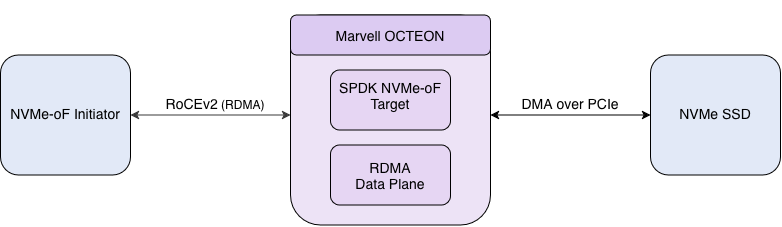
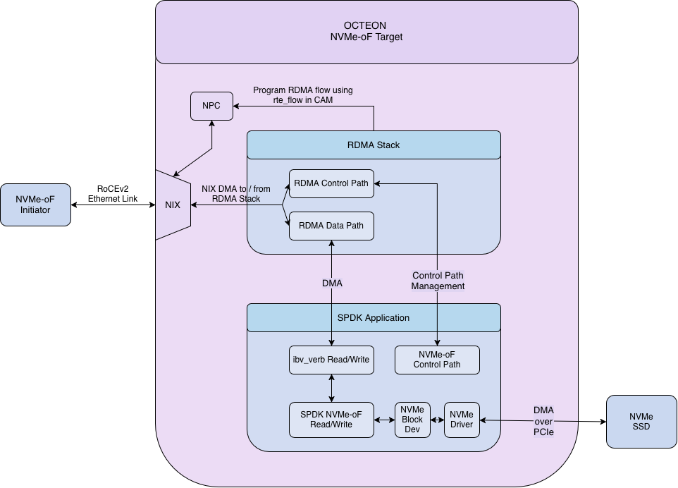

..  SPDX-License-Identifier: Marvell-MIT
    Copyright (c) 2026 Marvell.

********************************
NVMe-oF Storage Target on OCTEON
********************************

Introduction
============

Data centers increasingly disaggregate storage from compute: NVMe SSDs are pooled behind storage
nodes and served to remote machines over the network, rather than sitting inside each server. NVMe
over Fabrics (NVMe-oF) is the protocol that makes this practical.

An NVMe-oF **target** exports NVMe storage namespaces across a network so that a remote NVMe-oF
**initiator** can use them as if they were local NVMe drives. When the fabric is RDMA (RoCEv2), data
moves with zero-copy, low-latency transfers that keep CPU overhead low.

This guide walks you through bringing up an **NVMe-oF storage target on Marvell OCTEON**, end to end.
An SPDK NVMe-oF **target** runs on OCTEON, reached by a remote NVMe-oF **initiator** over a RoCEv2
link: the OCTEON RDMA transport is provided by the DAO ``dao-rdma_graph`` application and the OCTEON
RDMA provider, and the storage protocol is served by SPDK ``nvmf_tgt``.

.. note::
   This guide covers NVMe-oF over the **RDMA (RoCEv2)** transport throughout. NVMe-oF can also run
   over other transports such as TCP, which are outside the scope of this guide.

Solution Components
===================

The following diagram shows the end-to-end topology.

   End-to-end topology: an NVMe-oF initiator connected to an OCTEON target over a RoCEv2 link.

The solution is made of the following components:

* ``dao-rdma_graph`` -- the DPDK-based DAO application that runs the RoCEv2 data plane on OCTEON
  (RPM + DPI resources, worker cores feeding the RDMA graph nodes).
* ``octep-rdma.ko`` -- the OCTEON RDMA kernel module.
* OCTEON userspace RDMA provider -- ``liboctep_rp-rdmav34.so`` (the rdma-core ``octep_rp`` provider),
  plus the ``libibverbs`` / ``librdmacm`` and ``ibv_*`` utilities that let userspace applications see
  the ``octep_rdma_0`` device.
* SPDK ``nvmf_tgt`` -- the stock SPDK NVMe-oF target that terminates the NVMe-oF protocol on OCTEON
  and exports one or more namespaces.
* NVMe-oF initiator -- a standard NVMe-oF/RDMA initiator that drives the target.
  SPDK ships a suite of NVMe example and benchmarking applications (such as ``spdk_nvme_identify`` and
  ``spdk_nvme_perf``) that this guide uses.

Architecture
============

The following diagram shows the components of the OCTEON NVMe-oF target.

   Components of the OCTEON NVMe-oF target: the DAO RDMA data plane feeds the SPDK NVMe-oF target.

The NVMe-oF initiator opens an RDMA connection to the OCTEON target over a RoCEv2 link. On OCTEON,
``dao-rdma_graph`` owns the RoCEv2 data plane and presents an RDMA device (``octep_rdma_0``) to
userspace through the OCTEON RDMA provider. The SPDK ``nvmf_tgt`` binds to that device, listens on an RDMA
port, and serves NVMe commands.

NVMe I/O queues map one-to-one onto RDMA queue pairs. The NVMe-oF initiator submits NVMe commands over
the network using the NVMe-oF protocol, and they are carried to the target over the RoCEv2 transport.
The target executes them against the underlying block device and returns the data and completions over
RDMA to the initiator.

Prerequisites
=============

Hardware
--------

* A Marvell OCTEON CN10K platform with a 100 GbE port for the data path.
* An NVMe-oF initiator system with a RoCEv2-capable RDMA NIC.
* A 100 GbE link between the OCTEON data port and the initiator RDMA NIC.

Software
--------

* Component versions used in this guide: DPDK ``25.11``, DAO ``dao-devel``, SPDK ``v26.01``,
  and the ARM GNU toolchain ``aarch64-none-linux-gnu 14.2`` for cross-compiling the OCTEON RDMA
  data plane (``dao-rdma_graph`` and ``octep-rdma.ko``). SPDK (``nvmf_tgt`` and the initiator tools)
  is built natively.

System configuration
--------------------

* Hugepages mounted on both OCTEON and the NVMe-oF initiator.
* The OCTEON data interface configured with **MTU 9000**.
* CPU isolation on OCTEON (``isolcpus=domain,managed_irq,16-23 nohz_full=16-23 rcu_nocbs=16-23 irqaffinity=0-15``),
  so the RDMA graph (``dao-rdma_graph``) and the target (``nvmf_tgt``) run on dedicated cores.

The exact commands to apply these prerequisites are provided in the Environment Setup section and the
per-step instructions below.

.. note::
   The OCTEON coremasks must lie within the ``isolcpus`` range and must not overlap each other. The RDMA
   graph (``dao-rdma_graph -c``) and the target (``nvmf_tgt -m``) run on separate isolated cores: in
   this guide the target (``nvmf_tgt``) uses ``-m 0x10000`` (core 16) and the graph (``dao-rdma_graph``) uses ``-c 0x3C0000``
   (cores 18--21), all inside the isolated range 16--23.

.. note::
   Throughout this guide, the OCTEON data port uses the example address ``192.168.1.80/24`` and the
   initiator uses ``192.168.1.40/24``; the target subsystem is ``nqn.2016-06.io.spdk:cnode1`` on RDMA port
   ``4420``. Substitute the addresses, device names and file paths for your own environment.

Building the Components
=======================

DAO data plane
--------------

The DAO data plane -- ``dao-rdma_graph`` and the ``octep-rdma.ko`` kernel module compilation instructions
can be found in the :doc:`./rdma` guide:

* Getting Started build guide: https://marvellembeddedprocessors.github.io/dao/guides/gsg/build.html
* :doc:`./rdma` -- environment setup and launch of the RDMA data plane.

Building the OCTEON RDMA provider on OCTEON
-------------------------------------------

The provider produces ``liboctep_rp-rdmav34.so`` together with the ``libibverbs`` / ``librdmacm`` and ``ibv_*`` tools
that the target (``nvmf_tgt``) and the perftest utilities load at run time to see ``octep_rdma_0``.

.. code-block:: bash

   # Native compilation
   apt-get update
   apt-get install -y build-essential cmake ninja-build pkg-config \
     libnl-3-dev libnl-route-3-dev libudev-dev python3-docutils

   git clone https://github.com/MarvellEmbeddedProcessors/marvell-rdma-core -b rdma-core-57.0-devel
   cd marvell-rdma-core
   ./build.sh

Verify the artifacts and note the provider path -- to point the target's ``LD_LIBRARY_PATH`` at it:

.. code-block:: bash

   ls -l build/lib/liboctep_rp-rdmav34.so build/lib/libibverbs.so* \
         build/lib/librdmacm.so* build/bin/ibv_devices
   PROVIDER=$PWD

Building the NVMe-oF SPDK target on OCTEON
------------------------------------------

Build the SPDK NVMe-oF target natively. SPDK uses its own bundled DPDK submodule, and RDMA
support must be enabled explicitly.

.. code-block:: bash

   # Native compilation
   git clone https://github.com/spdk/spdk.git
   cd spdk
   git checkout v26.01
   git submodule update --init
   ./scripts/pkgdep.sh
   ./configure --with-rdma
   make -j"$(nproc)"

Verify:

.. code-block:: bash

   build/bin/nvmf_tgt --version      # SPDK v26.01

Building SPDK initiator tools on NVMe-oF Initiator System
---------------------------------------------------------

Build the same SPDK release natively on the NVMe-oF initiator system
so it links the initiator NIC's inbox RDMA stack.

.. code-block:: bash

   # on the NVMe-oF initiator system
   git clone https://github.com/spdk/spdk.git
   cd spdk
   git checkout v26.01
   git submodule update --init
   ./scripts/pkgdep.sh
   ./configure --with-rdma
   make -j"$(nproc)"

Verify:

.. code-block:: bash

   ls -l build/bin/spdk_nvme_identify build/bin/spdk_nvme_perf

Deploying the artifacts
-----------------------

Copy the data-plane artifacts ``dao-rdma_graph`` and ``octep-rdma.ko`` to OCTEON.

Environment Setup
=================

On OCTEON, bind the RPM/DPI virtual functions to ``vfio-pci`` and mount hugepages as described
in the :doc:`./rdma` guide (the ``dpi-test-setup.sh`` helper performs this). A minimal hugepage mount
is:

.. code-block:: bash

   mkdir -p /dev/huge
   mount -t hugetlbfs nodev /dev/huge
   echo 12 > /sys/kernel/mm/hugepages/hugepages-524288kB/nr_hugepages

Setting up the OCTEON Target
============================

Run the following three components in the same order: the RDMA graph (``dao-rdma_graph``), the SPDK
target (``nvmf_tgt``), and the RPC configuration that sets up NVMe-RDMA on the target.

Step 1 -- launch the RDMA data plane
------------------------------------

Before launching ``dao-rdma_graph``, prepare the RPM PF that carries the RoCEv2 data path
(``0002:03:00.0`` in this example). Confirm you are using the correct RPM PF interface and that it is
reachable from the NVMe-oF initiator with ``ping``, then bind the RPM PF to ``vfio-pci``:

.. code-block:: bash

   # confirm the RPM PF interface is reachable from the initiator, then bind it for dao-rdma_graph
   dpdk-devbind.py -b vfio-pci 0002:03:00.0
   dpdk-devbind.py --status | grep 0002:03:00.0

.. code-block:: bash

   modprobe ib_uverbs
   insmod <build-dir>/octep-rdma.ko
   <build-dir>/dao-rdma_graph -c 0x3C0000 \
     -a 0000:06:00.2 -a 0000:06:00.3 -a 0000:06:00.4 -a 0000:06:00.5 \
     -a 0000:06:00.6 -a 0000:06:00.7 -a 0000:06:01.0 -a 0000:06:01.1 \
     -a 0000:06:01.2 -a 0000:06:01.3 -a 0000:06:01.4 -a 0000:06:01.5 \
     -a 0000:06:01.6 -a 0000:06:01.7 -a 0002:03:00.0 \
     --file-prefix=ep -- -p 0x1 --max-pkt-len=9600 -P -n 1 -r 0x1 \
     --num-mbufs 524288 --enable-termination

The device (PCIe) addresses and the coremask (``-c 0x3C0000`` = cores 18--21) are examples; use the
values for your platform. A healthy start prints:

.. code-block:: console

   Port 0 Link up at 100 Gbps
   Port 0 is RDMA_PORT_ST_UP
   QP 1023 configured as management QP

Leave the graph (``dao-rdma_graph``) running.

.. note::
   For details on inserting ``octep-rdma.ko`` and running ``dao-rdma_graph``, refer to the
   :doc:`./rdma` guide; the only difference in this setup is that ``dao-rdma_graph`` is launched with
   the ``--enable-termination`` flag.

Step 2 -- configure the data interface and start the target
-----------------------------------------------------------

.. note::
   Before assigning the IP address, run ``dmesg -w`` and confirm that the expected data interface
   (for example ``enp6s0v22``) has been detected. After assigning the address, verify that the
   interface is reachable from the NVMe-oF initiator with ``ping``.

.. code-block:: bash

   ifconfig enp6s0v22 192.168.1.80/24 up
   ip link set enp6s0v22 mtu 9000

   export LD_LIBRARY_PATH=$PROVIDER/build/lib:$PROVIDER/build/libibverbs:$LD_LIBRARY_PATH
   <build-dir>/spdk/build/bin/nvmf_tgt -m 0x10000 -r /var/tmp/spdk.sock

A healthy start prints:

.. code-block:: console

   Reactor started on core 16

Leave the target (``nvmf_tgt``) running.

.. note::
   Ensure the OCTEON RDMA firmware is fully up (Step 1) before starting ``nvmf_tgt``, and export the
   provider ``LD_LIBRARY_PATH`` in the same shell that launches it -- otherwise ``nvmf_tgt`` cannot
   see ``octep_rdma_0``.

Step 3 -- configure the target over RPC
---------------------------------------

Create the RDMA transport, an underlying block device, a subsystem with one namespace, and an RDMA
listener:

.. code-block:: bash

   RPC=<build-dir>/spdk/scripts/rpc.py

   $RPC nvmf_create_transport -t rdma --num-shared-buffers 1024 --io-unit-size 65536 \
     --max-queue-depth 16 --max-io-size 131072 --in-capsule-data-size 4096 \
     --max-io-qpairs-per-ctrlr 128 --num-cqe 32767 --no-srq

   $RPC bdev_null_create Null0 262144 4096

   $RPC nvmf_create_subsystem nqn.2016-06.io.spdk:cnode1 -a \
     -s SPDK00000000000001 -d SPDK_Controller1
   $RPC nvmf_subsystem_add_ns nqn.2016-06.io.spdk:cnode1 Null0
   $RPC nvmf_subsystem_add_listener nqn.2016-06.io.spdk:cnode1 \
     -t rdma -a 192.168.1.80 -s 4420

   $RPC nvmf_get_transports
   $RPC nvmf_get_subsystems

Once the transport and listener are created, the ``nvmf_tgt`` output prints:

.. code-block:: console

   Create IB device octep_rdma_0 ... succeed
   NVMe/RDMA Target Listening on 192.168.1.80 port 4420

.. note::
   ``Null0`` is an in-memory block device that is ideal for measuring NVMe-oF protocol performance
   without the overhead of actual disk access. To back the namespace with real storage, create a
   different block device (for example an NVMe block device or a ``malloc``) and add it with
   ``nvmf_subsystem_add_ns``.

Setting up the NVMe-oF Initiator
================================

Confirm the NVMe-oF initiator RDMA device and its RoCEv2 GID index, then bring up the data interface:

.. code-block:: bash

   ibv_devices
   ibv_devinfo -v            # note the device name and the RoCEv2 (v2) gid-index
   ifconfig enp4s0f0np0 192.168.1.40/24 up
   ip link set enp4s0f0np0 mtu 9000

Functional Testing
==================

Connectivity is confirmed when ``spdk_nvme_identify`` returns the controller and namespace.

.. code-block:: bash

   <build-dir>/spdk/build/bin/spdk_nvme_identify \
     -r "trtype:RDMA adrfam:IPv4 traddr:192.168.1.80 trsvcid:4420 subnqn:nqn.2016-06.io.spdk:cnode1"

A successful run prints the controller identify data (controller model, namespace size, NQN).

Performance Testing
===================

``spdk_nvme_perf`` drives the target directly from the NVMe-oF initiator. Its main options are:

* ``-q`` -- queue depth
* ``-o`` -- payload size in bytes (``4096`` = 4 KB, ``65536`` = 64 KB)
* ``-w`` -- workload (``read``, ``write``, ``randread``, ``randwrite``)
* ``-t`` -- test duration in seconds
* ``-c`` -- core mask
* ``-P`` -- number of RDMA queue pairs per controller

Baseline (single core, single queue pair)
------------------------------------------

.. code-block:: bash

   R='trtype:RDMA adrfam:IPv4 traddr:192.168.1.80 trsvcid:4420 subnqn:nqn.2016-06.io.spdk:cnode1'

   # single baseline run: 4 KB read, queue depth 16, one core, one queue pair
   <build-dir>/spdk/build/bin/spdk_nvme_perf -r "$R" -q 16 -o 4096 -w read -t 10 -c 0x1 -P 1

Multi-core, multi-queue-pair testing
------------------------------------

Throughput scales by adding cores (``-c``) and queue pairs (``-P``) together:

.. code-block:: bash

   R='trtype:RDMA adrfam:IPv4 traddr:192.168.1.80 trsvcid:4420 subnqn:nqn.2016-06.io.spdk:cnode1'
   for cP in "0x1 1" "0x3 2" "0x7 3" "0xF 4"; do set -- $cP; c=$1; P=$2;
     echo "===== 64K READ cores=$c qpairs=$P q=16 =====";
     <build-dir>/spdk/build/bin/spdk_nvme_perf -r "$R" -q 16 -o 65536 -w read -t 10 -c $c -P $P;
   done

``spdk_nvme_perf`` reports IOPS, bandwidth (MiB/s) and average/percentile latency.

Limitations
===========

Shared Receive Queue (SRQ) not supported
----------------------------------------

The ``octep-rdma`` driver rejects SRQ-based QP creation; Shared Receive Queues are
not supported on the OCTEON RDMA firmware.

**Fix:** Pass ``--no-srq`` to ``nvmf_create_transport``.

**Impact:** SRQ-enabled transport setup can fail, or the initiator may fail to connect.

.. code-block:: bash

   $RPC nvmf_create_transport -t rdma ... --no-srq

Maximum NVMe queue depth of 16
------------------------------

``--max-queue-depth`` on the RDMA transport is supported **up to 16** only.

**Fix:** Set ``--max-queue-depth 16`` (or lower) and align the initiator queue depth.

**Impact:** Values above 16 may cause transport creation to fail or lead to unstable I/O.

.. code-block:: bash

   $RPC nvmf_create_transport -t rdma ... --max-queue-depth 16 --no-srq
   <build-dir>/spdk/build/bin/spdk_nvme_perf -r "$R" -q 16 -P 1 -o 65536 -w read -t 10 -c 0x1

Completion queue resize (``cv_resize_q``) not supported
-------------------------------------------------------

The OCTEON RDMA firmware does not implement ``cv_resize_q`` (dynamic CQ resize); CQ
depth is fixed at transport creation.

**Fix:** Provision the full CQ capacity at transport creation. The validated OCTEON configuration
uses ``--num-cqe 32767`` because CQ resources cannot be resized after connection.

**Impact:** Under-provisioned CQ depth cannot be increased at run time; I/O may fail or stall under
higher queue depth or multi-queue workloads.

Troubleshooting
===============

Work through these checks in order: **environment setup → dao-rdma_graph → nvmf_tgt → RPC → initiator**.

Bring-up order
--------------

* Set kernel boot params (``isolcpus``, ``nohz_full``, ``rcu_nocbs``, ``irqaffinity``) and bind
  DPI/RPM VFs to ``vfio-pci`` **before** starting the graph (``dao-rdma_graph``).
* Start in order: ``dao-rdma_graph`` → ``nvmf_tgt`` → RPC config. Do not overlap the ``dao-rdma_graph``
  and ``nvmf_tgt`` coremasks.

``dao-rdma_graph`` fails or port down
-------------------------------------

* Confirm PCIe BDFs with ``lspci`` / ``dpdk-devbind.py --status``.
* Include ``--enable-termination`` (required for OCTEON NVMe-oF target).
* Check log for ``Port 0 Link up at 100 Gbps`` and ``QP 1023 configured as management QP``.

``octep_rdma_0`` not found
--------------------------

* Load modules: ``modprobe ib_uverbs`` and ``insmod <build-dir>/octep-rdma.ko``.
* Export the provider path in the **same shell** as ``nvmf_tgt``, then confirm the device is visible:

  .. code-block:: bash

     export LD_LIBRARY_PATH=<provider-dir>/build/lib:<provider-dir>/build/libibverbs:$LD_LIBRARY_PATH
     ibv_devices

``nvmf_tgt`` / RPC fails
------------------------

* Keep ``nvmf_tgt`` running; confirm ``/var/tmp/spdk.sock`` exists.
* Create resources in order: transport → block device → subsystem → namespace → listener.
* Verify with ``nvmf_get_subsystems`` (listener must match OCTEON IP, e.g. ``192.168.1.80:4420``).

Initiator cannot connect
------------------------

* Set the initiator IP on the same subnet as the OCTEON target.
* Prefer **MTU 9000** on both OCTEON and initiator data interfaces. If connectivity fails due to a setup
  issue (switch/NIC not configured for jumbo frames), fall back to the default **MTU 1500** on both
  ends and retest.
* Run ``ping <octeon-ip>`` before ``spdk_nvme_identify``.
* Match ``traddr``, ``trsvcid``, and ``subnqn`` to the target listener.

See also :doc:`./rdma` for general RDMA/GID/VF binding issues.
