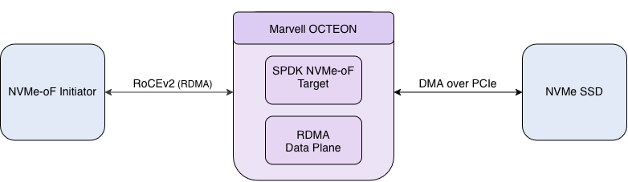
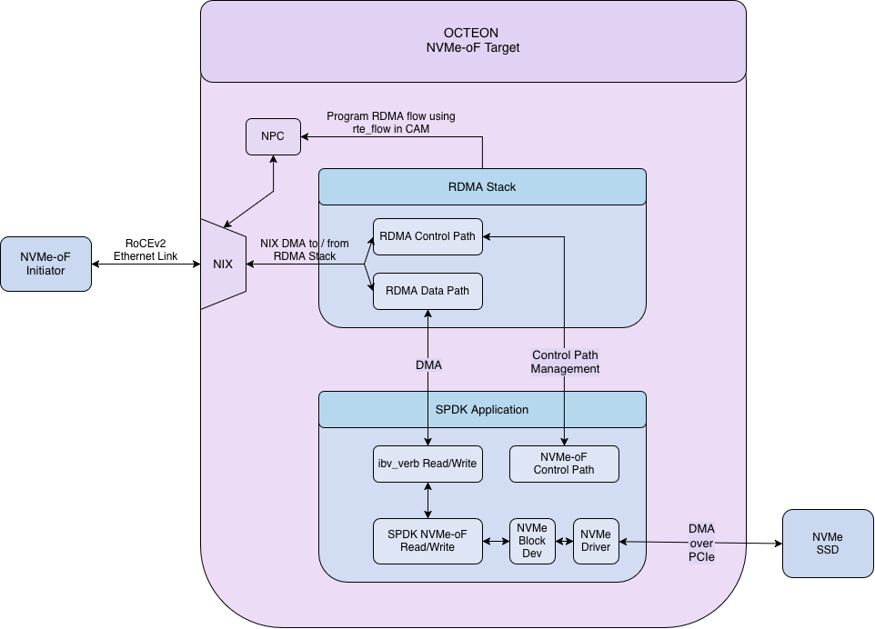

..  SPDX-License-Identifier: Marvell-MIT
    Copyright (c) 2026 Marvell.

********************************
NVMe-oF Storage Target on OCTEON
********************************

Introduction
============

Storage is increasingly disaggregated from compute: NVMe SSDs are pooled behind storage
nodes and served to remote machines over the network, rather than sitting inside each server. NVMe
over Fabrics (NVMe-oF) is the protocol that makes this practical.

An NVMe-oF **target** exports NVMe storage namespaces across a network so that a remote NVMe-oF
**initiator** can use them as if they were local NVMe drives. When the fabric is RDMA (RoCEv2), data
moves with zero-copy, low-latency transfers that keep CPU overhead low.

This guide walks you through bringing up an **NVMe-oF storage target on Marvell OCTEON**, end to end.
An SPDK NVMe-oF **target** runs on OCTEON, reached by a remote NVMe-oF **initiator** over a RoCEv2
link: the OCTEON RDMA transport is provided by the DAO ``dao-rdma_graph`` application and the OCTEON
RDMA provider, and the storage protocol is served by SPDK ``nvmf_tgt``.

.. note::
   This guide covers NVMe-oF over the **RDMA (RoCEv2)** transport throughout. NVMe-oF can also run
   over other transports such as TCP, which are outside the scope of this guide.

Solution Components
===================

The following diagram shows the end-to-end topology.

   End-to-end topology: an NVMe-oF initiator connected to an OCTEON target over a RoCEv2 link.

The solution is made of the following components:

* ``dao-rdma_graph`` -- the DPDK-based DAO application that runs the RoCEv2 data plane on OCTEON
  (RPM + DPI resources, worker cores feeding the RDMA graph nodes).
* ``octep-rdma.ko`` -- the OCTEON RDMA kernel module.
* OCTEON userspace RDMA provider -- ``liboctep_rp-rdmav34.so`` (the rdma-core ``octep_rp`` provider),
  plus the ``libibverbs`` / ``librdmacm`` and ``ibv_*`` utilities that let userspace applications see
  the ``octep_rdma_0`` device.
* SPDK ``nvmf_tgt`` -- the stock SPDK NVMe-oF target that terminates the NVMe-oF protocol on OCTEON
  and exports one or more namespaces.
* NVMe-oF initiator -- a standard NVMe-oF/RDMA initiator that drives the target.
  SPDK ships a suite of NVMe example and benchmarking applications (such as ``spdk_nvme_identify`` and
  ``spdk_nvme_perf``) that this guide uses.

Architecture
============

The following diagram shows the components of the OCTEON NVMe-oF target.

   Components of the OCTEON NVMe-oF target: the DAO RDMA data plane feeds the SPDK NVMe-oF target.

The NVMe-oF initiator opens an RDMA connection to the OCTEON target over a RoCEv2 link. On OCTEON,
``dao-rdma_graph`` owns the RoCEv2 data plane and presents an RDMA device (``octep_rdma_0``) to
userspace through the OCTEON RDMA provider. The SPDK ``nvmf_tgt`` binds to that device, listens on an RDMA
port, and serves NVMe commands.

NVMe I/O queues map one-to-one onto RDMA queue pairs. The NVMe-oF initiator submits NVMe commands over
the network using the NVMe-oF protocol, and they are carried to the target over the RoCEv2 transport.
The target executes them against the underlying block device and returns the data and completions over
RDMA to the initiator.

Prerequisites
=============

Hardware
--------

* A Marvell OCTEON CN10K platform with a 100 GbE port for the data path.
* An NVMe-oF initiator system with a RoCEv2-capable RDMA NIC.
* A 100 GbE link between the OCTEON data port and the initiator RDMA NIC.

Software
--------

* Component versions used in this guide: DPDK ``25.11``, DAO ``nvmeof-dao-release``, SPDK ``v26.01``,
  marvell-rdma-core ``nvmeof-rdma-core-release``, and the ARM GNU toolchain ``aarch64-none-linux-gnu 14.2``
  for cross-compiling the OCTEON RDMA data plane (``dao-rdma_graph`` and ``octep-rdma.ko``).
  SPDK (``nvmf_tgt`` and the initiator tools) is built natively.

.. note::
   The ``dao`` sources are maintained on the ``nvmeof-dao-release`` branch and the
   ``marvell-rdma-core`` sources on the ``nvmeof-rdma-core-release`` branch.
   Please build with sources from these release branches.

.. note::
   This guide assumes the OCTEON already boots the **Marvell Linux 6.6** kernel (6.6.46) with Ubuntu 24.04.
   See :doc:`../gsg/kernel` for building and deploying the OCTEON kernel (use the linux-6.6.x-release branch).

System configuration
--------------------

* Hugepages mounted on both OCTEON and the NVMe-oF initiator.
* The OCTEON data interface configured with **MTU 9000**.
* CPU isolation on OCTEON (``isolcpus=domain,managed_irq,16-23 nohz_full=16-23 rcu_nocbs=16-23 irqaffinity=0-15``),
  so the RDMA graph (``dao-rdma_graph``) and the target (``nvmf_tgt``) run on dedicated cores.

The exact commands to apply these prerequisites are provided in the Environment Setup section and the
per-step instructions below.

.. note::
   * The OCTEON coremasks must lie within the ``isolcpus`` range and must not overlap each other.
   * The RDMA graph (``dao-rdma_graph -c``) and the target (``nvmf_tgt -m``) run on separate
     isolated cores: in this guide the target (``nvmf_tgt``) uses ``-m 0x10000`` (core 16) and
     the graph (``dao-rdma_graph``) uses ``-c 0x3C0000`` (cores 18--21), all inside the isolated
     range 16--23.

.. note::
   * Throughout this guide, the OCTEON data port uses the example address ``192.168.1.80/24`` and
     the initiator uses ``192.168.1.40/24``.
   * The target subsystem is ``nqn.2016-06.io.spdk:cnode1`` on RDMA port ``4420``.
   * Three per-machine directory placeholders are used:

     * ``<dao>`` is the DAO source tree on the x86 **build host** (after ``ninja -C build`` the
       artifacts are under ``<dao>/build/`` and ``<dao>/subprojects/rdma-core/build/``).
     * ``<octeon-dir>`` is the directory on the **OCTEON target** that holds the deployed
       ``dao-rdma_graph``, ``octep-rdma.ko``, the RDMA-core provider (``rdma-core/``) and the
       natively-built SPDK (``spdk/``).
     * ``<initiator-dir>`` is the directory on the **NVMe-oF initiator** that holds the
       natively-built SPDK (``spdk/``).

   * Substitute the addresses, device names and file paths for your own environment.

Building the Components
=======================

DAO data plane
--------------

Build ``dao-rdma_graph`` and the ``octep-rdma.ko`` kernel module by cross-compiling on an x86 host,
then copy both artifacts to the OCTEON (see *Deploying the artifacts* below):

* :doc:`./rdma` -- **Octeon RDMA Termination Mode -> Steps to Compile DAO** builds,
  in a single step::

     Firmware:      dao-rdma_graph
     Kernel module: octep-rdma.ko
     rdma-core:     libibverbs, librdmacm, provider

  :doc:`./rdma` checks out DAO from ``dao-devel``; for this guide, check out the
  validated ``nvmeof-dao-release`` branch instead.

* :doc:`../gsg/build` -- the general DAO/DPDK cross-compilation, toolchain and meson-option
  reference that the recipe above builds on.

.. note::
   * Use the :doc:`./rdma` guide for **building** the data plane.
   * The runtime bring-up (hugepages, DPI/RPM VFs, and launching the graph with
     ``--enable-termination``) is covered by *Environment Setup* and *Setting up the OCTEON Target*
     below, which reference :doc:`./rdma`'s **Octeon RDMA Termination Mode** for the DPI/RPM VF
     details.
   * :doc:`./rdma` uses different sample addresses (for example ``30.0.0.x``) whereas this guide
     uses ``192.168.1.80``/ ``192.168.1.40`` -- keep one addressing scheme consistent across both
     guides.

Building the NVMe-oF SPDK target on OCTEON
------------------------------------------

Build the SPDK NVMe-oF target natively. SPDK uses its own bundled DPDK submodule, and RDMA
support must be enabled explicitly.

.. code-block:: bash

   # Native compilation on the OCTEON
   cd <octeon-dir>
   git clone https://github.com/spdk/spdk.git
   cd spdk
   git checkout v26.01
   git submodule update --init
   ./scripts/pkgdep.sh
   ./configure --with-rdma
   make -j"$(nproc)"

Verify:

.. code-block:: bash

   build/bin/nvmf_tgt --version      # SPDK v26.01

Building SPDK initiator tools on NVMe-oF Initiator System
---------------------------------------------------------

Build the same SPDK release natively on the NVMe-oF initiator system
so it links the initiator NIC's inbox RDMA stack.

.. code-block:: bash

   # on the NVMe-oF initiator system
   cd <initiator-dir>
   git clone https://github.com/spdk/spdk.git
   cd spdk
   git checkout v26.01
   git submodule update --init
   ./scripts/pkgdep.sh
   ./configure --with-rdma
   make -j"$(nproc)"

Verify:

.. code-block:: bash

   ls -l build/bin/spdk_nvme_identify build/bin/spdk_nvme_perf

Deploying the artifacts
-----------------------

On the x86 build host, the ``ninja -C build`` step (see :doc:`./rdma`) produces, under ``<dao>``::

   Firmware:      build/app/dao-rdma_graph
   Kernel module: build/kmod/rdma/octep_rdma/octep-rdma.ko
   rdma-core:     subprojects/rdma-core/build/{lib,bin} (libibverbs, librdmacm, provider, ibv_* tools)

Copy the firmware and kernel module to ``<octeon-dir>`` and the RDMA-core provider to
``<octeon-dir>/rdma-core`` on the OCTEON. Use ``rsync -a`` for the provider so the ``.so`` symlinks
are preserved:

.. code-block:: bash

   # on the x86 build host, from <dao>:
   scp   build/app/dao-rdma_graph                 <octeon>:<octeon-dir>/
   scp   build/kmod/rdma/octep_rdma/octep-rdma.ko <octeon>:<octeon-dir>/
   rsync -a subprojects/rdma-core/build/lib \
            subprojects/rdma-core/build/bin       <octeon>:<octeon-dir>/rdma-core/

Verify the provider on the OCTEON and export the provider path -- the target's ``LD_LIBRARY_PATH``
points at it:

.. code-block:: bash

   ls -l <octeon-dir>/rdma-core/lib/liboctep_rp-rdmav34.so \
         <octeon-dir>/rdma-core/lib/libibverbs.so* \
         <octeon-dir>/rdma-core/lib/librdmacm.so*
   export PROVIDER=<octeon-dir>/rdma-core

Environment Setup
=================

On OCTEON, perform the following as described in the :doc:`./rdma` guide:

* Configure Hugepages and VFIO
* Configure DPI and Bind VFs
* Create and Bind RPM VFs

Setting up the OCTEON Target
============================

Run the following three components in the same order: the RDMA graph (``dao-rdma_graph``), the SPDK
target (``nvmf_tgt``), and the RPC configuration that sets up NVMe-RDMA on the target.

Step 1 -- launch the RDMA data plane
------------------------------------

The DPI and RPM VFs were created and bound to ``vfio-pci`` in *Environment Setup* (per the
:doc:`./rdma` guide). Confirm the graph's data-port VF (``0002:03:00.1`` in this example) is bound, then load
the module and launch the graph:

.. code-block:: bash

   dpdk-devbind.py --status | grep 0002:03:00.1

.. code-block:: bash

   # Load RDMA Kernel Modules
   modprobe ib_uverbs
   insmod <octeon-dir>/octep-rdma.ko
   <octeon-dir>/dao-rdma_graph -c 0x3C0000 \
     -a 0000:06:00.2 -a 0000:06:00.3 -a 0000:06:00.4 -a 0000:06:00.5 \
     -a 0000:06:00.6 -a 0000:06:00.7 -a 0000:06:01.0 -a 0000:06:01.1 \
     -a 0000:06:01.2 -a 0000:06:01.3 -a 0000:06:01.4 -a 0000:06:01.5 \
     -a 0000:06:01.6 -a 0000:06:01.7 -a 0002:03:00.1 \
     --file-prefix=ep -- -p 0x1 --max-pkt-len=9600 -P -n 1 -r 0x1 \
     --num-mbufs 524288 --enable-termination

The device (PCIe) addresses and the coremask (``-c 0x3C0000`` = cores 18--21) are examples, use the
correct values for your platform. A healthy start prints:

.. code-block:: console

   Port 0 Link up at 100 Gbps
   Port 0 is RDMA_PORT_ST_UP
   QP 1023 configured as management QP

Leave the graph (``dao-rdma_graph``) running.

.. note::
   For details on inserting ``octep-rdma.ko`` and running ``dao-rdma_graph``, refer to the
   :doc:`./rdma` guide.

Step 2 -- configure the data interface and start the target
-----------------------------------------------------------

.. note::
   * Before assigning the IP address, run ``dmesg -w`` and confirm that the expected data interface
     (for example ``enp6s0v22``) has been detected.
   * After assigning the address, verify that the interface is reachable from the NVMe-oF initiator
     with ``ping``.

.. code-block:: bash

   ifconfig enp6s0v22 192.168.1.80/24 up
   ip link set enp6s0v22 mtu 9000

   export LD_LIBRARY_PATH=$PROVIDER/lib:$LD_LIBRARY_PATH
   $PROVIDER/bin/ibv_devices        # confirm octep_rdma_0 is listed before starting the target
   <octeon-dir>/spdk/build/bin/nvmf_tgt -m 0x10000 -r /var/tmp/spdk.sock

A healthy start prints:

.. code-block:: console

   Reactor started on core 16

Leave the target (``nvmf_tgt``) running.

.. note::
   * Ensure the OCTEON RDMA firmware is fully up (Step 1) before starting ``nvmf_tgt``.
   * Export the provider ``LD_LIBRARY_PATH`` in the same shell that launches ``nvmf_tgt`` --
     otherwise it cannot see ``octep_rdma_0``.

Step 3 -- configure the target over RPC
---------------------------------------

For simplicity of setup and testing, the commands below use a **NULL block device** (``Null0``) as
the backing store. Although the topology diagram above shows an NVMe SSD, the same steps apply to
any SPDK block device. Please substitute any SPDK bdev such as an NVMe bdev , a ramdisk , or
another bdev type. Replace the ``bdev_null_create`` command below with the appropriate bdev
creation command, and pass the resulting bdev name to ``nvmf_subsystem_add_ns``.

Create the RDMA transport, the block device, a subsystem with one namespace, and an RDMA listener:

.. code-block:: bash

   RPC=<octeon-dir>/spdk/scripts/rpc.py

   $RPC nvmf_create_transport -t rdma --num-shared-buffers 1024 --io-unit-size 65536 \
     --max-queue-depth 16 --max-io-size 131072 --in-capsule-data-size 4096 \
     --max-io-qpairs-per-ctrlr 128 --num-cqe 32767 --no-srq

   $RPC bdev_null_create Null0 262144 4096

   $RPC nvmf_create_subsystem nqn.2016-06.io.spdk:cnode1 -a \
     -s SPDK00000000000001 -d SPDK_Controller1
   $RPC nvmf_subsystem_add_ns nqn.2016-06.io.spdk:cnode1 Null0
   $RPC nvmf_subsystem_add_listener nqn.2016-06.io.spdk:cnode1 \
     -t rdma -a 192.168.1.80 -s 4420

   $RPC nvmf_get_transports
   $RPC nvmf_get_subsystems

Once the transport and listener are created, the ``nvmf_tgt`` output prints:

.. code-block:: console

   Create IB device octep_rdma_0 ... succeed
   NVMe/RDMA Target Listening on 192.168.1.80 port 4420

Setting up the NVMe-oF Initiator
================================

Confirm the NVMe-oF initiator RDMA device and its RoCEv2 GID index, then bring up the data interface:

.. code-block:: bash

   ibv_devices
   ibv_devinfo -v            # note the device name and the RoCEv2 (v2) gid-index
   ifconfig enp4s0f0np0 192.168.1.40/24 up
   ip link set enp4s0f0np0 mtu 9000

   # the SPDK initiator tools need hugepages
   mkdir -p /dev/huge
   mount -t hugetlbfs nodev /dev/huge
   echo 1024 > /sys/kernel/mm/hugepages/hugepages-2048kB/nr_hugepages

Functional Testing
==================

Connectivity is confirmed when ``spdk_nvme_identify`` returns the controller and namespace.

.. code-block:: bash

   <initiator-dir>/spdk/build/bin/spdk_nvme_identify \
     -r "trtype:RDMA adrfam:IPv4 traddr:192.168.1.80 trsvcid:4420 subnqn:nqn.2016-06.io.spdk:cnode1"

A successful run prints the controller identify data (controller model, namespace size, NQN).

Performance Testing
===================

``spdk_nvme_perf`` drives the target directly from the NVMe-oF initiator. Its main options are:

* ``-q`` -- queue depth
* ``-o`` -- payload size in bytes (``4096`` = 4 KB, ``65536`` = 64 KB)
* ``-w`` -- workload (``read``, ``write``, ``randread``, ``randwrite``)
* ``-t`` -- test duration in seconds
* ``-c`` -- core mask
* ``-P`` -- number of RDMA queue pairs per controller

Baseline (single core, single queue pair)
------------------------------------------

.. code-block:: bash

   R='trtype:RDMA adrfam:IPv4 traddr:192.168.1.80 trsvcid:4420 subnqn:nqn.2016-06.io.spdk:cnode1'

   # single baseline run: 4 KB read, queue depth 16, one core, one queue pair
   <initiator-dir>/spdk/build/bin/spdk_nvme_perf -r "$R" -q 16 -o 4096 -w read -t 10 -c 0x1 -P 1

Multi-core, multi-queue-pair testing
------------------------------------

Throughput scales by adding cores (``-c``) and queue pairs (``-P``) together:

.. code-block:: bash

   R='trtype:RDMA adrfam:IPv4 traddr:192.168.1.80 trsvcid:4420 subnqn:nqn.2016-06.io.spdk:cnode1'
   for cP in "0x1 1" "0x3 2" "0x7 3" "0xF 4"; do set -- $cP; c=$1; P=$2;
     echo "===== 64K READ cores=$c qpairs=$P q=16 =====";
     <initiator-dir>/spdk/build/bin/spdk_nvme_perf -r "$R" -q 16 -o 65536 -w read -t 10 -c $c -P $P;
   done

``spdk_nvme_perf`` reports IOPS, bandwidth (MiB/s) and average/percentile latency.

Limitations
===========

Shared Receive Queue (SRQ) not supported
----------------------------------------

The ``octep-rdma`` driver rejects SRQ-based QP creation. Shared Receive Queues are
not supported on the OCTEON RDMA firmware.

**Fix:** Pass ``--no-srq`` to ``nvmf_create_transport``.

**Impact:** SRQ-enabled transport setup can fail, or the initiator may fail to connect.

.. code-block:: bash

   $RPC nvmf_create_transport -t rdma ... --no-srq

Maximum NVMe queue depth of 16
------------------------------

``--max-queue-depth`` on the RDMA transport is supported **up to 16** only.

**Fix:** Set ``--max-queue-depth 16`` (or lower) and align the initiator queue depth.

**Impact:** Values above 16 may cause transport creation to fail or lead to unstable I/O.

.. code-block:: bash

   $RPC nvmf_create_transport -t rdma ... --max-queue-depth 16 --no-srq
   <initiator-dir>/spdk/build/bin/spdk_nvme_perf -r "$R" -q 16 -P 1 -o 65536 -w read -t 10 -c 0x1

Troubleshooting
===============

Work through these checks in order: **environment setup → dao-rdma_graph → nvmf_tgt → RPC → initiator**.

Reset to a clean slate
----------------------

To restart the target cleanly, stop ``nvmf_tgt`` and remove its control socket before relaunching:

.. code-block:: bash

   pkill -INT -f nvmf_tgt; sleep 2; pkill -KILL -f nvmf_tgt 2>/dev/null
   rm -f /var/tmp/spdk.sock

To also return the data plane to a clean state, stop ``dao-rdma_graph`` and re-run the bring-up in
:doc:`./rdma`. A reboot is the simplest way to fully reset the graph, the ``octep-rdma`` module, and
hugepages.

Bring-up order
--------------

* Set kernel boot params (``isolcpus``, ``nohz_full``, ``rcu_nocbs``, ``irqaffinity``) and bind
  DPI/RPM VFs to ``vfio-pci`` **before** starting the graph (``dao-rdma_graph``).
* Start in order: ``dao-rdma_graph`` → ``nvmf_tgt`` → RPC config. Do not overlap the ``dao-rdma_graph``
  and ``nvmf_tgt`` coremasks.

``dao-rdma_graph`` fails or port down
-------------------------------------

* Confirm PCIe BDFs with ``lspci`` / ``dpdk-devbind.py --status``.
* Include ``--enable-termination`` (required for OCTEON NVMe-oF target).
* Check log for ``Port 0 Link up at 100 Gbps`` and ``QP 1023 configured as management QP``.

``octep_rdma_0`` not found
--------------------------

* Load modules: ``modprobe ib_uverbs`` and ``insmod <octeon-dir>/octep-rdma.ko``.
* Export the provider path in the **same shell** as ``nvmf_tgt``, then confirm the device is visible
  (``PROVIDER=<octeon-dir>/rdma-core``):

  .. code-block:: bash

     export LD_LIBRARY_PATH=$PROVIDER/lib:$LD_LIBRARY_PATH
     $PROVIDER/bin/ibv_devices

``nvmf_tgt`` / RPC fails
------------------------

* Keep ``nvmf_tgt`` running; confirm ``/var/tmp/spdk.sock`` exists.
* Create resources in order: transport → block device → subsystem → namespace → listener.
* Verify with ``nvmf_get_subsystems`` (listener must match OCTEON IP, e.g. ``192.168.1.80:4420``).

Initiator cannot connect
------------------------

* Set the initiator IP on the same subnet as the OCTEON target.
* Prefer **MTU 9000** on both OCTEON and initiator data interfaces. If connectivity fails due to a setup
  issue (switch/NIC not configured for jumbo frames), fall back to the default **MTU 1500** on both
  ends and retest.
* Run ``ping <octeon-ip>`` before ``spdk_nvme_identify``.
* Match ``traddr``, ``trsvcid``, and ``subnqn`` to the target listener.

See also :doc:`./rdma` for general RDMA/GID/VF binding issues.
