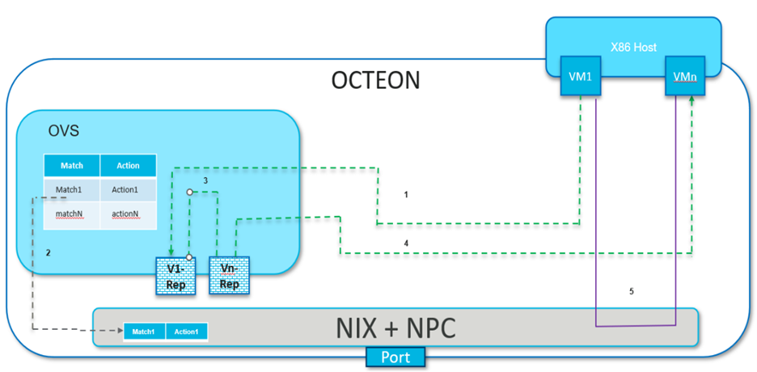
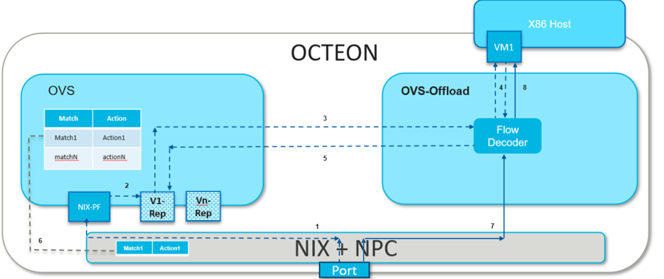

..  SPDX-License-Identifier: Marvell-MIT
    Copyright (c) 2024 Marvell.

***********
OVS Offload
***********

Introduction
============

Open vSwitch(OVS) is often used in conjunction with companion applications to
enhance and extend its capabilities. OVS offload is a companion application which
enhance OVS functionality between host ports and mac ports.

Existing Marvell SOC's lacks direct communication channel between Host PEM and MAC,
hence dedicated ARM cores are required to intercept packets from Host and relay them
to MAC ports, and reciprocally manage the packet flow between the two.

OVS-offload is a DPDK graph based application intended for bridging the void between
Host PEM (SDP, virtio) and Ethernet MAC (RPM).

Architecture
============

OVS harnesses DPDK port representors to seamlessly integrate with hardware-accelerated
interfaces, optimizing packet processing path and enhancing network performance.

Traffic steering rules typically necessitate preliminary software processing. OVS
must handle traffic among various device endpoints prior to their linkage. This
process is streamlined by ‘port representors’, functioning as a frontend interface
for OVS.

VM1 and VMn, depicted here, are two virtual machines operating on the x86 host,
with Octeon connected as a PCI endpoint to the host. OVS utilizes VF representors
VF1 and VFn to facilitate switching between these VMs. These representors initially
receive traffic from their respective VMs. After OVS classifies this traffic, flow
rules are offloaded to the hardware, enabling direct, high-speed network connectivity
between the two VMs without additional traffic being directed to OVS.



Following are steps to demonstrate packet flow:

1. Initial VM1 traffic, failing to find a matching hardware flow entry, is redirected
to OVS via representor port VF1.

2. OVS categorizes the packets and readies the flow rules for hardware offloading.

3. The packets are then routed to VMn via its representor port VFn by OVS.

4. VMn receives the initial traffic from VM1 via OVS.

5. Post offloading of the rules to the hardware by OVS, all traffic between VM1 and
VMn occurs directly, bypassing OVS.

Packet Flow - Wire-VM Communication and vice versa
--------------------------------------------------

The diagram below illustrates the process of VM1, hosted on a local machine,
establishing communication with a peer machine across the network.
To ping VM1, the peer machine initiates the process by sending out the first ARP
request to retrieve VM1’s MAC address.



1. Within the Octeon, in the absence of a direct flow rule for routing the packet
to VM1, the packet is guided towards its PF, which is typically bound to OVS in
most cases.

2. Upon receiving the ARP packet, OVS, functioning as a switch, broadcasts it to
all its ports that are part of the bridge, which includes the PF port. At this
point OVS also associates the MAC address of peer machine with PF port as part of
MAC learning.

3. The ARP request is received by all VMs represented through representor ports on
the OVS bridge. However, only the intended recipient of this packet responds with
an ARP reply.

4. The ARP reply from VM1 is channeled to OVS through its representor port. Given
that the ARP reply’s destination MAC address matches that of the peer machine, OVS
forward it via the PF port.

5. OVS offloads the flow associated with the ARP response, aiming to enable subsequent
ARP packets to reach VM1 directly.

6. Subsequently, peer machine sends ICMP packets which also reaches VM1 via representors
due to missing flow rule related to ICMP packets.

7. OVS also offloads the ICMP-related flow rules to the hardware, ensuring that all future
ICMP packets can reach VM1 directly from the network.

Getting the sources and compile
===============================

OVS-offload application is part of the ``DAO`` package and follow
:doc:`steps to build DAO <../gsg/build>`

Setting up the Environment
==========================

Before launching ``ovs-offload``, OVS should be running with the required port
representors.

.. note::
 Follow the steps to :doc:`get started with OVS with port representors <../howtoguides/ovs>`

For ovs-offload solution each port representor represents a SDP port and RPM port
as a pair and each SDP port is mapped to a unique RPM port. Hence for 3 interfaces
on host side - requires 3 SDP VF and 3 RPM VFs bind to ovs-offload application and
3 port representors are bind to an OVS bridge providing switching between them.

Binding required devices
------------------------

ovs-offload app needs a ESW VF device to communicate with OVS for exception path,
equal no of SDP VFs and RPM (NIX) VFs to form a pair.

Binding ESW VF
``````````````

ESW PF is bind to OVS while ESW VF is bind to ovs-offload app to enable data path
between each other.

Create VF, check for device ID ``0xa0e1`` viz ESW VF and bind to vfio-pci

.. code-block:: console

 # echo 1 > echo 1 > /sys/bus/pci/devices/0002\:1c\:00.0/sriov_numvfs

 # lspci | grep a0e1
 0002:1c:00.1 Ethernet controller: Cavium, Inc. Device a0e1 (rev 50)

 # dpdk-devbind.py -b vfio-pci 0002:1c:00.1

Binding SDP and RPM VFs
```````````````````````
.. note::
  SDP PF doesn't participate in datapath while NIX PF in common scenarios is bind to OVS

Check for device ID ``0xa0f7`` viz SDP VF and bind to vfio-pci

.. code-block:: console

 # dpdk-devbind.py -s
 0002:1f:00.1 'Octeon Tx2 SDP Virtual Function a0f7' if=sdp31-0 drv=rvu_nicvf unused=vfio-pci
 0002:1f:00.2 'Octeon Tx2 SDP Virtual Function a0f7' if=sdp31-1 drv=rvu_nicvf unused=vfio-pci

 # dpdk-devbind.py -b vfio-pci 0002:1f:00.1
 # dpdk-devbind.py -b vfio-pci 0002:1f:00.2


Create VFs, check for device ID ``0xa064`` viz RPM (NIX) VF and bind to vfio-pci

.. code-block:: console

 # echo 2 > /sys/bus/pci/devices/0002\:02\:00.0/sriov_numvfs

 # dpdk-devbind.py -s
 0002:02:00.1 'Octeon Tx2 RVU Virtual Function a064' if=eth1 drv=rvu_nicvf unused=vfio-pci
 0002:02:00.2 'Octeon Tx2 RVU Virtual Function a064' if=eth5 drv=rvu_nicvf unused=vfio-pci

 # dpdk-devbind.py -b vfio-pci 0002:02:00.1
 # dpdk-devbind.py -b vfio-pci 0002:02:00.2

Launching the application
=========================

.. code-block:: console

  dpdk-ovs-offload [EAL options] -- -p PORTMASK
                                    --portmap(PCI_BDF1, PCI_BDF2)[,(PCI_BDF3, PCI_BDF4)]
                                    --config(port,queue,lcore)[,(port,queue,lcore)]
                                    [--max-pkt-len PKTLEN]
                                    [--pcap-enable]
                                    [--pcap-num-cap]
                                    [--pcap-file-name]
                                    [--enable-graph-stats]

Where,
* ``-p PORTMASK:`` Hexadecimal bitmask of ports to configure

* ``--portmap:`` Between which 2 PCI ports forwarding shall be enabled. In most common case
  1 of the PCI BDF is SDP VF and other is RPM VF.

* ``--config (port,queue,lcore)[,(port,queue,lcore)]:`` Determines which queues from which ports
  are mapped to which cores.

* ``--max-pkt-len:`` Optional, maximum packet length in decimal (64-9600).

* ``--pcap-enable:`` Optional, Enables packet capture in pcap format on each node with mbuf and
  node metadata.

* ``--pcap-num-cap:`` Optional, Number of packets to be captured per core.

* ``--pcap-file-name:`` Optional, Pcap filename to capture packets in.

* ``--enable-graph-stats`` Optional, enable graph statistics on the console.

For example:
Consider a scenario where there are 2 VMs running on the host and each VM may receive and send
packets on the wire. For intercepting the packets from the host and relaying to the wire 2 SDP
VFs(i.e. 0002:1f:00.1 and 0002:1f:00.2) paired with 2 RPM VFs(i.e. 0002:02:00.1 and 0002:02:00.2)
are required. To enable forwarding between these SDP and RPM ports, say core 1-4 are used and
core 0 be the control core, command to be executed is:

.. code-block:: console

  dpdk-ovs-offload  -l 0,1,2,3,4  -a 0002:1c:00.1 -a 0002:02:00.1 -a 0002:1f:00.1
  -a 0002:02:00.2 -a 0002:1f:00.2 --vfio-vf-token="9d75f7af-606e-47ff-8ae4-f459fce4a422"
  --file-prefix=ep -- -p 0xff  --portmap="(0002:02:00.1,0002:1f:00.1),(0002:02:00.2,0002:1f:00.2)"
  --config="(0,0,1),(1,0,2),(3,0,3),(4,0,4)" --enable-graph-stats

In this command:

*   | The -l option enables worker cores 1, 2, 3, 4 polling for packets and core 0 is control core.
    | For same -c 0x1F could have also been used.

*   | The --portmap option enables forwarding between SDP and RPM port i.e between
    | SDP VF 0002:1f:00.1 <--------> RPM (or NIX) VF 0002:02:00.1
    | SDP VF 0002:1f:00.2 <--------> RPM (or NIX) VF 0002:02:00.2

*   | The --config option enables one queue on each port and maps each (port,queue) pair to a
      specific core.
    | The following table shows the mapping in this example:

   +----------+-----------+-----------+-------------------------------------+
   | **Port** | **Queue** | **lcore** | **Description**                     |
   |          |           |           |                                     |
   +----------+-----------+-----------+-------------------------------------+
   | 0        | 0         | 1         | Map queue 0 from port 0 to lcore 1. |
   |          |           |           |                                     |
   +----------+-----------+-----------+-------------------------------------+
   | 1        | 0         | 2         | Map queue 0 from port 1 to lcore 2. |
   |          |           |           |                                     |
   +----------+-----------+-----------+-------------------------------------+
   | 3        | 0         | 3         | Map queue 0 from port 3 to lcore 3. |
   |          |           |           |                                     |
   +----------+-----------+-----------+-------------------------------------+
   | 4        | 0         | 4         | Map queue 0 from port 4 to lcore 4. |
   |          |           |           |                                     |
   +----------+-----------+-----------+-------------------------------------+

.. note::
   port 2 is skipped in forwarding as it is the port ID for 0002:1c:00.1, which is a ESW device used for
   sending the exception path packets to OVS.

To enable pcap trace on each graph, command becomes

.. code-block:: console

  dpdk-ovs-offload  -l 0,1,2,3,4  -a 0002:1c:00.1 -a 0002:02:00.1 -a 0002:1f:00.1
  -a 0002:02:00.2 -a 0002:1f:00.2 --vfio-vf-token="9d75f7af-606e-47ff-8ae4-f459fce4a422"
  --file-prefix=ep -- -p 0xff  --portmap="(0002:02:00.1,0002:1f:00.1),(0002:02:00.2,0002:1f:00.2)"
  --config="(0,0,1),(1,0,2),(3,0,3),(4,0,4)" --enable-graph-stats
  --pcap-enable --pcap-num-cap=100000 --pcap-file-name=/tmp/rx.pcap

*   The --pcap-enable option enables pcap trace on graph nodes.

*   The --pcap-num-cap option enables user to configure number packets to be captured per graph.
    Default 1024 packets per graph are captured.

*   The --pcap-file-name option enables user to give filename in which packets are to be captured.


Understanding the output
------------------------

If `--enable-graph-stats` is included as command line argument, we would observe following
output getting refreshed every second:

   +-----------------+-----------+-------+---------------+-----------+---------------+-----------+
   |Node             |calls      |objs   |realloc_count  |objs/call  |objs/sec(10E6) |cycles/call|
   +=================+===========+=======+===============+===========+===============+===========+
   |flow_mapper      |97         |97     |5              |1.000      |0.000002       |221.0000   |
   +-----------------+-----------+-------+---------------+-----------+---------------+-----------+
   |ood_eth_tx-0     |44         |44     |5              |1.000      |0.000001       |320.0000   |
   +-----------------+-----------+-------+---------------+-----------+---------------+-----------+
   |ood_eth_tx-3     |47         |47     |5              |1.000      |0.000001       |262.0000   |
   +-----------------+-----------+-------+---------------+-----------+---------------+-----------+
   |ood_eth_tx-4     |2          |2      |5              |0.000      |0.000000       |0.0000     |
   +-----------------+-----------+-------+---------------+-----------+---------------+-----------+
   |ood_eth_rx-0-0   |81195623   |45     |2              |0.000      |0.000001       |269.0000   |
   +-----------------+-----------+-------+---------------+-----------+---------------+-----------+
   |repr_tx-0        |4          |4      |5              |0.000      |0.000000       |0.0000     |
   +-----------------+-----------+-------+---------------+-----------+---------------+-----------+
   |ood_eth_rx-3-0   |78412260   |48     |2              |0.000      |0.000001       |275.0000   |
   +-----------------+-----------+-------+---------------+-----------+---------------+-----------+
   |repr_rx          |81505738   |4      |2              |0.000      |0.000000       |617.0000   |
   +-----------------+-----------+-------+---------------+-----------+---------------+-----------+

 | Where,
 | ``Node``: all the nodes participating in data path
 | ``calls``: no of time node process callback is invoked
 | ``objs``: no of packets processed by the node
 | ``realloc_count``: no of time memory reallocated
 | ``cycles/call``: no of cycles spent in a node

Understanding different nodes
-----------------------------

* | ``ood_eth_tx-x``: Ethernet tx node - both SDP and RPM port
  | where, x is the port ID
  | eg: as per above command executed, port 0 is RPM (NIX) VF and port 3,4 are SDP VFs

* | ``ood_eth_rx-x-y``: Ethernet rx node - both SDP and RPM port
  | where, x is port ID and y is queue ID
  | eg, as per above command executed, port 0 is RPM (NIX) VF and port 3,4 are SDP VFs

* | ``repr_tx-x``: Representor tx node - used to send exception packet to OVS
  | where, x is the port representor ID mapped to respective SDP port
  | eg, port SDP port 3 maps to representor port 0 and SDP port 4 maps to representor port 1

* ``repr_rx``: single representor rx node for receiving packets from OVS

* ``flow_mapper``: This node is responsible for moving the packets across the nodes i.e.
  receiving packets from SDP and transmitting to RPM ports and vice versa. It also moves
  packets across advanced use case nodes like encapsulation/decapsulation.

* ``vxlan_encap``: This node performs VxLAN tunnel encapsulation to all the received packets.

* ``tunnel_decap``: This node performs tunnel decapsulation to all the received packets.
