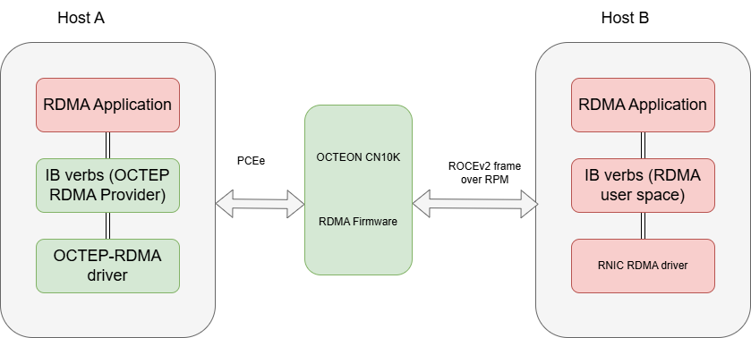
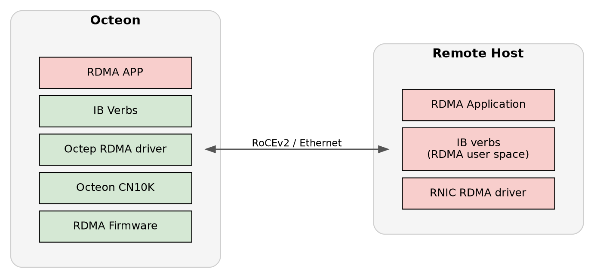

..  SPDX-License-Identifier: Marvell-MIT
    Copyright (c) 2025 Marvell.

*************
RDMA Solution
*************

RDMA Overview
=============

Remote Direct Memory Access (RDMA) enables zero-copy data transfer between
memory regions of two systems without CPU involvement in the data path. This
significantly reduces latency and CPU overhead, making RDMA ideal for
high-performance networking.

RoCE v2 (RDMA over Converged Ethernet v2) encapsulates RDMA traffic over UDP/IP,
allowing it to be routable across Layer 3 networks.

RDMA solution comprises multiple software components working together: on the
x86 host, the rdma-core user-space libraries and kernel modules provide RDMA
verbs and core functionality, while on the Octeon CN10K, a DPDK-based firmware
application maintains RDMA resource contexts and performs RoCEv2 encapsulation
for high-performance data transfer

RDMA Operation Modes
====================

OCTEON RDMA can operate in two modes:

* **Endpoint Mode**: the OCTEON acts as an RDMA adapter (NIC) for the
  x86 host, which terminates the RDMA endpoint. This mode is described in the
  Octeon RDMA End Point Mode subsection below.
* **Termination mode**: the OCTEON terminates the RDMA endpoint locally instead
  of passing RDMA traffic through to the host. This mode is described in the
  Octeon RDMA Termination Mode subsection below.

Octeon RDMA End Point Mode
--------------------------

``dao-rdma_graph`` (referred to here as ``rdma``) is a DPDK based application
that exercises RDMA (RoCEv2/IB verbs) dataplane paths on OCTEON and host
platforms. It supports multi-queue (multi-QP) UD and RC transports,
multi-device scenarios (multiple RDMA interfaces), and validation via
standard rdma-core utilities (``ibv_*``) and RDMA perftests utilities.

The application configures required RPM/DPI resources on OCTEON, launches
workers to process Ethernet receive nodes feeding RDMA graph nodes, and allows
users to run verbs test programs (``ibv_ud_pingpong``, ``ibv_rdma_mq_trf``)
across host <-> OCTEON or multi-device setups. Non-RDMA host stack traffic
(ARP, ICMP, RDMA CM) is handled through a management QP ring-based netdev
using BAR4 doorbells and DMA passthrough, eliminating the previous SDP
dependency.

Features
~~~~~~~~
 * DPDK based RDMA dataplane orchestration on OCTEON (RPM + DPI VFs)
 * Management QP ring-based netdev for non-RDMA host traffic (ARP, ICMP, RDMA CM)
 * Supports UD transport ping/pong validation (``ibv_ud_pingpong``)
 * Supports multi-queue UD and RC tests (``ibv_rdma_mq_trf``)
 * Multi-device RDMA support (multiple RDMA VF devices)
 * Works with host-side ``rdma-core`` utilities for probing & stats
 * VFIO-PCI binding for RPM/DPI devices
 * Programmable number of Queue Pairs (QPs) per test
 * Command-line options for selecting device masks, number of RDMA devices, etc.
 * Integrates with perftest utilities (``ib_send_lat``, ``ib_send_bw``, ``ib_write_lat``, ``ib_write_bw``, ``ib_read_lat``, ``ib_read_bw``) for latency & bandwidth benchmarking
 * Supports high-performance RDMA memory allocations and multi-QP resource scaling

Setting up Environment
~~~~~~~~~~~~~~~~~~~~~~
Bind RPM device to ``vfio-pci``:

.. code-block:: bash

   dpdk-devbind.py -b vfio-pci 0002:02:00.0

.. _rdma-obtain-dao:

Obtain DAO sources and checkout DAO 26.02 branch
^^^^^^^^^^^^^^^^^^^^^^^^^^^^^^^^^^^^^^^^^^^^^^^^

.. code-block:: bash

   git clone https://github.com/MarvellEmbeddedProcessors/dao.git
   cd dao
   git checkout dao-26.02

Enable and bind DPI/NPA devices (helper script)
^^^^^^^^^^^^^^^^^^^^^^^^^^^^^^^^^^^^^^^^^^^^^^^

The ``dpi-test-setup.sh`` helper configures DPI VFs and related devices for the
RDMA dataplane. It is supplied with the DAO/OCTEON SDK deliverable for your
platform (some images install it as ``/usr/bin/dpi-test-setup.sh``). After
cloning the repository (:ref:`rdma-obtain-dao`), you can also run a copy from
your DAO checkout if your release ships it under ``scripts/`` or similar.

The reference implementation discovers the DPI PF via ``lspci -d 177d:a080``,
creates VFs, binds DPI VFs (``177d:a081``) and an NPA PF (``177d:a0fb``) to
``vfio-pci``, and mounts hugepages. Adjust ``NUM_DPI`` / ``NUMVFS`` inside the
script if your board differs.

Run the packaged script when available:

.. code-block:: bash

   dpi-test-setup.sh

If you do not have ``dpi-test-setup.sh`` on the system, save the following as
``dpi-test-setup.sh`` (make it executable), or paste it into a root shell. It
matches the reference script bundled on typical Marvell OCTEON images:

.. code-block:: bash

   # Copyright (c) 2020 Marvell.
   # SPDX-License-Identifier: BSD-3-Clause

   # Set to 2 to use two DPI blocks when present (e.g. on 98xx).
   NUM_DPI=1

   # Enable DPI VFs
   NUMVFS=12
   DPIPF=$(lspci -d 177d:a080|awk '{print $1}' | head -${NUM_DPI})
   echo "###### DPI PFs ######"
   echo "$DPIPF"

   mkdir -p /dev/huge
   mount -t hugetlbfs nodev /dev/huge
   echo 12 > /sys/kernel/mm/hugepages/hugepages-524288kB/nr_hugepages

   echo -e "\n"
   echo "Creating DPI VFs ..."
   for PF in $DPIPF
   do
           DPIVFS=$(cat /sys/bus/pci/devices/$PF/sriov_numvfs)
           echo "Current number of VFs under DPIPF $PF = $DPIVFS"
           if [ "x$DPIVFS" != x"$NUMVFS" ]; then
                   TOTALVFS=$(cat /sys/bus/pci/devices/$PF/sriov_totalvfs)
                   if [ $TOTALVFS -lt $NUMVFS ]; then
                           NUMVFS=$TOTALVFS
                   fi

                   echo "Creating $NUMVFS VFs for DPIPF $PF ..."
                   echo 0 > /sys/bus/pci/devices/$PF/sriov_numvfs
                   echo $NUMVFS > /sys/bus/pci/devices/$PF/sriov_numvfs
                   if [ x"$?" != "x0" ]; then
                           echo -n \
           """Failed to enable $DPI DMA queues.
           """ >&2
                   exit 1
           fi
           fi
   done

   # Bind only required NPA and DPI VFs to vfio-pci
   DPIVF=$(lspci -d 177d:a081|awk '{print $1}')
   echo -e "\n"
   echo "###### DPI VFs ######"
   echo "$DPIVF"

   NPAPF=$(lspci -d 177d:a0fb|awk '{print $1}'|head -1)
   echo -e "\n"
   echo "Using NPA PF $NPAPF ..."

   dpi_devs=(${DPIVF} $NPAPF)

   for DEV in ${dpi_devs[*]}; do
           if [ -e /sys/bus/pci/devices/$DEV/driver/unbind ]; then
                   drv="$(readlink -f /sys/bus/pci/devices/$DEV/driver)"
                   drv="$(basename $drv)"
                   if [ "$drv" != "vfio-pci" ]; then
                           echo $DEV > "/sys/bus/pci/devices/$DEV/driver/unbind"
                   fi
           fi
           echo vfio-pci > "/sys/bus/pci/devices/$DEV/driver_override"
           echo $DEV > /sys/bus/pci/drivers_probe
           echo "  Device $DEV moved to VFIO-PCI"
   done

If you perform **only** manual ``vfio-pci`` binding without running the script
above, configure hugepages separately on the OCTEON:

.. code-block:: bash

   mkdir -p /dev/huge
   mount -t hugetlbfs nodev /dev/huge
   echo 12 > /sys/kernel/mm/hugepages/hugepages-524288kB/nr_hugepages

Cross Compile for ARM64:
^^^^^^^^^^^^^^^^^^^^^^^^
Follow: https://marvellembeddedprocessors.github.io/dao/guides/gsg/build.html#compiling-and-installing

Launching RDMA Application on OCTEON
~~~~~~~~~~~~~~~~~~~~~~~~~~~~~~~~~~~~
Export DPI device list and run application:

.. code-block:: bash

   export DPI_DEV="-a 0000:06:00.1 -a 0000:06:00.2 -a 0000:06:00.3 -a 0000:06:00.4 -a 0000:06:00.5 -a 0000:06:00.6 \
   -a 0000:06:00.7 -a 0000:06:01.0 -a 0000:06:01.1 -a 0000:06:01.2 -a 0000:06:01.3 -a 0000:06:01.4 -a 0000:06:01.5"
   scp dao-rdma_graph root@OCTEON_IP:/root/
   /root/dao-rdma_graph -c 0xf -a 0002:02:00.0 $DPI_DEV --file-prefix=ep -- -p 0x1 -P --max-pkt-len=9600 -n 1 -r 0x1 --num-mbufs 1048576

Sample boot log excerpt:

.. code-block:: console

   [lcore -1] DAO_INFO: RDMA application version 25.01.0-24.11.0-d6645f1
   EAL: Detected CPU lcores: 24
   ...
   [lcore   0] DAO_INFO: Port 0 Link up at 100 Gbps FDX Fixed
   [lcore   0] DAO_INFO: Setting up 8 VFs for PEM0
   [lcore   0] DAO_INFO: graph node: rdma_eth_rx-0-0
   [lcore   0] DAO_INFO: graph node: rdma_eth_rx-0-1
   [lcore   0] DAO_INFO: Launching worker loops....

.. note::
 Ensure that the Octeon CN10K firmware is fully initialized and running before
 configuring the RDMA software components on the host.

Host Setup Environment
~~~~~~~~~~~~~~~~~~~~~~

The host initiates RDMA communication using the RDMA verbs API provided by rdma-core.

a. User Space
^^^^^^^^^^^^^

``Application``: Uses RDMA verbs (e.g., ibv_post_send, ibv_post_recv) through libibverbs.
``rdma-core``: Provides libraries and utilities for RDMA (e.g., libibverbs, libmlx5, etc.).

Includes vendor-specific provider implementation (e.g., Mellanox, Broadcom, Marvell CNXK).
Provider translates generic verbs into hardware-specific operations.

b. Kernel Space
^^^^^^^^^^^^^^^

``ib_core``: RDMA core kernel module providing common RDMA infrastructure.
Vendor-specific kernel driver: Implements low-level hardware interaction for the RDMA adaptor.
Handles Queue Pairs (QPs), Completion Queues (CQs), memory registration, and DMA mapping.

Setting up Environment
^^^^^^^^^^^^^^^^^^^^^^

Configure the required host kernel bootargs by updating the
``GRUB_CMDLINE_LINUX`` line in ``/etc/default/grub``. ``aw_bits=39`` is required
on all hosts; on Intel hosts also enable the IOMMU with
``iommu=on intel_iommu=on`` (these two are Intel specific).

On an Intel host:

.. code-block:: console

   GRUB_CMDLINE_LINUX="iommu=on intel_iommu=on aw_bits=39"

On a non-Intel host:

.. code-block:: console

   GRUB_CMDLINE_LINUX="aw_bits=39"

Regenerate the GRUB configuration and reboot for the changes to take effect
(for example, ``update-grub`` on Debian/Ubuntu or ``grub2-mkconfig`` on
RHEL-based systems).

Clone DAO sources for host kernel driver:

.. code-block:: bash

   git clone https://github.com/MarvellEmbeddedProcessors/dao.git
   cd dao
   git checkout dao-26.02

Build DAO for x86 host

``rdma-core`` is defined as a subproject, kernel header updates and its compilation
will be handled with following instructions.

.. note::
  ``pciutils`` (which provides ``lspci``) is required on the machine where the
  sources are compiled. Install it before building:

  .. code-block:: bash

     sudo apt install pciutils

.. note::
  Meson version 1.8.0 or higher is mandatory for RDMA host build.

  Update meson version on host to >= 1.8.0 using following command:

  pip3 install meson==1.8.0

.. code-block:: bash

   export KERNEL_BUILD_DIR=/usr/src/linux-headers-`uname -r`/
   meson setup build -Dkernel_dir=${KERNEL_BUILD_DIR} -Drdma_build=true
   ninja -C build
   # Module at build/kmod/rdma/octep_rdma/octep-rdma.ko
   # ibv CLIs at ./subprojects/rdma-core/build/bin/

Insert module & dependencies (ensure Octeon FW running):

.. code-block:: bash

   modprobe ib_uverbs
   insmod build/kmod/rdma/octep_rdma/octep-rdma.ko
   lspci | grep Cav
   echo 1 > /sys/bus/pci/devices/0000\:01\:00.0/sriov_numvfs

Validate device probing:

.. code-block:: bash

   ./subprojects/rdma-core/build/bin/ibv_devices
   ./subprojects/rdma-core/build/bin/ibv_devinfo

Bring up host interface:

.. code-block:: bash

   ifconfig enp1s0 30.0.0.3 up

Partner Machine Setup (MLX example):

.. code-block:: bash

   /etc/init.d/openibd restart
   ifconfig enp6s0f1np1 30.0.0.11
   ping 30.0.0.3
   rdma link show
   ibv_devices
   ibv_devinfo

Octeon RDMA Termination Mode
----------------------------

In termination mode the OCTEON terminates the RDMA endpoint locally instead of
passing RDMA traffic through to the host. It is enabled by launching
``dao-rdma_graph`` with the ``--enable-termination`` option; the periodic
heartbeat is disabled in this mode.

Required versions:

* **DPDK** 25.11 or newer.
* **DAO** ``dao-devel`` (tip-of-tree); this mode is not yet part of a release
  branch.
* **OCTEON kernel** Marvell Linux 6.6, built from
  https://github.com/Marvell-Lab/linux-kernel.

.. note::
   The OCTEON must run the **Marvell Linux 6.6** kernel
   (https://github.com/Marvell-Lab/linux-kernel), which provides the
   ``octeontx2_dpi`` module parameters used during setup.

Steps to Compile DAO
~~~~~~~~~~~~~~~~~~~~
Build on an x86 host and copy the resulting binaries to the OCTEON DUT. The
``-Drdma_build=true`` option enables a unified cross-compilation that builds
``rdma-core`` (libibverbs, librdmacm, octep_rdma provider), the ``octep_rdma``
kernel module (with ``-DCONFIG_OCTEP_RDMA_OCTTERM`` for termination mode), and
``dao-rdma_graph`` in a single step. ``<linux-6.6-kernel-path>`` must point to
the OCTEON Linux 6.6 kernel source tree.

.. note::
   Meson version 1.8.0 or higher is required for the RDMA cross-compilation.

   .. code-block:: bash

      pip3 install meson==1.8.0

.. code-block:: bash

   # Compile and install DPDK 25.11 (or newer), then point pkg-config at it
   export PKG_CONFIG_PATH=<dpdk-install-dir>/lib/pkgconfig

   # Obtain DAO sources (tip-of-tree; termination mode is not on a release branch)
   git clone https://github.com/MarvellEmbeddedProcessors/dao.git
   cd dao
   git checkout dao-devel

   # Cross-compile DAO with rdma-core, octep_rdma kmod and dao-rdma_graph
   meson setup build --buildtype=debug --cross=config/arm64_cn10k_linux_gcc \
     -Denable_docs=false -Dc_args='-ggdb3' --prefer-static --werror \
     -Drdma_build=true -Dkernel_dir=<linux-6.6-kernel-path>
   ninja -C build

   # Build artifacts:
   #   Firmware:      build/app/dao-rdma_graph
   #   Kernel module: build/kmod/rdma/octep_rdma/octep-rdma.ko
   #   rdma-core:     subprojects/rdma-core/build/lib/ (libibverbs, librdmacm, provider)

   # Copy firmware, kmod and rdma-core libraries to the DUT

The following steps are performed on the OCTEON DUT.

Configure Hugepages and VFIO
~~~~~~~~~~~~~~~~~~~~~~~~~~~~

.. code-block:: bash

   mkdir -p /mnt/huge
   mount -t hugetlbfs nodev /mnt/huge
   modprobe vfio-pci
   echo 36 > /proc/sys/vm/nr_hugepages

Configure DPI and Bind VFs
~~~~~~~~~~~~~~~~~~~~~~~~~~
Discover the DPI PF, tune the ``octeontx2_dpi`` module parameters, create DPI
VFs, and bind them to ``vfio-pci``. Leave at least one VF unbound so the kernel
can take it up and create a netdev:

.. code-block:: bash

   DPI_PF=$(lspci -d :a080 | awk '{print $1}')

   echo 0x10101010 > /sys/module/octeontx2_dpi/parameters/eng_fifo_buf
   echo 512 > /sys/module/octeontx2_dpi/parameters/mrrs
   echo 256 > /sys/module/octeontx2_dpi/parameters/mps

   echo 32 > /sys/bus/pci/devices/$DPI_PF/sriov_numvfs
   # Bind all but at least one VF; the unbound VF lets the kernel create a netdev
   DPI_VF=$(lspci -d :a081 | awk '{print $1}' | head -22)
   usertools/dpdk-devbind.py -b vfio-pci $DPI_VF

Create and Bind RPM VFs
~~~~~~~~~~~~~~~~~~~~~~~
Create the RPM VFs used for connectivity with the remote machine and bind them
to ``vfio-pci`` (adjust the BDFs to match your setup):

.. code-block:: bash

   echo 3 > /sys/bus/pci/devices/0002:03:00.0/sriov_numvfs
   usertools/dpdk-devbind.py -b vfio-pci 0002:03:00.1 0002:03:00.2 0002:03:00.3

Load RDMA Kernel Modules
~~~~~~~~~~~~~~~~~~~~~~~~
Load the modules on the OCTEON. This creates the ``/dev/octterm0`` character
device that ``dao-rdma_graph`` requires in termination mode:

.. code-block:: bash

   modprobe ib_uverbs
   insmod kmod/rdma/octep_rdma/octep-rdma.ko

Launch the Application
~~~~~~~~~~~~~~~~~~~~~~
Export the DPI device list and launch ``dao-rdma_graph`` with
``--enable-termination`` (adjust the Ethernet BDFs to match your setup):

.. code-block:: bash

   export DPI_DEV="-a 0000:06:00.2 -a 0000:06:00.3 -a 0000:06:00.4 -a 0000:06:00.5 \
   -a 0000:06:00.6 -a 0000:06:00.7 -a 0000:06:01.0 -a 0000:06:01.1 -a 0000:06:01.2 \
   -a 0000:06:01.3 -a 0000:06:01.4 -a 0000:06:01.5 -a 0000:06:01.6 -a 0000:06:01.7"
   build/app/dao-rdma_graph -c 0x3f $DPI_DEV -a 0002:03:00.1 --file-prefix=ep -- \
   -p 0x1 --max-pkt-len=9600 -P -n 1 -r 0x1 --num-mbufs 1048576 \
   --enable-termination

Bring up the Interface
~~~~~~~~~~~~~~~~~~~~~~
Find the VF interface name (format ``enp6s0vxx``, where ``xx`` is a number)
using ``ifconfig``, then assign an IP address in the same subnet as the remote
machine:

.. code-block:: bash

   ifconfig enp6s0v22 30.0.0.3/24 up

Run UD Ping-Pong Test
~~~~~~~~~~~~~~~~~~~~~
With the termination VF interface up and addressed in the same subnet as the
remote machine (previous step), verify connectivity and run a UD ping-pong
test:

.. code-block:: bash

   ping 30.0.0.11
   ibv_ud_pingpong -g 1 -d <device-name> -i 1 30.0.0.11

Testing
=======

UD Ping-Pong Test
-----------------
Server (partner MLX device):

.. code-block:: bash

   ibv_ud_pingpong -g 3 -d mlx5_1 -i 1

Client (host with octep driver):

.. code-block:: bash

   ./subprojects/rdma-core/build/bin/ibv_ud_pingpong -g 1 -d octep_rdma_0 -i 1 30.0.0.11

Successful output example (server/client throughput & latency lines retained).

Multi-Queue UD Test (``ibv_rdma_mq_trf``)
-----------------------------------------
Clone & build rdma-core (both sides) if not already done. Launch server:

.. code-block:: bash

   ./subprojects/rdma-core/build/bin/ibv_rdma_mq_trf -g 1 -q 1 -s

Flags:

* ``-g <idx>`` GID index
* ``-q <num>`` Number of QPs (increase to stress multi-queue, e.g. ``-q 4``)
* ``-s`` Server mode

Client example:

.. code-block:: bash

   ./subprojects/rdma-core/build/bin/ibv_rdma_mq_trf -g 1 -q 1 -r 20.20.20.21

Multi-Device RDMA Steps
-----------------------
Create RPM VFs and bind to VFIO-PCI:

.. code-block:: bash

   echo 0002:02:00.0 > /sys/bus/pci/drivers/vfio-pci/unbind
   echo > /sys/bus/pci/devices/0002:02:00.0/driver_override
   echo 0002:02:00.0 > /sys/bus/pci/drivers/rvu_nicpf/bind
   echo 3 > /sys/bus/pci/devices/0002:02:00.0/sriov_numvfs
   dpdk-devbind.py -b vfio-pci 0002:02:00.1
   dpdk-devbind.py -b vfio-pci 0002:02:00.2
   dpdk-devbind.py -b vfio-pci 0002:02:00.3

Start application for 3 devices:

.. code-block:: bash

   dao-rdma_graph -c 0x1f -a 0002:02:00.1 -a 0002:02:00.2 -a 0002:02:00.3 $DPI_DEV --file-prefix=ep -- -p 0x7 -r 0x7 -n 3 -P

* ``-n`` Number of RDMA devices
* ``-r`` RDMA devices mask

Insert module & create RDMA VFs on host:

.. code-block:: bash

   insmod build/kmod/rdma/octep_rdma/octep-rdma.ko
   echo 3 > /sys/bus/pci/devices/0000:01:00.0/sriov_numvfs

Verify IB devices:

.. code-block:: bash

   ./subprojects/rdma-core/build/bin/ibv_devices

Configure VF interfaces (examples):

.. code-block:: bash

   ifconfig enp1s0v0 30.0.0.1
   ifconfig enp1s0v1 31.0.0.1
   ifconfig enp1s0v2 32.0.0.1

Check GIDs:

.. code-block:: bash

   ./subprojects/rdma-core/build/bin/ibv_devinfo -v

Partner device RPM VFs:

.. code-block:: bash

   echo 3 > /sys/bus/pci/devices/0002:02:00.0/sriov_numvfs
   ifconfig enP2p2s0v0 30.0.0.2
   ifconfig enP2p2s0v1 31.0.0.2
   ifconfig enP2p2s0v2 32.0.0.2

Connectivity validation (ping multiple IPs)
~~~~~~~~~~~~~~~~~~~~~~~~~~~~~~~~~~~~~~~~~~~
Perform ICMP pings to each partner VF IP to ensure reachability.

Multi-Device UD Ping-Pong Examples
~~~~~~~~~~~~~~~~~~~~~~~~~~~~~~~~~~
Partner:

.. code-block:: bash

   ibv_ud_pingpong -g 1 -d <device-name> -i 1

Host:

.. code-block:: bash

   ./subprojects/rdma-core/build/bin/ibv_ud_pingpong -g 1 -d octep_rdma_1 -i 1 30.0.0.2

Troubleshooting
---------------
If ``ibv_ud_pingpong`` shows empty GID (``GID ::``):

* IP likely not configured on interface; assign IP and re-check.
* Kernel log may show: ``octep_rdma 0000:01:00.0: Invalid MSIX entry 0 for Q-1``
* If IPv6 GID appears unexpectedly, try different ``-g`` index (e.g. ``-g 2`` or ``-g 1``).

Command-Line Scenarios (Multi-QP Application)
---------------------------------------------
1. Single Server / Single Client, 1000 QPs, SGE=1

Server:

.. code-block:: bash

   ./subprojects/rdma-core/build/bin/ibv_rdma_mq_trf -q 1000 -t 8

Client UD Mode:

.. code-block:: bash

   ./subprojects/rdma-core/build/bin/ibv_rdma_mq_trf -g <gid-idx> -q 1000 -t 8 -d <device-name> --qp-type UD --op-type SEND -n <iters> <server-ip>

Client RC Examples:

.. code-block:: bash

   ./subprojects/rdma-core/build/bin/ibv_rdma_mq_trf -g <gid-idx> -q 1000 -t 8 -d <device-name> --qp-type RC --op-type SEND -n 10 --size 1024 <server-ip>
   ./subprojects/rdma-core/build/bin/ibv_rdma_mq_trf -g <gid-idx> -q 1000 -t 8 -d <device-name> --qp-type RC --op-type WRITE -n 10 --size 1024 <server-ip>
   ./subprojects/rdma-core/build/bin/ibv_rdma_mq_trf -g <gid-idx> -q 1000 -t 8 -d <device-name> --qp-type RC --op-type WRITE_IMM -n 10 --size 1024 <server-ip>
   ./subprojects/rdma-core/build/bin/ibv_rdma_mq_trf -g <gid-idx> -q 1000 -t 8 -d <device-name> --qp-type RC --op-type READ -n 10 --size 1024 <server-ip>

2. Single Server / Single Client, 1000 QPs, SGE=2

Server:

.. code-block:: bash

   ./subprojects/rdma-core/build/bin/ibv_rdma_mq_trf -q 1000 -t 8 --nb-sge=2

Client UD Mode:

.. code-block:: bash

   ./subprojects/rdma-core/build/bin/ibv_rdma_mq_trf -g <gid-idx> -q 1000 -t 8 -d <device-name> --qp-type UD --op-type SEND -n <iters> --nb-sge=2 <server-ip>

Client RC Modes (SEND/WRITE/WRITE_IMM/READ) add ``--nb-sge=2`` similarly.

3. Single Server with 1000 Clients, 1 QP Each, SGE=1

Server:

.. code-block:: bash

   ./subprojects/rdma-core/build/bin/ibv_rdma_mq_trf -q 1 -t 8 -c 1000

Client Loops (example UD):

.. code-block:: bash

   count=1
   while [ $count -le 1000 ]; do
       ./subprojects/rdma-core/build/bin/ibv_rdma_mq_trf -g <gid-idx> -q 1 -t 1 -d <device-name> --qp-type UD --op-type SEND -n <iters> <server-ip>
       ((count++))
   done

For RC (SEND/WRITE/WRITE_IMM/READ) run separate loops (example count up to 250 each) as in reference steps.

4. Single Server with 1000 Clients, 1 QP Each, SGE=2

Server:

.. code-block:: bash

   ./subprojects/rdma-core/build/bin/ibv_rdma_mq_trf -q 1 -t 8 -c 1000 --nb-sge=2

Client UD / RC loops similar to SGE=1 case adding ``--nb-sge=2``.

Performance Testing (Perftest Suite)
------------------------------------
The RDMA application supports standard perftest tools for exercising latency,
bandwidth, and operation-specific performance over both UD and RC transports.
Below are generalized usage patterns using devices like ``octep_rdma_0``
and a partner Mellanox device (e.g. ``mlx5_1``). Adjust GID indices, IPs,
queue counts (``-q``), iteration counts (``-n``), and operation modes as
appropriate for your environment.

General Notes:
 * Run server side commands (those without a destination IP) on the responder host.
 * Client side adds destination IP (last argument) to initiate connection.
 * Use ``--gid-index <idx>`` to select RoCE v2 GID matching configured IP.
 * ``-c UD`` selects Unreliable Datagram; ``-c RC`` selects Reliable Connected.
 * ``-F`` enables "Formatted" output; ``--report_gbits`` reports throughput in Gbit/s.
 * Increase ``-q`` (number of QPs) to evaluate scalability; increase ``-n`` to extend test iterations.
 * For read tests, ``-o <order>`` may select posting order or opcode variant (per perftest help).

Latency Tests (UD / RC):
------------------------
Server examples (no destination IP):

.. code-block:: bash

   ib_send_lat -d octep_rdma_0 -c UD -i 1 --gid-index 1 -F --report_gbits -a
   ib_send_lat -d octep_rdma_0 -c RC -i 1 --gid-index 1 -F --report_gbits -a
   ib_write_lat -d octep_rdma_0 -c RC -i 1 --gid-index 1 -F --report_gbits -a -n 40
   ib_read_lat  -d octep_rdma_0 -c RC -i 1 --gid-index 1 -F --report_gbits -a -o 2

Client counterparts (add server IP):

.. code-block:: bash

   ib_send_lat  -d octep_rdma_0 -c UD -i 1 --gid-index 1 -F --report_gbits -a 20.10.10.3
   ib_send_lat  -d octep_rdma_0 -c RC -i 1 --gid-index 1 -F --report_gbits -a 20.10.10.3
   ib_write_lat -d octep_rdma_0 -c RC -i 1 --gid-index 1 -F --report_gbits -a 20.10.10.3 -n 40
   ib_read_lat  -d octep_rdma_0 -c RC -i 1 --gid-index 1 -F --report_gbits -a 20.10.10.3 -o 2
   ib_read_lat  -d mlx5_1        -c RC -i 1 --gid-index 3 -F -a -o 2 20.10.10.2

Bandwidth Tests (UD / RC SEND, WRITE, READ):
--------------------------------------------
Server-side examples:

.. code-block:: bash

   ib_send_bw  -d octep_rdma_0 -c UD -i 1 --gid-index 1 -F --report_gbits -a -n 5 -q 15
   ib_send_bw  -d octep_rdma_0 -c RC -i 1 --gid-index 1 -F --report_gbits -a -n 5 -q 2
   ib_write_bw -d octep_rdma_0 -c RC -i 1 --gid-index 1 -F --report_gbits -a -n 10 -q 2
   ib_read_bw  -d octep_rdma_0 -c RC -i 1 --gid-index 1 -F --report_gbits -a -n 10 -q 2 -o 2

Client examples (add destination IP):

.. code-block:: bash

   ib_send_bw  -d octep_rdma_0 -c UD -i 1 --gid-index 1 -F --report_gbits -a 20.10.10.3
   ib_send_bw  -d octep_rdma_0 -c RC -i 1 --gid-index 1 -F --report_gbits -a -n 5 -q 10 20.10.10.3
   ib_write_bw -d octep_rdma_0 -c RC -i 1 --gid-index 1 -F --report_gbits -a -n 10 -q 10 20.10.10.3
   ib_write_bw -d mlx5_1       -c RC -i 1 --gid-index 3 -F -a -q 2 -n 10 20.10.10.2
   ib_read_bw  -d octep_rdma_0 -c RC -i 1 --gid-index 1 -F --report_gbits -a -n 10 -q 2 -o 2 20.10.10.3
   ib_read_bw  -d mlx5_1       -c RC -i 1 --gid-index 3 -F -a -q 2 -n 10 -o 2 20.10.10.2

Scaling Guidelines:
 * Increase ``-q`` to test parallel QPs for throughput scaling (e.g. 2, 10, 15).
 * Adjust ``-n`` iterations for longer measurement windows (latency stabilization).
 * Use consistent MTU settings across devices (verify with ``ibv_devinfo``).
 * Ensure GID indices map to the IPv4-mapped RoCE v2 addresses (``::ffff:X.Y.Z.W``).
 * Validate link status and speed before benchmarking.

Memory Allocation Considerations:
 * Pre-allocate large buffers to avoid page faults during measurement.
 * Pin hugepages if using user-space memory registration for stable results.
 * Reuse registered MR across QPs when possible to reduce setup overhead.

Result Interpretation:
 * Latency outputs typically include min/avg/max; track jitter when increasing QPs.
 * Bandwidth tests report Gbit/s; correlate with line rate (e.g. 100G) and packet size.
 * For WRITE/READ, consider PCIe round-trip and completion queue depth effects.

Troubleshooting Perftest:
 * Empty or incorrect GID: re-check IP assignment or use alternate ``--gid-index``.
 * Low bandwidth: verify flow control settings, MTU, and absence of packet drops (``ethtool -S``).
 * Elevated latency spikes: inspect CPU frequency scaling, NUMA placement, and interrupt affinity.

RDMA Counters
=============

.. note::

   The telemetry client requires ``python3-dev`` and ``libreadline-dev`` packages. Install them before use:

   .. code-block:: bash

      sudo apt install python3-dev libreadline-dev

.. note::

   Debug counters require ``DAO_RDMA_DEBUG`` to be enabled at build time. Set the
   ``rdma_debug`` option when configuring the build:

   .. code-block:: bash

      meson setup build -Drdma_debug=true

   Most counters are always available; only the counters listed under
   :ref:`rdma-debug-only-counters` are gated behind this option.

Connection & Access Overview
----------------------------

Telemetry connects locally via a Unix domain socket. Remote access is not
supported. Before connecting, make sure the ``dao-rdma_graph`` application is
running to enable access to RDMA counter endpoints.

Connect to telemetry:

.. code-block:: console

   dpdk-telemetry.py -f ep
   Connecting to /var/run/dpdk/ep/dpdk_telemetry.v2
   {
     "version": "DPDK 25.11.0",
     "pid": 981,
     "max_output_len": 16384
   }
   Connected to application: "dao-rdma_graph"

Where ``ep`` is the file-prefix used when launching the application.

RDMA Core & Port Overview
-------------------------

Returns list of enabled lcores and active RDMA ports.

* **Parameters:** None
* **Endpoint:** ``/rdma/port/list``

Example output:

.. code-block:: console

   --> /rdma/port/list
   {
     "/rdma/port/list": {
       "rdma_system_info": {
         "core_info": {
           "num_enabled_lcores": 6,
           "enabled_lcores": [
             0,
             1,
             2,
             3,
             4,
             5
           ]
         },
         "port_info": {
           "num_active_ports": 1,
           "active_ports": [
             0
           ]
         }
       }
     }
   }

RDMA Port-Level Statistics
--------------------------

Returns RDMA port statistics for a specific lcore and port.

* **Parameters:**

  * ``lcore`` — Logical core ID
  * ``port`` — RDMA port ID

* **Endpoint:** ``/rdma/port/counters,lcore,port``

Example output (specific lcore and port):

.. code-block:: console

   --> /rdma/port/counters,1,0
   {
     "/rdma/port/counters": {
       "lcore_1_port_0": {
         "RDMA_RX_PORT_HDR_CHK_BTH_TVER_FAIL": 0,
         "RDMA_RX_PORT_HDR_CHK_MULTICAST_QP_FAIL": 0,
         "RDMA_RX_PORT_HDR_CHK_QP_INV": 0,
         "RDMA_RX_PORT_RX_PROC_HDR_CHK_FAIL": 0,
         "RDMA_RX_PORT_RSP_QP_INV": 0,
         "RDMA_RX_PORT_PROC_ACK_QP_INV": 0,
         "RDMA_TX_PORT_TX_PROC_QP_INV": 0,
         "RDMA_TX_PORT_REQ_QP_INV": 0,
         "RDMA_PORT_QP_DESTROY": 0,
         "RDMA_PORT_QP_DESTROY_ACK_PENDING": 0,
         "RDMA_PORT_QP_MODIFY": 0,
         "RDMA_PORT_ETH_TX_DROP": 0
       }
     }
   }

Example output (aggregate across all lcores and ports):

.. code-block:: console

   --> /rdma/port/counters,-1,-1
   {
     "/rdma/port/counters": {
       "all_lcores_all_ports_sum": {
         "num_enabled_lcores": 6,
         "enabled_lcores": [
           0,
           1,
           2,
           3,
           4,
           5
         ],
         "num_active_ports": 1,
         "active_ports": [
           0
         ],
         "port_counters": {
           "RDMA_RX_PORT_HDR_CHK_BTH_TVER_FAIL": 0,
           "RDMA_RX_PORT_HDR_CHK_MULTICAST_QP_FAIL": 0,
           "RDMA_RX_PORT_HDR_CHK_QP_INV": 0,
           "RDMA_RX_PORT_RX_PROC_HDR_CHK_FAIL": 0,
           "RDMA_RX_PORT_RSP_QP_INV": 0,
           "RDMA_RX_PORT_PROC_ACK_QP_INV": 0,
           "RDMA_TX_PORT_TX_PROC_QP_INV": 0,
           "RDMA_TX_PORT_REQ_QP_INV": 0,
           "RDMA_PORT_QP_DESTROY": 0,
           "RDMA_PORT_QP_DESTROY_ACK_PENDING": 0,
           "RDMA_PORT_QP_MODIFY": 4,
           "RDMA_PORT_ETH_TX_DROP": 0
         }
       }
     }
   }

Special cases:

* If ``lcore = -1`` and ``port = -1``: Aggregate statistics across all ports and all lcores.
* If ``port = -1``: Aggregate statistics across all ports for a specified lcore.

RDMA Port & QP Overview
-----------------------

Returns list of active Queue Pairs (QPs) across all active RDMA ports.

* **Parameters:** None
* **Endpoint:** ``/rdma/qp/list``

Example output:

.. code-block:: console

   --> /rdma/qp/list
   {
     "/rdma/qp/list": {
       "port_qp_info": {
         "port_0": {
           "num_active_qp": 2,
           "valid_qps": [
             1,
             1023
           ]
         }
       }
     }
   }

Checking Per-QP Status
----------------------

To inspect the status of a single Queue Pair, first discover the active QPs and
then query the counters for a specific one:

#. List active QPs to find valid ``port`` / ``qp`` pairs (see above). In the
   example, ``port_0`` reports ``valid_qps`` of ``1`` and ``1023``.
#. Query counters for the chosen QP using ``/rdma/qp/counters,<port>,<qp>``.
   For ``port_0`` QP ``1``:

   .. code-block:: console

      --> /rdma/qp/counters,0,1

.. note::

   The endpoint takes exactly two parameters in the order ``port,qp`` (for
   example ``/rdma/qp/counters,0,1``). The owning lcore is resolved
   automatically and reported in the output key (e.g. ``lcore_5_port_0_qp_1``);
   it is not supplied as a parameter.

RDMA Queue Pair Statistics
--------------------------

Returns RDMA statistics for a specific Queue Pair (QP) on a given port.

* **Parameters:**

  * ``port`` — RDMA port ID
  * ``qp`` — Queue Pair ID

* **Endpoint:** ``/rdma/qp/counters,port,qp``

Example output (specific port and QP). Here ``port`` ``0`` and ``qp`` ``1`` are
taken from the ``valid_qps`` list returned by ``/rdma/qp/list`` above:

.. code-block:: console

   --> /rdma/qp/counters,0,1
   {
     "/rdma/qp/counters": {
       "lcore_5_port_0_qp_1": {
         "RDMA_RX_QP_HDR_CHK_ACCESS_QP_BY_NON_OWNER_LCORE": 0,
         "RDMA_RX_QP_HDR_CHK_QP_STATE_INV": 0,
         "RDMA_RX_QP_HDR_CHK_ADDR_INV": 0,
         "RDMA_RX_QP_HDR_CHK_KEYS_INV": 0,
         "RDMA_RX_QP_ICRC_CHK_PKT_ICRC_EXTRACT_FAIL": 0,
         "RDMA_RX_QP_ICRC_CHECK_ICRC_MISMATCH": 0,
         "RDMA_RX_QP_RX_PROC_ICRC_CHK_FAIL": 0,
         "RDMA_RX_QP_WRITE_MSG_COMPLETE": 0,
         "RDMA_RX_QP_WRITE_LAST_NO_ACK_REQ": 0,
         "RDMA_RX_QP_ACK_GENERATED": 0,
         "RDMA_RX_QP_ACK_QUEUED": 0,
         "RDMA_RX_QP_ACK_SENT": 0,
         "RDMA_RX_QP_CNP_THROTTLED": 0,
         "RDMA_RX_QP_SEND_CNP_MBUF_ALLOC_FAIL": 0,
         "RDMA_RX_QP_SEND_CNP_MBUF_PREPEND_FAIL": 0,
         "RDMA_RX_QP_SEND_CNP_NET_HDR_INS_FAIL": 0,
         "RDMA_RX_QP_SEND_CNP_ICRC_GEN_FAIL": 0,
         "RDMA_RX_QP_SEND_CNP_TX_BURST_FAIL": 0,
         "RDMA_RX_QP_CNP_SENT": 0,
         "RDMA_RX_QP_ECN_CE_DETECTED": 0,
         "RDMA_RX_QP_DCQCN_CNP_RECEIVED": 0,
         "RDMA_RX_QP_RSP_QP_STATE_RESET": 0,
         "RDMA_RX_QP_QUEUE_CHK_QP_STATE_ERR": 0,
         "RDMA_RX_QP_CHK_PSN_PKT_OUT_OF_SEQ_ERR": 0,
         "RDMA_RX_QP_CHK_PSN_DUP_REQ": 0,
         "RDMA_RX_QP_CHK_OP_SEQ_MISS_OP_LAST_C_ERR": 0,
         "RDMA_RX_QP_CHK_OP_SEQ_MISS_OP_FIRST_ERR": 0,
         "RDMA_RX_QP_CHK_OP_VALID_UNSUPP_OP_ERR": 0,
         "RDMA_RX_QP_CHK_RES_NO_READ_REQ_RES": 0,
         "RDMA_RX_QP_CHK_RES_RNR_ERR": 0,
         "RDMA_RX_QP_VAL_RKEY_INV_RKEY_INDEX": 0,
         "RDMA_RX_QP_VAL_RKEY_PD_NOT_FOUND": 0,
         "RDMA_RX_QP_VAL_RKEY_MR_NOT_FOUND": 0,
         "RDMA_RX_QP_VAL_RKEY_ACC_VIOL": 0,
         "RDMA_RX_QP_VAL_RKEY_LEN_VIOL": 0,
         "RDMA_RX_QP_CHK_RKEY_INV_RKEY": 0,
         "RDMA_RX_QP_HANDLE_READ_REQ_DMA_LEN_EXC": 0,
         "RDMA_RX_QP_READ_PREP_PTS_ALLOC_MBUF_ERR": 0,
         "RDMA_RX_QP_HANDLE_READ_REQ_READ_PREP_PTS_FAIL": 0,
         "RDMA_RX_QP_DO_COMP_QP_STATE_ERR": 0,
         "RDMA_RX_QP_PREP_ACK_PKT_MBUF_ALLOC_FAIL": 0,
         "RDMA_RX_QP_PREP_ACK_PKT_FAIL": 0,
         "RDMA_RX_QP_SEND_ACK_UPDATE_ACK_PENDING_LIST_ERR": 0,
         "RDMA_RX_QP_SEND_DUP_ACK_TX_BURST_FAIL": 0,
         "RDMA_RX_QP_RSP_CLASS_C_ERR": 0,
         "RDMA_RX_QP_RSP_CLASS_C_RNR_ERR": 0,
         "RDMA_RX_QP_RSP_CQ_OVERFLOW_ERR": 0,
         "RDMA_RX_QP_RSP_RESPST_EXIT": 0,
         "RDMA_RX_QP_RSP_RESPST_RESET": 0,
         "RDMA_RX_QP_RSP_RESPST_ERR": 0,
         "RDMA_RX_QP_RX_PROC_RESPONDER_FAIL": 0,
         "RDMA_RX_QP_GET_WQE_WQE_STATE_DONE": 0,
         "RDMA_RX_QP_GET_WQE_WQE_STATE_ERR": 0,
         "RDMA_RX_QP_CHK_PSN_READ_PSN_AHEAD_RETRY": 0,
         "RDMA_RX_QP_CHK_ACK_OPCODE_MISMATCH": 0,
         "RDMA_RX_QP_CHK_ACK_RNR_NAK": 0,
         "RDMA_RX_QP_CHK_ACK_REMOTE_PSN_SEQ_ERR": 0,
         "RDMA_RX_QP_CHK_ACK_NAK_PSN_SEQ_ERR": 0,
         "RDMA_RX_QP_CHK_ACK_UNEXPECTED_NAK": 0,
         "RDMA_RX_QP_CHK_ACK_UNEXPECTED_OPCODE": 0,
         "RDMA_RX_QP_ERR_RETRY_RETRANS_LIMIT_EXC": 0,
         "RDMA_RX_QP_RNR_RETRY_LIMIT_EXC_ERR": 0,
         "RDMA_RX_QP_RDMA_COMPST_ERR": 0,
         "RDMA_RX_QP_RX_PROC_PROCESS_ACK_FAIL": 0,
         "RDMA_TX_QP_TX_PROC_ACC_QP_BY_NON_OWNER_LCORE": 0,
         "RDMA_TX_QP_PROC_REMAINING_SEGS_WQE_EMPTY": 0,
         "RDMA_TX_QP_PROC_REMAINING_SEGS_REQUESTER_FAIL": 0,
         "RDMA_TX_QP_PREPROC_DEQ_PKTS_EXTRACT_WQE_FAIL": 0,
         "RDMA_TX_QP_PREPROC_DEQ_PKTS_DMA_LEN_INV": 0,
         "RDMA_TX_QP_PROC_RC_PKTS_PREPROC_DEQ_PKTS_FAIL": 0,
         "RDMA_TX_QP_SEND_CQE_ENQ_CQE_FAIL": 0,
         "RDMA_TX_QP_SEND_CQE_FAIL": 0,
         "RDMA_TX_QP_PROC_READ_REPLY_ACK_MISMATCH": 0,
         "RDMA_TX_QP_PROC_READ_REPLY_MBUF_PSN_MISMATCH": 0,
         "RDMA_TX_QP_PROC_RC_PKTS_READ_REPLY_FAIL": 0,
         "RDMA_TX_QP_PROC_RC_PKTS_WQE_EMPTY": 0,
         "RDMA_TX_QP_REQ_QP_STATE_ERR": 0,
         "RDMA_TX_QP_REQ_QP_STATE_RESET": 0,
         "RDMA_TX_QP_REQ_WQE_FENCED": 0,
         "RDMA_TX_QP_REQ_LOCAL_OP_FAIL": 0,
         "RDMA_TX_QP_REQ_OPCODE_ERR": 0,
         "RDMA_TX_QP_REQ_READ_CREDIT_EXHAUSTED": 0,
         "RDMA_TX_QP_REQ_PAYLOAD_ERR": 0,
         "RDMA_TX_QP_REQ_PAYLOAD_EXC_MTU": 0,
         "RDMA_TX_QP_REQ_AV_FAIL": 0,
         "RDMA_TX_QP_HDR_INSERT_PROTO_HDR_INS_FAIL": 0,
         "RDMA_TX_QP_HDR_INS_NET_HDR_INS_FAIL": 0,
         "RDMA_TX_QP_HDR_INSERT_ICRC_GEN_FAIL": 0,
         "RDMA_TX_QP_REQ_INSERT_HDR_FAIL": 0,
         "RDMA_TX_QP_REQ_WQE_STATE_ERR": 0,
         "RDMA_TX_QP_PROC_RC_REQUESTER_FAIL": 0,
         "RDMA_TX_QP_TX_PROC_RC_PKT_PROCESS_FAIL": 0,
         "RDMA_TX_QP_TX_PROC_UD_REQUESTER_FAIL": 0,
         "RDMA_TX_QP_TX_PROC_REQUESTER_FAIL": 0,
         "RDMA_QP_NET_HDR_INSERT_FAIL": 0,
         "RDMA_QP_ICRC_GEN_APPEND_ICRC_FAIL": 0,
         "RDMA_TX_QP_PTS_ENQ_FAIL": 0,
         "RDMA_RX_QP_READ_DUP_ENQ_PKT_LOST_PTS_REQUEUE": 0,
         "RDMA_RX_QP_READ_DUP_WIRE_PKT_LOST_PTS_REQUEUE": 0
       }
     }
   }

Example output (aggregate across all ports and QPs):

.. code-block:: console

   --> /rdma/qp/counters,-1,-1
   {
     "/rdma/qp/counters": {
       "all_ports_all_qps_sum": {
         "qp_counters": {
           "RDMA_RX_QP_HDR_CHK_ACCESS_QP_BY_NON_OWNER_LCORE": 0,
           "RDMA_RX_QP_HDR_CHK_QP_STATE_INV": 0,
           "RDMA_RX_QP_HDR_CHK_ADDR_INV": 0,
           "RDMA_RX_QP_HDR_CHK_KEYS_INV": 0,
           "RDMA_RX_QP_ICRC_CHK_PKT_ICRC_EXTRACT_FAIL": 0,
           "RDMA_RX_QP_ICRC_CHECK_ICRC_MISMATCH": 0,
           "RDMA_RX_QP_RX_PROC_ICRC_CHK_FAIL": 0,
           "RDMA_RX_QP_WRITE_MSG_COMPLETE": 0,
           "RDMA_RX_QP_WRITE_LAST_NO_ACK_REQ": 0,
           "RDMA_RX_QP_ACK_GENERATED": 0,
           "RDMA_RX_QP_ACK_QUEUED": 0,
           "RDMA_RX_QP_ACK_SENT": 0,
           "RDMA_RX_QP_CNP_THROTTLED": 0,
           "RDMA_RX_QP_SEND_CNP_MBUF_ALLOC_FAIL": 0,
           "RDMA_RX_QP_SEND_CNP_MBUF_PREPEND_FAIL": 0,
           "RDMA_RX_QP_SEND_CNP_NET_HDR_INS_FAIL": 0,
           "RDMA_RX_QP_SEND_CNP_ICRC_GEN_FAIL": 0,
           "RDMA_RX_QP_SEND_CNP_TX_BURST_FAIL": 0,
           "RDMA_RX_QP_CNP_SENT": 0,
           "RDMA_RX_QP_ECN_CE_DETECTED": 0,
           "RDMA_RX_QP_DCQCN_CNP_RECEIVED": 0,
           "RDMA_RX_QP_RSP_QP_STATE_RESET": 0,
           "RDMA_RX_QP_QUEUE_CHK_QP_STATE_ERR": 0,
           "RDMA_RX_QP_CHK_PSN_PKT_OUT_OF_SEQ_ERR": 0,
           "RDMA_RX_QP_CHK_PSN_DUP_REQ": 0,
           "RDMA_RX_QP_CHK_OP_SEQ_MISS_OP_LAST_C_ERR": 0,
           "RDMA_RX_QP_CHK_OP_SEQ_MISS_OP_FIRST_ERR": 0,
           "RDMA_RX_QP_CHK_OP_VALID_UNSUPP_OP_ERR": 0,
           "RDMA_RX_QP_CHK_RES_NO_READ_REQ_RES": 0,
           "RDMA_RX_QP_CHK_RES_RNR_ERR": 0,
           "RDMA_RX_QP_VAL_RKEY_INV_RKEY_INDEX": 0,
           "RDMA_RX_QP_VAL_RKEY_PD_NOT_FOUND": 0,
           "RDMA_RX_QP_VAL_RKEY_MR_NOT_FOUND": 0,
           "RDMA_RX_QP_VAL_RKEY_ACC_VIOL": 0,
           "RDMA_RX_QP_VAL_RKEY_LEN_VIOL": 0,
           "RDMA_RX_QP_CHK_RKEY_INV_RKEY": 0,
           "RDMA_RX_QP_HANDLE_READ_REQ_DMA_LEN_EXC": 0,
           "RDMA_RX_QP_READ_PREP_PTS_ALLOC_MBUF_ERR": 0,
           "RDMA_RX_QP_HANDLE_READ_REQ_READ_PREP_PTS_FAIL": 0,
           "RDMA_RX_QP_DO_COMP_QP_STATE_ERR": 0,
           "RDMA_RX_QP_PREP_ACK_PKT_MBUF_ALLOC_FAIL": 0,
           "RDMA_RX_QP_PREP_ACK_PKT_FAIL": 0,
           "RDMA_RX_QP_SEND_ACK_UPDATE_ACK_PENDING_LIST_ERR": 0,
           "RDMA_RX_QP_SEND_DUP_ACK_TX_BURST_FAIL": 0,
           "RDMA_RX_QP_RSP_CLASS_C_ERR": 0,
           "RDMA_RX_QP_RSP_CLASS_C_RNR_ERR": 0,
           "RDMA_RX_QP_RSP_CQ_OVERFLOW_ERR": 0,
           "RDMA_RX_QP_RSP_RESPST_EXIT": 0,
           "RDMA_RX_QP_RSP_RESPST_RESET": 0,
           "RDMA_RX_QP_RSP_RESPST_ERR": 0,
           "RDMA_RX_QP_RX_PROC_RESPONDER_FAIL": 0,
           "RDMA_RX_QP_GET_WQE_WQE_STATE_DONE": 0,
           "RDMA_RX_QP_GET_WQE_WQE_STATE_ERR": 0,
           "RDMA_RX_QP_CHK_PSN_READ_PSN_AHEAD_RETRY": 0,
           "RDMA_RX_QP_CHK_ACK_OPCODE_MISMATCH": 0,
           "RDMA_RX_QP_CHK_ACK_RNR_NAK": 0,
           "RDMA_RX_QP_CHK_ACK_REMOTE_PSN_SEQ_ERR": 0,
           "RDMA_RX_QP_CHK_ACK_NAK_PSN_SEQ_ERR": 0,
           "RDMA_RX_QP_CHK_ACK_UNEXPECTED_NAK": 0,
           "RDMA_RX_QP_CHK_ACK_UNEXPECTED_OPCODE": 0,
           "RDMA_RX_QP_ERR_RETRY_RETRANS_LIMIT_EXC": 0,
           "RDMA_RX_QP_RNR_RETRY_LIMIT_EXC_ERR": 0,
           "RDMA_RX_QP_RDMA_COMPST_ERR": 0,
           "RDMA_RX_QP_RX_PROC_PROCESS_ACK_FAIL": 0,
           "RDMA_TX_QP_TX_PROC_ACC_QP_BY_NON_OWNER_LCORE": 0,
           "RDMA_TX_QP_PROC_REMAINING_SEGS_WQE_EMPTY": 0,
           "RDMA_TX_QP_PROC_REMAINING_SEGS_REQUESTER_FAIL": 0,
           "RDMA_TX_QP_PREPROC_DEQ_PKTS_EXTRACT_WQE_FAIL": 0,
           "RDMA_TX_QP_PREPROC_DEQ_PKTS_DMA_LEN_INV": 0,
           "RDMA_TX_QP_PROC_RC_PKTS_PREPROC_DEQ_PKTS_FAIL": 0,
           "RDMA_TX_QP_SEND_CQE_ENQ_CQE_FAIL": 0,
           "RDMA_TX_QP_SEND_CQE_FAIL": 0,
           "RDMA_TX_QP_PROC_READ_REPLY_ACK_MISMATCH": 0,
           "RDMA_TX_QP_PROC_READ_REPLY_MBUF_PSN_MISMATCH": 0,
           "RDMA_TX_QP_PROC_RC_PKTS_READ_REPLY_FAIL": 0,
           "RDMA_TX_QP_PROC_RC_PKTS_WQE_EMPTY": 0,
           "RDMA_TX_QP_REQ_QP_STATE_ERR": 0,
           "RDMA_TX_QP_REQ_QP_STATE_RESET": 0,
           "RDMA_TX_QP_REQ_WQE_FENCED": 0,
           "RDMA_TX_QP_REQ_LOCAL_OP_FAIL": 0,
           "RDMA_TX_QP_REQ_OPCODE_ERR": 0,
           "RDMA_TX_QP_REQ_READ_CREDIT_EXHAUSTED": 0,
           "RDMA_TX_QP_REQ_PAYLOAD_ERR": 0,
           "RDMA_TX_QP_REQ_PAYLOAD_EXC_MTU": 0,
           "RDMA_TX_QP_REQ_AV_FAIL": 0,
           "RDMA_TX_QP_HDR_INSERT_PROTO_HDR_INS_FAIL": 0,
           "RDMA_TX_QP_HDR_INS_NET_HDR_INS_FAIL": 0,
           "RDMA_TX_QP_HDR_INSERT_ICRC_GEN_FAIL": 0,
           "RDMA_TX_QP_REQ_INSERT_HDR_FAIL": 0,
           "RDMA_TX_QP_REQ_WQE_STATE_ERR": 0,
           "RDMA_TX_QP_PROC_RC_REQUESTER_FAIL": 0,
           "RDMA_TX_QP_TX_PROC_RC_PKT_PROCESS_FAIL": 0,
           "RDMA_TX_QP_TX_PROC_UD_REQUESTER_FAIL": 0,
           "RDMA_TX_QP_TX_PROC_REQUESTER_FAIL": 0,
           "RDMA_QP_NET_HDR_INSERT_FAIL": 0,
           "RDMA_QP_ICRC_GEN_APPEND_ICRC_FAIL": 0,
           "RDMA_TX_QP_PTS_ENQ_FAIL": 0,
           "RDMA_RX_QP_READ_DUP_ENQ_PKT_LOST_PTS_REQUEUE": 0,
           "RDMA_RX_QP_READ_DUP_WIRE_PKT_LOST_PTS_REQUEUE": 0
         }
       }
     }
   }

Special cases:

* If ``port = -1`` and ``qp = -1``: Aggregate statistics across all QPs and all ports.
* If ``qp = -1``: Aggregate statistics across all QPs for the specified port.

RDMA Ethdev Statistics
----------------------

Returns DPDK ethdev hardware statistics (as reported by ``rte_eth_stats_get``)
for each active port: received/transmitted packets and bytes, along with
missed/error counters.

* **Parameters:** None
* **Endpoint:** ``/rdma/ethdev/stats``

Example output (polled repeatedly; values are cumulative and keep increasing
between consecutive queries):

.. code-block:: console

   --> /rdma/ethdev/stats
   {
     "/rdma/ethdev/stats": {
       "port_0": {
         "ipackets": 15795736,
         "opackets": 492417620,
         "ibytes": 979354096,
         "obytes": 532533349180,
         "imissed": 0,
         "ierrors": 0,
         "oerrors": 0,
         "rx_nombuf": 0
       }
     }
   }

   --> /rdma/ethdev/stats
   {
     "/rdma/ethdev/stats": {
       "port_0": {
         "ipackets": 15840492,
         "opackets": 493849734,
         "ibytes": 982128968,
         "obytes": 534082894364,
         "imissed": 0,
         "ierrors": 0,
         "oerrors": 0,
         "rx_nombuf": 0
       }
     }
   }

Counter Lifecycle
-----------------

All RDMA telemetry counters (port, QP, and ethdev) are cumulative from
application start. They increase monotonically for the lifetime of the
``dao-rdma_graph`` process. There is no reset or clear endpoint; counters can
only be cleared by restarting the application.

To observe rates or trends, poll an endpoint at a regular interval (for
example, every ~5 seconds) and compute the difference between consecutive
samples, since counters are cumulative. The interval is only a recommendation;
choose one that suits your monitoring needs.

.. _rdma-debug-only-counters:

Debug-Only Counters
-------------------

Most counters are always available. The counters listed below are compiled in
only when the application is built with ``-Drdma_debug=true``
(``DAO_RDMA_DEBUG``). When enabled, they appear appended to the end of the
respective ``port_counters`` / ``qp_counters`` output; without the debug build
they are absent.

Port debug-only counters:

* ``RDMA_RX_PORT_ETH_RX_RECVD``
* ``RDMA_TX_PORT_ETH_TX_SENT``

Queue Pair debug-only counters:

* ``RDMA_RX_QP_PKT_RECV``
* ``RDMA_TX_QP_PTS_ENQUEUE``
* ``RDMA_TX_QP_PTS_DEQUEUE``
* ``RDMA_TX_QP_SEND_WQE_PROCESSED``
* ``RDMA_TX_QP_WRITE_WQE_PROCESSED``
* ``RDMA_TX_QP_READ_WQE_PROCESSED``
* ``RDMA_TX_QP_SEND_REQ_PKT_SENT``
* ``RDMA_TX_QP_WRITE_REQ_PKT_SENT``
* ``RDMA_TX_QP_READ_REQ_PKT_SENT``
* ``RDMA_RX_QP_SEND_REQ_RECVD``
* ``RDMA_RX_QP_WRITE_REQ_RECVD``
* ``RDMA_RX_QP_ACK_RECVD``
* ``RDMA_RX_QP_READ_REQ_RCVD``
* ``RDMA_RX_QP_READ_DUP_REQ``
* ``RDMA_TX_QP_READ_RSP_PKT_SENT``
* ``RDMA_TX_QP_READ_RSP_COMPLETE``
* ``RDMA_TX_QP_READ_REQ_SENT``
* ``RDMA_RX_QP_READ_RSP_RCVD``
* ``RDMA_RX_QP_READ_MSG_COMPLETE``
* ``RDMA_TX_QP_READ_RETRANSMIT``
* ``RDMA_TX_QP_SEND_RETRANSMIT``
* ``RDMA_TX_QP_WRITE_RETRANSMIT``

Planned Enhancements
====================
* Extended statistics and graphs for RDMA nodes
* Automated multi-QP stress scripts
* IPv6 focused examples
* Integration with perf benchmarks

Known Issues
============
* Empty GID requires manual IP configuration or correct GID index selection
* Some platform device probes may fail harmlessly (logged) depending on FW
* Multi-device setups rely on correct VF ordering; mismatches can cause mask errors

References
==========
* rdma-core upstream documentation
* OCTEON SDK Getting Started Guide
* DPDK Programmer's Guide (EAL & VFIO binding)
