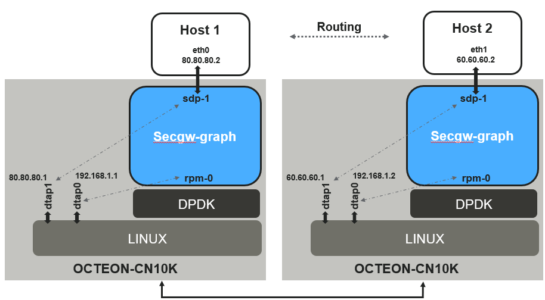
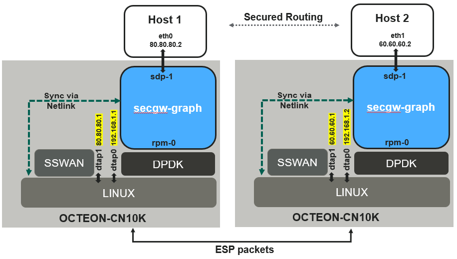

..  SPDX-License-Identifier: Marvell-MIT
    Copyright (c) 2024 Marvell.

***********
Secgw-graph
***********
``dao-secgw-graph`` or simply ``secgw-graph`` is a DPDK based security gateway
application providing IPv4 and IPsec dataplane functionalities which is
integrated with LINUX for control plane configuration, via netlink protocol

.. figure:: ./img/secgw-graph.png

Features
--------
 * DPDK rte_graph based fast path application integrated with LINUX control plane.
 * Supports policy based tunnel mode IPsec via DPDK libIPsec library. (Transport mode IPsec not yet supported)
 * Optimally leverages OCTEON10 inline IPsec protocol offload via rte_security APIs.
 * Integrated with LINUX for control plane configurations using netlink protocol.
 * Supports integration with ``strongswan daemon`` for IPsec SA/Policy negotiations
 * Supports dynamic addition of IP routes (LPM based)
 * Supports dynamic updates of IPsec SA and policies on a per-port basis.
 * Leverages ARP and ICMP functionality from LINUX
 * Supports dynamic addition/deletion of ports for RQ polling in fast path
 * Supports IPv4 (IPv6 not yet supported)

.. _secgw_setting_up_env:

Setting up environment
-------------------------

Setup of SDP and RPM  devices
~~~~~~~~~~~~~~~~~~~~~~~~~~~~~
In case OCTEON is used as PCI endpoint, make sure SDP config is configured properly in EBF menu

Setup huge pages for DPDK application
~~~~~~~~~~~~~~~~~~~~~~~~~~~~~~~~~~~~~
Setup enough hugepages and a mount point for the same in order for the ``dao-secgw-graph`` application
to run. For example to setup 4GB of hugepages of each size 512MB

.. code-block:: bash

   mkdir /dev/huge
   mount -t hugetlbfs none /dev/huge
   echo 8 > /proc/sys/vm/nr_hugepages

Bind required RPM VF's to vfio-pci
~~~~~~~~~~~~~~~~~~~~~~~~~~~~~~~~~~~
Sample code to map CN10K ethdev's to vfio-pci.

.. code-block:: bash

   RPM_PF=0002:02:00.0 OR (`lspci -d :a063 | head -1 | awk -e '{print $1}'`)
   RPM_PF_NAME=enP2p2s0
   VF_CNT=1

   dpdk-devbind.py -b rvu_nicpf $RPM_PF
   echo $VF_CNT > /sys/bus/pci/devices/$RPM_PF/sriov_numvfs

   RPM_VF=`lspci -d :a064 | awk -e '{print $1}'`

   dpdk-devbind.py -u $RPM_VF
   dpdk-devbind.py -b vfio-pci $RPM_VF

Bind required SDP VF's to vfio-pci
~~~~~~~~~~~~~~~~~~~~~~~~~~~~~~~~~~
Sample code to map CN10K SDPVF to vfio-pci.

.. code-block:: bash

   SDP_VF=0002:01:00.1 OR (`lspci -d :a0f7 | head -1 | awk -e '{print $1}'`)

   dpdk-devbind.py -u $SDP_VF
   dpdk-devbind.py -b vfio-pci $SDP_VF

Bind required CPT VF to vfio-pci
~~~~~~~~~~~~~~~~~~~~~~~~~~~~~~~~
Sample code to map CN10K CPT_VF to vfio-pci.

.. code-block:: bash

   CPT_PF=`lspci -d :a0f2 | head -1 | awk -e '{print $1}'`
   CPT_VF_CNT=1

   Check `dpdk-devbind.py -s` to check $CPT_PF is binded to kernel driver: `rvu_cptpf`

   echo $CPT_VF_CNT > /sys/bus/pci/devices/$CPT_PF/sriov_numvfs
   CPT_VF=`lspci -d :a0f3 | head -1 | awk -e '{print $1}'`

   dpdk-devbind.py -u $CPT_VF
   dpdk-devbind.py -b vfio-pci $CPT_VF

Bind required Inline device PF to vfio-pci
~~~~~~~~~~~~~~~~~~~~~~~~~~~~~~~~~~~~~~~~~~
Sample code to map CN10K INL_DEV_PF to vfio-pci.

.. code-block:: bash

   INL_DEV_PF=`lspci -d :a0f0 | head -1 | awk -e '{print $1}'`

   dpdk-devbind.py -u $INL_DEV_PF
   dpdk-devbind.py -b vfio-pci $INL_DEV_PF

Setting up Host environment
~~~~~~~~~~~~~~~~~~~~~~~~~~~
Perform following for configuring OCTEON as a PCIe endpoint to communicate with host via SDP interface

Install CNXK PCIe driver on OCTEON
^^^^^^^^^^^^^^^^^^^^^^^^^^^^^^^^^^

.. code-block:: bash

   modprobe pcie_marvell_cnxk_ep

Launch `octep_cp_agent` on OCTEON
^^^^^^^^^^^^^^^^^^^^^^^^^^^^^^^^^

.. code-block:: bash

   # octep_cp_agent octep_cp_cn10kxx.cfg

.. note:: Follow the steps to :doc:`Octep_cp_agent <../howtoguides/octep_agent>`

Insert OCTEON endpoint kernel driver on host
^^^^^^^^^^^^^^^^^^^^^^^^^^^^^^^^^^^^^^^^^^^^

.. code-block:: bash

   # git clone https://github.com/MarvellEmbeddedProcessors/pcie_ep_octeon_host
   # cd pcie_ep_octeon_host
   # make
   # insmod drivers/octeon_ep/octeon_ep.ko

Running `secgw-graph`
---------------------

Make sure number of tap devices provided in EAL command line is equal to number
of RPM and SDP devices combined. The application has following command line
options

.. code-block:: console

   dao-secgw-graph -a $RPM_VF -a $SDP_VF -a $CPT_VF -a $INL_DEV_PF [Other EAL Options] --vdev=net_tap0 --vdev=net_tap1 [-- -s app/secgw-graph/cli/secgw.cli]

EAL Options
~~~~~~~~~~~

The following are the EAL command-line options that can be used in conjunction
with the ``dao-secgw-graph`` application.
See the DPDK Getting Started Guides for more information on these options.

*   ``-c <COREMASK>`` or ``-l <CORELIST>``

        Set the hexadecimal bitmask of the cores to run on. The corelist is a
        list of cores to use.

Application Options
~~~~~~~~~~~~~~~~~~~

The following are the application command-line options:

* ``-s <CLI Script file>``

        Optional argument. CLI script file supported by applications.

* ``-i <Host IP address running application>``

        Optional argument. IP address of host, running this application, required to connect CLI. Default: ``localhost``

* ``-p <Listening Port Number>``

        Optional argument. UDP Port on which app should listen for CLI connection. Default: ``8086``

Application bootup logs
~~~~~~~~~~~~~~~~~~~~~~~

Example to command to run ``dao-secgw-graph`` on 1 ethdev and 1 SDP dev port with two tap devices

.. code-block:: console

    # ./build/app/dao-secgw-graph -a 0002:02:00.0 -a 0002:1f:00.1  -a 0002:20:00.1 -a 0002:0f:00.0 -c 0xf000 --vdev=net_tap0 --vdev=net_tap1 -- -s app/secgw-graph/cli/secgw.cli -i 127.0.0.1 -p 50000
    EAL: Detected CPU lcores: 24
    EAL: Detected NUMA nodes: 1
    EAL: Detected shared linkage of DPDK
    EAL: Multi-process socket /var/run/dpdk/rte/mp_socket
    EAL: Selected IOVA mode 'VA'
    EAL: 512 hugepages of size 2097152 reserved, but no mounted hugetlbfs found for that size
    EAL: VFIO support initialized
    EAL: Using IOMMU type 1 (Type 1)
    EAL: Probe PCI driver: net_cn10k (177d:a063) device: 0002:02:00.0 (socket 0)
    CNXK: RoC Model: cn10ka_b0 (HW_PLATFORM)
    EAL: Probe PCI driver: cnxk_nix_inl (177d:a0f0) device: 0002:0f:00.0 (socket 0)
    EAL: Probe PCI driver: net_cn10k (177d:a0f7) device: 0002:1f:00.1 (socket 0)
    EAL: Probe PCI driver: crypto_cn10k (177d:a0f3) device: 0002:20:00.1 (socket 0)
    CRYPTODEV: Creating cryptodev 0002:20:00.1
    CRYPTODEV: Initialisation parameters - name: 0002:20:00.1,socket id: 0, max queue pairs: 0
    TELEMETRY: No legacy callbacks, legacy socket not created
    [lcore 12] DAO_INFO: main[C0, C0]: dpdk_lcore_id: 12, dpdk_core_index: 0, dpdk_cpu_id: 12
    [lcore 12] DAO_INFO: wrkr[C1, W0]: dpdk_lcore_id:13, dpdk_core_index: 1, dpdk_cpu_id: 13
    [lcore 12] DAO_INFO: wrkr[C2, W1]: dpdk_lcore_id:14, dpdk_core_index: 2, dpdk_cpu_id: 14
    [lcore 12] DAO_INFO: wrkr[C3, W2]: dpdk_lcore_id:15, dpdk_core_index: 3, dpdk_cpu_id: 15
    [lcore 12] DAO_ERR: port_group_main not initialized
    [lcore 12] DAO_INFO: CLI configured 127.0.0.1:50000
    [lcore 12] DAO_INFO: rpmpf-0: Rx/Tx offloads capa: [0xee04f, 0x13d7bf]
    [lcore 12] DAO_INFO: rpmpf-0 configured with Rx/Tx offloads [0x800e, 0x2000e], Flags: 0x3
    [lcore 12] DAO_INFO: sdpvf-1: Rx/Tx offloads capa: [0xea04f, 0x13d7bf]
    [lcore 12] DAO_INFO: sdpvf-1 configured with Rx/Tx offloads [0x800e, 0x2000e], Flags: 0x3
    [lcore 12] DAO_INFO: rpmpf-0 paired with dtap0
    [lcore 12] DAO_INFO: sdpvf-1 paired with dtap1
    [lcore 13] DAO_INFO: W0: Eth-rx-node Polling Vector: [P0, Q0], [P1, Q0],
    [lcore 13] DAO_INFO: W0: Tap-rx-node Polling Vector: [P2, Q0], [P3, Q0],
    [lcore 15] DAO_INFO: W2: Eth-rx-node Polling Vector: [P0, Q2], [P1, Q2],
    [lcore 15] DAO_INFO: W2: Tap-rx-node Polling Vector: [P2, Q2], [P3, Q2],
    [lcore 14] DAO_INFO: W1: Eth-rx-node Polling Vector: [P0, Q1], [P1, Q1],
    [lcore 14] DAO_INFO: W1: Tap-rx-node Polling Vector: [P2, Q1], [P3, Q1],

CLI terminal
~~~~~~~~~~~~
Connect to CLI terminal via telnet

.. code-block:: console

   telnet <Host IP running app>:<Listening Port Number>

Example

.. code-block:: console

   # telnet localhost:50000
   Connected to localhost:50000

          WELCOME to Security Gateway App!

   secgw-graph>
   secgw-graph>

CLI commands
------------

The following are the supported application CLI commands

* ``show ports``

       Show runtime ports statistics

        .. code-block:: console

           secgw-graph> show ports

           ######################## NIC statistics: rpmpf-0 ########################
           Link-Status: Up         RX-packets: 0           RX-missed: 0
           RX-bytes: 0             RX-errors: 0            RX-nombuf:  0
           TX-packets: 17          TX-errors: 0            TX-bytes:  1397
           Throughput (since last show)
           Rx-pps:            0          Rx-bps:            0
           Tx-pps:            0          Tx-bps:            0

           ######################## NIC statistics: sdpvf-1 ########################
           Link-Status: Up         RX-packets: 21          RX-missed: 0
           RX-bytes: 1260          RX-errors: 0            RX-nombuf:  0
           TX-packets: 17          TX-errors: 0            TX-bytes:  1397
           Throughput (since last show)
           Rx-pps:            0          Rx-bps:            0
           Tx-pps:            0          Tx-bps:            0

           ######################## NIC statistics: dtap0   ########################
           Link-Status: Up         RX-packets: 17          RX-missed: 0
           RX-bytes: 1397          RX-errors: 0            RX-nombuf:  0
           TX-packets: 0           TX-errors: 0            TX-bytes:  0
           Throughput (since last show)
           Rx-pps:            0          Rx-bps:            0
           Tx-pps:            0          Tx-bps:            0

           ######################## NIC statistics: dtap1   ########################
           Link-Status: Up         RX-packets: 17          RX-missed: 0
           RX-bytes: 1397          RX-errors: 0            RX-nombuf:  0
           TX-packets: 21          TX-errors: 0            TX-bytes:  1260
           Throughput (since last show)
           Rx-pps:            0          Rx-bps:            0
           Tx-pps:            0          Tx-bps:            0

* ``show graph``

       Show runtime rte_graph statistics

        .. code-block:: console

           secgw-graph> show graph
           +-------------------------------+---------------+---------------+---------------+---------------+---------------+-----------+
           |Node                           |calls          |objs           |realloc_count  |objs/call      |objs/sec(10E6) |cycles/call|
           +-------------------------------+---------------+---------------+---------------+---------------+---------------+-----------+
           |secgw_ethdev-rx                |215093816      |21             |2              |0.000          |0.000000       |894.0000   |
           |secgw_taprx-rx                 |215093824      |13             |2              |0.000          |0.000000       |1295.0000  |
           |secgw_interface-output         |33             |34             |1              |1.000          |0.000000       |56.0000    |
           |secgw_port-mapper              |33             |34             |1              |1.000          |0.000000       |57.0000    |
           |secgw_pkt-cls                  |21             |21             |1              |1.000          |0.000000       |60.0000    |
           |ethdev-tx-0                    |10             |10             |1              |1.000          |0.000000       |157.0000   |
           |ethdev-tx-1                    |3              |3              |1              |1.000          |0.000000       |937.0000   |
           |tap-tx-1                       |21             |21             |1              |1.000          |0.000000       |2020.0000  |
           +-------------------------------+---------------+---------------+---------------+---------------+---------------+-----------+

* ``show routes``

       Show runtime IP4 routes

        .. code-block:: console

           secgw-graph> show routes
            Route   Type           IP           Device     Rewrite-Data
                0   local      80.80.80.1/ 8    rpmpf-0
                1   local      80.80.80.1/24    rpmpf-0
                2   local     192.168.1.1/24    rpmpf-0
                3 forward      80.80.80.2/32    sdpvf-1    0x10100ba02bb4f7d8e

* ``show neigh``

       Show runtime IP4 neighbors

        .. code-block:: console

           secgw-graph> show neigh
                   Type          IP           Device        Link addr
                             80.80.80.2/32    rpmpf-0    0: 0: 0: 1: 1: 0
             unresolved     192.168.1.2/32    rpmpf-0          ?

Running as IPv4 router
----------------------
``secgw-graph`` is capable of acting as an IPv4 router where routes can be
added at runtime. It relies on LINUX network stack for resolving ARP entries
while it maintains its own IP FIB lookup in fast-path

Configuration
~~~~~~~~~~~~~
Following example can be used as a reference to configure ``secgw-graph`` as an IPv4 router

Launch `secgw-graph` on CN10K
^^^^^^^^^^^^^^^^^^^^^^^^^^^^^
Launch ``secgw-graph`` on each CN10K with valid PCI BDFs and LINUX tap devices

.. code-block:: console

    # ./build/app/dao-secgw-graph -a 0002:02:00.0 -a 0002:1f:00.1  -a 0002:20:00.1 -a 0002:0f:00.0 -c 0xf000 --vdev=net_tap0 --vdev=net_tap1 -- -s app/secgw-graph/cli/secgw.cli

.. note:: PCI devices may vary on each OCTEON. Please refer to :ref:`section<secgw_setting_up_env>`

IP assignments
^^^^^^^^^^^^^^

OCTEON connected to host1
+++++++++++++++++++++++++
Run following commands on OCTEON LINUX

.. code-block:: console

   ip link set dev dtap1 address 00:0f:b7:22:22:22
   ip link set dev dtap0 address 00:0f:b7:06:55:1e
   ifconfig dtap1 80.80.80.1/24 up
   ifconfig dtap0 192.168.1.1/24 up
   ip route add 60.60.60.2/32 via 192.168.1.2 dev dtap0

.. note:: Above command assumes that "dtap0" LINUX interface is paired with RPM device
   while "dtap1" interface is paired with SDP. Pairing logs are printed in
   application boot-up sequence

host1
+++++

.. code-block:: console

   ifconfig eth0 80.80.80.2/24 up
   ip route add 60.60.60.0/24 via 80.80.80.1

.. note:: Above command assumes that "eth0" host interface connected to OCTEON
   via SDP interface

OCTEON connected to host2
+++++++++++++++++++++++++

.. code-block:: console

   ip link set dev dtap1 address 00:0f:b7:11:11:11
   ip link set dev dtap0 address 00:0f:b7:06:55:1f
   ifconfig dtap1 60.60.60.1/24 up
   ifconfig dtap0 192.168.1.2/24 up
   ip route add 80.80.80.2/32 via 192.168.1.1 dev dtap0

.. note:: Above command assumes that "dtap0" LINUX interface is paired with RPM device
   while "dtap1" interface is paired with SDP. Pairing logs are printed in
   application boot-up sequence

host2
+++++

.. code-block:: console

   ifconfig eth1 60.60.60.2/24 up
   ip route add 80.80.80.0/24 via 60.60.60.1

.. note:: Above command assumes that "eth1" host interface connected to OCTEON
   via SDP interface

`ping` host2 IP from host1
~~~~~~~~~~~~~~~~~~~~~~~~~~
After above configuration user may need to resolve `partial routes` manually by
following :ref:`section<resolve_partial_routes>`. `ping` or `iperf` is ready to
run between host1 and host2

.. code-block:: bash

   host-1# ping 60.60.60.2
   PING 60.60.60.2 (60.60.60.2) 56(84) bytes of data.
   64 bytes from 60.60.60.2: icmp_seq=1 ttl=62 time=0.604 ms

   --- 60.60.60.2 ping statistics ---
   1 packets transmitted, 1 received, 0% packet loss, time 0ms
   rtt min/avg/max/mdev = 0.604/0.604/0.604/0.000 ms

How it works
~~~~~~~~~~~~
``secgw-graph`` creates a LINUX TAP device for each NIC device on OCTEON. In
other words, each NIC device (rpmvf, sdpvf) are paired with a unique ``tap``
device on LINUX. Packets sent or received to/from these ``tap`` interfaces on
LINUX are cross-connected via ``secgw-graph`` to their respective paired
devices. Similarly, any control plane configurations on these ``tap`` interfaces
like IP address assignment, L2 address assignment would apply similar
configurations to their respective NIC devices (rpmvf or sdpvf etc) in
application

.. code-block:: console

   # ifconfig dtap0
   dtap0: flags=4419<UP,BROADCAST,RUNNING,PROMISC,MULTICAST>  mtu 1500
           inet 192.168.1.1  netmask 255.255.255.0  broadcast 192.168.1.255
           inet6 fe80::ec99:8bff:fe3c:e515  prefixlen 64  scopeid 0x20<link>
           ether 00:0f:b7:06:55:1e  txqueuelen 1000  (Ethernet)
           RX packets 0  bytes 0 (0.0 B)
           RX errors 0  dropped 0  overruns 0  frame 0
           TX packets 169  bytes 11996 (11.7 KiB)
           TX errors 0  dropped 0 overruns 0  carrier 0  collisions 0

   # ifconfig dtap1
   dtap1: flags=4419<UP,BROADCAST,RUNNING,PROMISC,MULTICAST>  mtu 1500
           inet 80.80.80.1  netmask 255.255.255.0  broadcast 80.80.80.255
           inet6 fe80::1cc5:77ff:fe37:d469  prefixlen 64  scopeid 0x20<link>
           ether 00:0f:b7:22:22:22  txqueuelen 1000  (Ethernet)
           RX packets 37111  bytes 2230705 (2.1 MiB)
           RX errors 0  dropped 0  overruns 0  frame 0
           TX packets 173  bytes 12276 (11.9 KiB)
           TX errors 0  dropped 0 overruns 0  carrier 0  collisions 0

.. note:: Tap interfaces allows secgw-graph to reuse LINUX control plane
   functionalities like ARP resolution, IKE negotiations etc.

.. _resolve_partial_routes:

Resolving Partial Routes
~~~~~~~~~~~~~~~~~~~~~~~~
``secgw-graph`` installs only `complete routes` (a route which is `connected`
with its ARP entry resolved) in its IP lookup table. A route with an unresolved
ARP is called as `partial route` and it will not be installed in IP lookup
table until its ARP entry is unresolved. Unresolved routes can be seen via
``show neigh`` commands from CLI

.. code-block:: console

   secgw-graph> show neigh
           Type          IP           Device        Link addr
                     80.80.80.2/32    rpmpf-0    0: 0: 0: 1: 1: 0
     unresolved     192.168.1.2/32    rpmpf-0          ?

In above example, route to `80.80.80.2/32` is `complete or connected` while
route to `192.168.1.2/32` is `partial`. Often a manual ``ping`` to a `partial
route` from LINUX interface would resolve it's ARP

.. code-block:: console

   # ping 192.168.1.1
   PING 192.168.1.1 (192.168.1.1) 56(84) bytes of data.
   64 bytes from 192.168.1.1: icmp_seq=1 ttl=64 time=0.026 ms

   --- 192.168.1.1 ping statistics ---
   1 packets transmitted, 1 received, 0% packet loss, time 0ms
   rtt min/avg/max/mdev = 0.026/0.026/0.026/0.000 ms

   # telnet localhost:8086
   Connected to localhost:8086

                   WELCOME to Security Gateway App!
   secgw-graph> show neigh
           Type          IP           Device        Link addr
                    192.168.1.2/32    rpmpf-0    0: f:b7:11:11:11
                     80.80.80.2/32    sdpvf-1    0: 0: 0: 1: 1: 0
   secgw-graph>

Running as IPsec gateway
------------------------
``secgw-graph`` can behave as IPsec gateway where SA/SPD negotiations happens
via IKE daemon (like Strongswan) on LINUX.

Configuration
~~~~~~~~~~~~~
Following example can be used as a reference to configure ``secgw-graph`` as an IPsec gateway

.. _ipsec_figure:

.. note:: Following example assumes that Strongswan or any other IKE daemon is installed on OCTEON LINUX

Configure Strongswan on OCTEON
^^^^^^^^^^^^^^^^^^^^^^^^^^^^^^
Perform configuring strongswan daemon on *both* OCTEON LINUX

`swanctl.conf`
++++++++++++++
Update ``/etc/strongswan.d/charon.conf`` to restrict IPsec SPI ranges from 500 to 5000

.. code-block:: console

   charon {
            spi_max = 0x1388
            spi_min = 0x1f4
   }

`ipsec.conf`
++++++++++++
Update ``/etc/ipsec.conf`` on both OCTEON to reflect above network topology
as shown in :ref:`above figure<ipsec_figure>`

- Configure Tunnel mode IPsec between IP endpoints `192.168.1.1 <-> 192.168.1.2`
- SA rekeying disabled
- Anti-replay and ESN disabled
- IPsec algorithm as AES256-SHA1
- IP subnets as shown in :ref:`figure<ipsec_figure>`

`ipsec.conf` on OCTEON connected to host1
'''''''''''''''''''''''''''''''''''''''''
.. code-block:: console

   config setup
        ...
        ...
        ...

   conn tunnel-dpu1-dpu2
        type=tunnel
        auto=start
        keyexchange=ikev2
        authby=secret
        aggressive=no
        keyingtries=%forever
        ikelifetime=28800s
        lifetime=3600s
        rekey=no
        left=192.168.1.1
        leftsubnet=80.80.80.0/24
        right=192.168.1.2
        rightsubnet=60.60.60.0/24
        replay_window=0
        esp=aes256-sha1-esn-noesn!

`ipsec.conf` on OCTEON connected to host2
'''''''''''''''''''''''''''''''''''''''''
.. code-block:: console

   config setup
        ...
        ...
        ...

   conn tunnel-dpu2-dpu1
        type=tunnel
        auto=start
        keyexchange=ikev2
        authby=secret
        aggressive=no
        keyingtries=%forever
        ikelifetime=28800s
        lifetime=3600s
        rekey=no
        left=192.168.1.2
        leftsubnet=60.60.60.0/24
        right=192.168.1.1
        rightsubnet=80.80.80.0/24
        replay_window=0
        esp=aes256-sha1-esn-noesn!

Assign IP and start IPsec daemon
^^^^^^^^^^^^^^^^^^^^^^^^^^^^^^^^^

host1
+++++

.. code-block:: console

   ifconfig eth0 80.80.80.2/24 up
   ip route add 60.60.60.0/24 via 80.80.80.1

.. note:: Above command assumes that "eth0" host interface connected to OCTEON
   via SDP interface

OCTEON connected to host1
+++++++++++++++++++++++++
Run following commands on OCTEON LINUX

.. code-block:: console

   ipsec stop
   ip link set dev dtap1 address 00:0f:b7:22:22:22
   ip link set dev dtap0 address 00:0f:b7:06:55:1e
   ifconfig dtap1 80.80.80.1/24 up
   ifconfig dtap0 192.168.1.1/24 up
   ip route add 60.60.60.2/32 via 192.168.1.2 dev dtap0
   ipsec start

.. note:: Above command assumes that "dtap0" LINUX interface is paired with RPM device
   while "dtap1" interface is paired with SDP. Pairing logs are printed in
   application boot-up sequence

OCTEON connected to host2
+++++++++++++++++++++++++

.. code-block:: console

   ipse stop
   ip link set dev dtap1 address 00:0f:b7:11:11:11
   ip link set dev dtap0 address 00:0f:b7:06:55:1f
   ifconfig dtap1 60.60.60.1/24 up
   ifconfig dtap0 192.168.1.2/24 up
   ip route add 80.80.80.2/32 via 192.168.1.1 dev dtap0
   ipsec start

.. note:: Above command assumes that "dtap0" LINUX interface is paired with RPM device
   while "dtap1" interface is paired with SDP. Pairing logs are printed in
   application boot-up sequence

host2
+++++

.. code-block:: console

   ifconfig eth1 60.60.60.2/24 up
   ip route add 80.80.80.0/24 via 60.60.60.1

.. note:: Above command assumes that "eth1" host interface connected to OCTEON
   via SDP interface

Check IPsec configuration
~~~~~~~~~~~~~~~~~~~~~~~~~
Use ``ip xfrm`` command to verify IPsec configurations

OCTEON connected to host1
^^^^^^^^^^^^^^^^^^^^^^^^^
.. code-block:: bash

   # ip x s
   src 192.168.1.1 dst 192.168.1.2
           proto esp spi 0x0000028b reqid 1 mode tunnel
           replay-window 0 flag af-unspec
           auth-trunc hmac(sha1) 0x7c7ce3a4f28bf3ab0f590a4c2e4ea87c59eb69a9 96
           enc cbc(aes) 0x6c248f224a25d5e3c39925cd056d1f3eff042ef1e8f104a0da39aee998a2d9c9
           anti-replay context: seq 0x0, oseq 0x0, bitmap 0x00000000
   src 192.168.1.2 dst 192.168.1.1
           proto esp spi 0x000009ad reqid 1 mode tunnel
           replay-window 0 flag af-unspec
           auth-trunc hmac(sha1) 0x520311d57e1eae550cfb50ec7924790455b0fdd0 96
           enc cbc(aes) 0xb3d76e12816f8c2953b879f2606f8b6b391c448b6c159bbec8634b237d5d1a9f
           anti-replay context: seq 0x0, oseq 0x0, bitmap 0x00000000
   src 192.168.1.2 dst 192.168.1.1
           proto esp spi 0x00000002 reqid 1 mode tunnel
           replay-window 0
           auth-trunc digest_null  0
           enc ecb(cipher_null)
           anti-replay context: seq 0x0, oseq 0x0, bitmap 0x00000000
           sel src 0.0.0.0/0 dst 0.0.0.0/0
   src 192.168.1.1 dst 192.168.1.2
           proto esp spi 0x00000001 reqid 1 mode tunnel
           replay-window 0
           auth-trunc digest_null  0
           enc ecb(cipher_null)
           anti-replay context: seq 0x0, oseq 0x0, bitmap 0x00000000
           sel src 0.0.0.0/0 dst 0.0.0.0/0
   #
   # ip x p
   src 80.80.80.0/24 dst 60.60.60.0/24
           dir out priority 375423
           tmpl src 192.168.1.1 dst 192.168.1.2
                   proto esp spi 0x0000028b reqid 1 mode tunnel
   src 60.60.60.0/24 dst 80.80.80.0/24
           dir fwd priority 375423
           tmpl src 192.168.1.2 dst 192.168.1.1
                   proto esp reqid 1 mode tunnel
   src 60.60.60.0/24 dst 80.80.80.0/24
           dir in priority 375423
           tmpl src 192.168.1.2 dst 192.168.1.1
                   proto esp reqid 1 mode tunnel
   src 0.0.0.0/0 dst 0.0.0.0/0
           socket in priority 0
   src 0.0.0.0/0 dst 0.0.0.0/0
           socket out priority 0
   src 0.0.0.0/0 dst 0.0.0.0/0
           socket in priority 0
   src 0.0.0.0/0 dst 0.0.0.0/0
           socket out priority 0
   src ::/0 dst ::/0
           socket in priority 0
   src ::/0 dst ::/0
           socket out priority 0
   src ::/0 dst ::/0
           socket in priority 0
   src ::/0 dst ::/0
           socket out priority 0
   #

OCTEON connected to host2
^^^^^^^^^^^^^^^^^^^^^^^^^
.. code-block:: bash

   # ip x s
   src 192.168.1.2 dst 192.168.1.1
           proto esp spi 0x000009ad reqid 1 mode tunnel
           replay-window 0 flag af-unspec
           auth-trunc hmac(sha1) 0x520311d57e1eae550cfb50ec7924790455b0fdd0 96
           enc cbc(aes) 0xb3d76e12816f8c2953b879f2606f8b6b391c448b6c159bbec8634b237d5d1a9f
           anti-replay context: seq 0x0, oseq 0x0, bitmap 0x00000000
   src 192.168.1.1 dst 192.168.1.2
           proto esp spi 0x0000028b reqid 1 mode tunnel
           replay-window 0 flag af-unspec
           auth-trunc hmac(sha1) 0x7c7ce3a4f28bf3ab0f590a4c2e4ea87c59eb69a9 96
           enc cbc(aes) 0x6c248f224a25d5e3c39925cd056d1f3eff042ef1e8f104a0da39aee998a2d9c9
           anti-replay context: seq 0x0, oseq 0x0, bitmap 0x00000000
   src 192.168.1.2 dst 192.168.1.1
           proto esp spi 0x00000002 reqid 1 mode tunnel
           replay-window 0
           auth-trunc digest_null  0
           enc ecb(cipher_null)
           anti-replay context: seq 0x0, oseq 0x0, bitmap 0x00000000
           sel src 0.0.0.0/0 dst 0.0.0.0/0
   src 192.168.1.1 dst 192.168.1.2
           proto esp spi 0x00000001 reqid 1 mode tunnel
           replay-window 0
           auth-trunc digest_null  0
           enc ecb(cipher_null)
           anti-replay context: seq 0x0, oseq 0x0, bitmap 0x00000000
           sel src 0.0.0.0/0 dst 0.0.0.0/0
   #
   # ip x p
   src 60.60.60.0/24 dst 80.80.80.0/24
           dir out priority 375423
           tmpl src 192.168.1.2 dst 192.168.1.1
                   proto esp spi 0x000009ad reqid 1 mode tunnel
   src 80.80.80.0/24 dst 60.60.60.0/24
           dir fwd priority 375423
           tmpl src 192.168.1.1 dst 192.168.1.2
                   proto esp reqid 1 mode tunnel
   src 80.80.80.0/24 dst 60.60.60.0/24
           dir in priority 375423
           tmpl src 192.168.1.1 dst 192.168.1.2
                   proto esp reqid 1 mode tunnel
   src 0.0.0.0/0 dst 0.0.0.0/0
           socket in priority 0
   src 0.0.0.0/0 dst 0.0.0.0/0
           socket out priority 0
   src 0.0.0.0/0 dst 0.0.0.0/0
           socket in priority 0
   src 0.0.0.0/0 dst 0.0.0.0/0
           socket out priority 0
   src ::/0 dst ::/0
           socket in priority 0
   src ::/0 dst ::/0
           socket out priority 0
   src ::/0 dst ::/0
           socket in priority 0
   src ::/0 dst ::/0
           socket out priority 0
   #

`ping` host2 IP from host1
~~~~~~~~~~~~~~~~~~~~~~~~~~
After above configuration user may need to resolve `partial routes` manually by
following :ref:`section<resolve_partial_routes>`. `ping` or `iperf` is ready to
run between host1 and host2

.. code-block:: bash

   host-1# ping 60.60.60.2
   PING 60.60.60.2 (60.60.60.2) 56(84) bytes of data.
   64 bytes from 60.60.60.2: icmp_seq=1 ttl=62 time=0.604 ms

   --- 60.60.60.2 ping statistics ---
   1 packets transmitted, 1 received, 0% packet loss, time 0ms
   rtt min/avg/max/mdev = 0.604/0.604/0.604/0.000 ms

Planned Features
----------------
- Support IPv6 routing
- Support IP fragmentation
- Support 100G as PCI endpoint by integrating virtio on OCTEON
- Support for lookaside IPsec protocol support

Known Issues
------------
#. Application is in POC state but it is targeted to be production ready in future
#. IPsec SA renegotiations are not yet supported
#. Routes deletions are not yet supported
#. ``secgw-graph`` when launched with CLI file argument becomes unresponsive with Ctrl-C or Ctrl-D commands. Please use ``kill`` command to terminate the program. Although CLI telnet session would remain responsive with no affect to fast path traffic

