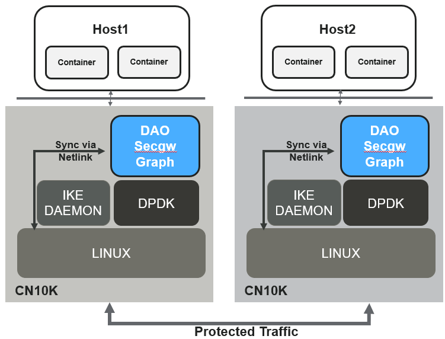

..  SPDX-License-Identifier: Marvell-MIT
    Copyright (c) 2024 Marvell.

****************
Security Gateway
****************
``secgw-graph`` is a security gateway application based on rte_graph library
which provides IP and IPsec functionality.

Features
--------
 * DPDK rte_graph based fast path application integrated with LINUX control plane
 * Supports integration with Strongswan daemon for SA negotiations
 * Supports dynamic addition of IP routes (LPM based)
 * Supports dynamic updates of IPsec SA and policies on a per-port basis.
 * Leverages ARP and ICMP functionality from LINUX
 * Supports dynamic addition/deletion of ports forRQ polling in fast path
 * Supports IPv4 (but not IPv6 yet)

Setting up environment
-------------------------

Setup of SDP and RPM  devices
~~~~~~~~~~~~~~~~~~~~~~~~~~~~~
In case OCTEON is used as PCI endpoint, make sure SDP config is configured properly in EBF menu

Setup huge pages for DPDK application
~~~~~~~~~~~~~~~~~~~~~~~~~~~~~~~~~~~~~
Setup enough hugepages and a mount point for the same in order for the dao-secgw-graph application
to run.

Bind required RPM VF's to vfio-pci
~~~~~~~~~~~~~~~~~~~~~~~~~~~~~~~~~~~
Sample code to map CN10K ethdev's to vfio-pci.

.. code-block:: bash

   RPM_PF=0002:02:00.0 OR (`lspci -d :a063 | head -1 | awk -e '{print $1}'`)
   RPM_PF_NAME=enP2p2s0
   VF_CNT=1

   dpdk-devbind.py -b rvu_nicpf $RPM_PF
   echo $VF_CNT > /sys/bus/pci/devices/$RPM_PF/sriov_numvfs

   RPM_VF=`lspci -d :a064 | awk -e '{print $1}'`

   dpdk-devbind.py -u $RPM_VF
   dpdk-devbind.py -b vfio-pci $RPM_VF

Bind required SDP VF's to vfio-pci
~~~~~~~~~~~~~~~~~~~~~~~~~~~~~~~~~~
Sample code to map CN10K SDPVF to vfio-pci.

.. code-block:: bash

   SDP_VF=0002:01:00.1 OR (`lspci -d :a0f7 | head -1 | awk -e '{print $1}'`)

   dpdk-devbind.py -u $SDP_VF
   dpdk-devbind.py -b vfio-pci $SDP_VF

Bind required CPT VF to vfio-pci
~~~~~~~~~~~~~~~~~~~~~~~~~~~~~~~~
Sample code to map CN10K CPT_VF to vfio-pci.

.. code-block:: bash

   CPT_PF=`lspci -d :a0f2 | head -1 | awk -e '{print $1}'`
   CPT_VF_CNT=1

   Check `dpdk-devbind.py -s` to check $CPT_PF is binded to kernel driver: `rvu_cptpf`

   echo $CPT_VF_CNT > /sys/bus/pci/devices/$CPT_PF/sriov_numvfs
   CPT_VF=`lspci -d :a0f3 | head -1 | awk -e '{print $1}'`

   dpdk-devbind.py -u $CPT_VF
   dpdk-devbind.py -b vfio-pci $CPT_VF

Bind required Inline device PF to vfio-pci
~~~~~~~~~~~~~~~~~~~~~~~~~~~~~~~~~~~~~~~~~~
Sample code to map CN10K INL_DEV_PF to vfio-pci.

.. code-block:: bash

   INL_DEV_PF=`lspci -d :a0f0 | head -1 | awk -e '{print $1}'`

   dpdk-devbind.py -u $INL_DEV_PF
   dpdk-devbind.py -b vfio-pci $INL_DEV_PF

Running the application
-----------------------

Make sure number of tap devices provided in EAL command line is equal to number of RPM and SDP devices combined. The application has following command line options

.. code-block:: console

   dao-secgw-graph -a $RPM_VF -a $SDP_VF -a $CPT_VF -a $INL_DEV_PF [Other EAL Options] --vdev=net_tap0 --vdev=net_tap1 [-- -s app/secgw-graph/cli/secgw.cli]

EAL Options
~~~~~~~~~~~

The following are the EAL command-line options that can be used in conjunction
with the ``dao-secgw-graph`` application.
See the DPDK Getting Started Guides for more information on these options.

*   ``-c <COREMASK>`` or ``-l <CORELIST>``

        Set the hexadecimal bitmask of the cores to run on. The corelist is a
        list of cores to use.

Application Options
~~~~~~~~~~~~~~~~~~~

The following are the application command-line options:

* ``-s <CLI Script file>``

        Optional argument. CLI script file supported by applications.

* ``-i <Host IP address running application>``

        Optional argument. IP address of host, running this application, required to connect CLI. Default: ``localhost``

* ``-p <Listening Port Number>``

        Optional argument. UDP Port on which app should listen for CLI connection. Default: ``8086``

Example to run app
~~~~~~~~~~~~~~~~~~~~~~~~~~~

Example to command to run ``dao-secgw-graph`` on 1 ethdev and 1 SDP dev port with two tap devices

.. code-block:: console

    # ./build/app/dao-secgw-graph -a 0002:02:00.0 -a 0002:1f:00.1  -a 0002:20:00.1 -a 0002:0f:00.0 -c 0xf000 --vdev=net_tap0 --vdev=net_tap1 -- -s app/secgw-graph/cli/secgw.cli -i 127.0.0.1 -p 50000
    EAL: Detected CPU lcores: 24
    EAL: Detected NUMA nodes: 1
    EAL: Detected shared linkage of DPDK
    EAL: Multi-process socket /var/run/dpdk/rte/mp_socket
    EAL: Selected IOVA mode 'VA'
    EAL: 512 hugepages of size 2097152 reserved, but no mounted hugetlbfs found for that size
    EAL: VFIO support initialized
    EAL: Using IOMMU type 1 (Type 1)
    EAL: Probe PCI driver: net_cn10k (177d:a063) device: 0002:02:00.0 (socket 0)
    CNXK: RoC Model: cn10ka_b0 (HW_PLATFORM)
    EAL: Probe PCI driver: cnxk_nix_inl (177d:a0f0) device: 0002:0f:00.0 (socket 0)
    EAL: Probe PCI driver: net_cn10k (177d:a0f7) device: 0002:1f:00.1 (socket 0)
    EAL: Probe PCI driver: crypto_cn10k (177d:a0f3) device: 0002:20:00.1 (socket 0)
    CRYPTODEV: Creating cryptodev 0002:20:00.1
    CRYPTODEV: Initialisation parameters - name: 0002:20:00.1,socket id: 0, max queue pairs: 0
    TELEMETRY: No legacy callbacks, legacy socket not created
    [lcore 12] DAO_INFO: main[C0, C0]: dpdk_lcore_id: 12, dpdk_core_index: 0, dpdk_cpu_id: 12
    [lcore 12] DAO_INFO: wrkr[C1, W0]: dpdk_lcore_id:13, dpdk_core_index: 1, dpdk_cpu_id: 13
    [lcore 12] DAO_INFO: wrkr[C2, W1]: dpdk_lcore_id:14, dpdk_core_index: 2, dpdk_cpu_id: 14
    [lcore 12] DAO_INFO: wrkr[C3, W2]: dpdk_lcore_id:15, dpdk_core_index: 3, dpdk_cpu_id: 15
    [lcore 12] DAO_ERR: port_group_main not initialized
    [lcore 12] DAO_INFO: CLI configured 127.0.0.1:50000
    [lcore 12] DAO_INFO: rpmpf-0: Rx/Tx offloads capa: [0xee04f, 0x13d7bf]
    [lcore 12] DAO_INFO: rpmpf-0 configured with Rx/Tx offloads [0x800e, 0x2000e], Flags: 0x3
    [lcore 12] DAO_INFO: sdpvf-1: Rx/Tx offloads capa: [0xea04f, 0x13d7bf]
    [lcore 12] DAO_INFO: sdpvf-1 configured with Rx/Tx offloads [0x800e, 0x2000e], Flags: 0x3
    [lcore 12] DAO_INFO: rpmpf-0 paired with dtap0
    [lcore 12] DAO_INFO: sdpvf-1 paired with dtap1
    [lcore 13] DAO_INFO: W0: Eth-rx-node Polling Vector: [P0, Q0], [P1, Q0],
    [lcore 13] DAO_INFO: W0: Tap-rx-node Polling Vector: [P2, Q0], [P3, Q0],
    [lcore 15] DAO_INFO: W2: Eth-rx-node Polling Vector: [P0, Q2], [P1, Q2],
    [lcore 15] DAO_INFO: W2: Tap-rx-node Polling Vector: [P2, Q2], [P3, Q2],
    [lcore 14] DAO_INFO: W1: Eth-rx-node Polling Vector: [P0, Q1], [P1, Q1],
    [lcore 14] DAO_INFO: W1: Tap-rx-node Polling Vector: [P2, Q1], [P3, Q1],

CLI terminal
~~~~~~~~~~~~
Connect to CLI terminal via telnet

.. code-block:: console

   telnet <Host IP running app>:<Listening Port Number>

Example

.. code-block:: console

   # telnet localhost:50000
   Connected to localhost:50000

          WELCOME to Security Gateway App!

   secgw-graph>
   secgw-graph>

CLI commands
------------

The following are the application CLI commands

* ``show ports``

       Show runtime ports statistics

        .. code-block:: console

           secgw-graph> show ports

           ######################## NIC statistics: rpmpf-0 ########################
           Link-Status: Up         RX-packets: 0           RX-missed: 0
           RX-bytes: 0             RX-errors: 0            RX-nombuf:  0
           TX-packets: 17          TX-errors: 0            TX-bytes:  1397
           Throughput (since last show)
           Rx-pps:            0          Rx-bps:            0
           Tx-pps:            0          Tx-bps:            0

           ######################## NIC statistics: sdpvf-1 ########################
           Link-Status: Up         RX-packets: 21          RX-missed: 0
           RX-bytes: 1260          RX-errors: 0            RX-nombuf:  0
           TX-packets: 17          TX-errors: 0            TX-bytes:  1397
           Throughput (since last show)
           Rx-pps:            0          Rx-bps:            0
           Tx-pps:            0          Tx-bps:            0

           ######################## NIC statistics: dtap0   ########################
           Link-Status: Up         RX-packets: 17          RX-missed: 0
           RX-bytes: 1397          RX-errors: 0            RX-nombuf:  0
           TX-packets: 0           TX-errors: 0            TX-bytes:  0
           Throughput (since last show)
           Rx-pps:            0          Rx-bps:            0
           Tx-pps:            0          Tx-bps:            0

           ######################## NIC statistics: dtap1   ########################
           Link-Status: Up         RX-packets: 17          RX-missed: 0
           RX-bytes: 1397          RX-errors: 0            RX-nombuf:  0
           TX-packets: 21          TX-errors: 0            TX-bytes:  1260
           Throughput (since last show)
           Rx-pps:            0          Rx-bps:            0
           Tx-pps:            0          Tx-bps:            0

* ``show graph``

       Show runtime rte_graph statistics

        .. code-block:: console

           secgw-graph> show graph
           +-------------------------------+---------------+---------------+---------------+---------------+---------------+-----------+
           |Node                           |calls          |objs           |realloc_count  |objs/call      |objs/sec(10E6) |cycles/call|
           +-------------------------------+---------------+---------------+---------------+---------------+---------------+-----------+
           |secgw_ethdev-rx                |215093816      |21             |2              |0.000          |0.000000       |894.0000   |
           |secgw_taprx-rx                 |215093824      |13             |2              |0.000          |0.000000       |1295.0000  |
           |secgw_interface-output         |33             |34             |1              |1.000          |0.000000       |56.0000    |
           |secgw_port-mapper              |33             |34             |1              |1.000          |0.000000       |57.0000    |
           |secgw_pkt-cls                  |21             |21             |1              |1.000          |0.000000       |60.0000    |
           |ethdev-tx-0                    |10             |10             |1              |1.000          |0.000000       |157.0000   |
           |ethdev-tx-1                    |3              |3              |1              |1.000          |0.000000       |937.0000   |
           |tap-tx-1                       |21             |21             |1              |1.000          |0.000000       |2020.0000  |
           +-------------------------------+---------------+---------------+---------------+---------------+---------------+-----------+

* ``show routes``

       Show runtime IP4 routes

        .. code-block:: console

           secgw-graph> show routes
            Route   Type           IP           Device     Rewrite-Data
                0   local      80.80.80.1/ 8    rpmpf-0
                1   local      80.80.80.1/24    rpmpf-0
                2   local     192.168.1.1/24    rpmpf-0
                3 forward      80.80.80.2/32    sdpvf-1    0x10100ba02bb4f7d8e

* ``show neigh``

       Show runtime IP4 neighbors

        .. code-block:: console

           secgw-graph> show neigh
                   Type          IP           Device        Link addr
                             80.80.80.2/32    rpmpf-0    0: 0: 0: 1: 1: 0
             unresolved     192.168.1.2/32    rpmpf-0          ?

Setting up Host environment
---------------------------
TBD

Performance Tuning on Host
~~~~~~~~~~~~~~~~~~~~~~~~~~
TBD
