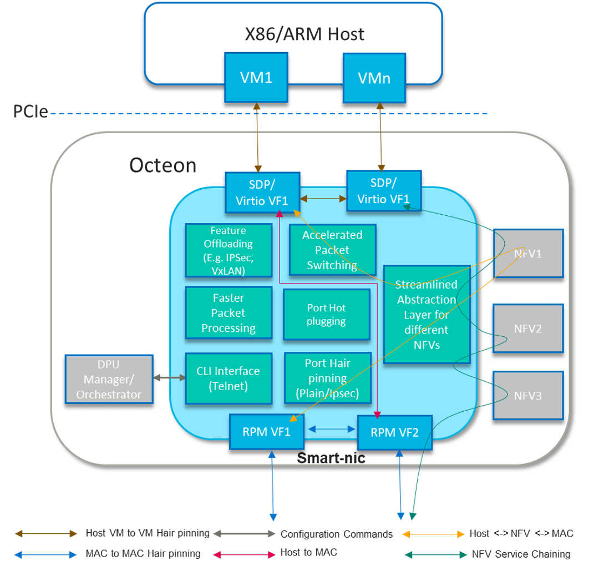

..  SPDX-License-Identifier: Marvell-MIT
    Copyright (c) 2024 Marvell.

******************************
Universal SmartNIC Turnkey App
******************************

Introduction
============

Universal Smart NIC app is a powerful tool that harnesses the performance
and efficiency of hardware accelerators in DPUs. It also mitigates some
hardware gaps by providing optimized software solution for advanced
features like as port hair pinning, tunnel-transport, port hotplugging, etc.



Port hairpinning facilitates packet routing between Ethernet MAC, PCI endpoint
port, and network function virtualization (NFVs). With this feature NFV
service chaining can be achieved.

Port hotplugging refers to the dynamically add or remove network ports from
virtual or host machine without requiring the VM or host machine to be powered
off or restarted. In demanding situation, administrators can hotplug additional
network ports to meet the high traffic flow without affecting other VMs
operation.

Feature List
------------

Its adaptability ensures seamless integration and enhanced functionality.

Completed
`````````
* Rich command line interface (CLI) with telnet support
* Port hairpininng

Planned
```````
* 100Gbps virtio
* MAC Learning
* Network function service chaining.

Pending
```````
* Port hotplugging
* 200Gbs IPsec
* SA sharing between CPT and SW
* IPsec strong swan integration
* virtio block support for storage
* tunnel-transport
* Pre-fragmentation, post fragmentation
* Full back pressure support in all Traffic directions
* PFC support on RPM
* support for virtio queues

Getting the sources and compile
===============================

OVS-offload application is part of the ``DAO`` package and follow
:doc:`steps to build DAO <../gsg/build>`

Binding required devices
------------------------

Smart NIC app needs RPM and SDP ports for inter connectivity between host and
outside network.

Binding SDP and RPM VFs
```````````````````````
Check for device ID ``0xa0f7`` viz SDP VF and bind to vfio-pci

.. code-block:: console

 # dpdk-devbind.py -s
 0002:1f:00.1 'Octeon Tx2 SDP Virtual Function a0f7' if=sdp31-0 drv=rvu_nicvf unused=vfio-pci
 0002:1f:00.2 'Octeon Tx2 SDP Virtual Function a0f7' if=sdp31-1 drv=rvu_nicvf unused=vfio-pci

 # dpdk-devbind.py -b vfio-pci 0002:1f:00.1
 # dpdk-devbind.py -b vfio-pci 0002:1f:00.2


Create VFs, check for device ID ``0xa064`` viz RPM (NIX) VF and bind to vfio-pci

.. code-block:: console

 # echo 2 > /sys/bus/pci/devices/0002\:02\:00.0/sriov_numvfs

 # dpdk-devbind.py -s
 0002:02:00.1 'Octeon Tx2 RVU Virtual Function a064' if=eth1 drv=rvu_nicvf unused=vfio-pci
 0002:02:00.2 'Octeon Tx2 RVU Virtual Function a064' if=eth5 drv=rvu_nicvf unused=vfio-pci

 # dpdk-devbind.py -b vfio-pci 0002:02:00.1
 # dpdk-devbind.py -b vfio-pci 0002:02:00.2

Launching the application
=========================

The application has a number of command line options
which can be provided in following syntax:

.. code-block:: console

   dpdk-smart-nic [EAL Options] -- [application options]
   Eg.
   dpdk-smart-nic [EAL options] -- -s <config file>
                                   -h BOARD IP
				   -p port
				   [--enable-graph-stats]

Application Options
-------------------

Following are the application command-line options:

``-h``

   Board's IPv4 address which can be used to open telnet session.
   It is an optional parameter. Default host address is ``0.0.0.0``.

``-p``

   Set the L4 port number over which telnet session can be opened.
	It is an optional parameter. Default port is ``8086``.

``-s``

   Script name with absolute path which specifies the use case.
   It is a mandatory parameter which will be used to create desired
   graph for a given use case. Detailed command list provided below. 

``--enable-graph-stats``

   Enable graph statistics printing on console.
   By default, graph statistics are disabled.

``--help``

   Dumps application usage.

Example Commands
----------------

.. code-block:: console

  dpdk-smart-nic -c 0xf -a 0002:02:00.0 -a 0002:1f:00.1 -a 0002:1f:00.2 --
  	-s ./app/smart-nic/smart-nic.cli -h 127.0.0.1 -p 50000   --enable-graph-stats

Supported CLI commands
----------------------

This section provides details on commands which can be used in ``<usecase>.cli``
file to express the requested use case configuration.

.. table:: Exposed CLIs
   :widths: auto

   +--------------------------------------+-----------------------------------+-------------------+----------+
   |               Command                |             Description           |     Scope         | Optional |
   +======================================+===================================+===================+==========+
   | | graph <usecases> [bsz <size>]      | | Command to express the desired  | :ref:`1 <scopes>` |    No    |
   | | [tmo <ns>] [coremask <bitmask>]    | | use case. Also enables/disable  |                   |          |
   | | model <rtc/mcd/default> pcap_enable| | pcap capturing.                 |                   |          |
   | | <0/1> num_pcap_pkts <num> pcap_file|                                   |                   |          |
   | | <output_capture_file>              |                                   |                   |          |
   +--------------------------------------+-----------------------------------+-------------------+----------+
   | graph start                          | | Command to start the graph.     | :ref:`1 <scopes>` |    No    |
   |                                      | | This command triggers that no   |                   |          |
   |                                      | | more commands are left to be    |                   |          |
   |                                      | | parsed and graph initialization |                   |          |
   |                                      | | can be started now. It must be  |                   |          |
   |                                      | | the last command in usecase.cli |                   |          |
   +--------------------------------------+-----------------------------------+-------------------+----------+
   | graph stats show                     | | Command to dump current graph   | :ref:`2 <scopes>` |    Yes   |
   |                                      | | statistics.                     |                   |          |
   +--------------------------------------+-----------------------------------+-------------------+----------+
   | graph dump                           | | Command to dump current graph   | :ref:`2 <scopes>` |    Yes   |
   |                                      | | which includes nodes debug info |                   |          |
   +--------------------------------------+-----------------------------------+-------------------+----------+
   | help graph                           | | Command to dump graph help      | :ref:`2 <scopes>` |    Yes   |
   |                                      | | message.                        |                   |          |
   +--------------------------------------+-----------------------------------+-------------------+----------+
   | | mempool <mempool_name> size        | | Command to create mempool which | :ref:`1 <scopes>` |    No    |
   | | <mbuf_size> buffers                | | will be further associated to   |                   |          |
   | | <number_of_buffers>                | | RxQ to dequeue the packets.     |                   |          |
   | | cache <cache_size> numa <numa_id>  |                                   |                   |          |
   +--------------------------------------+-----------------------------------+-------------------+----------+
   | help mempool                         | | Command to dump mempool help    | :ref:`2 <scopes>` |    Yes   |
   |                                      | | message.                        |                   |          |
   +--------------------------------------+-----------------------------------+-------------------+----------+
   | | ethdev <ethdev_name> rxq <n_queues>| | Command to create DPDK port with| :ref:`1 <scopes>` |    No    |
   | | txq <n_queues> <mempool_name>      | | given number of Rx and Tx queues|                   |          |
   |                                      | | . Also attach RxQ with given    |                   |          |
   |                                      | | mempool. Each port can have     |                   |          |
   |                                      | | single mempool only i.e. all    |                   |          |
   |                                      | | RxQs will share the same mempool|                   |          |
   |                                      | | .                               |                   |          |
   +--------------------------------------+-----------------------------------+-------------------+----------+
   | ethdev <ethdev_name> mtu <mtu_sz>    | | Command to configure MTU of DPDK| :ref:`3 <scopes>` |    Yes   |
   |                                      | | port.                           |                   |          |
   +--------------------------------------+-----------------------------------+-------------------+----------+
   | | ethdev <ethdev_name> promiscuous   | | Command to enable/disable       | :ref:`3 <scopes>` |    Yes   |
   | | <on/off>                           | | promiscuous mode on DPDK port.  |                   |          |
   +--------------------------------------+-----------------------------------+-------------------+----------+
   | ethdev <ethdev_name> show            | | Command to dump current ethdev  | :ref:`2 <scopes>` |    Yes   |
   |                                      | | configuration.                  |                   |          |
   +--------------------------------------+-----------------------------------+-------------------+----------+
   | ethdev <ethdev_name> stats           | | Command to dump current ethdev  | :ref:`2 <scopes>` |    Yes   |
   |                                      | | statistics.                     |                   |          |
   +--------------------------------------+-----------------------------------+-------------------+----------+
   | help ethdev                          | | Command to dump ethdev help     | :ref:`2 <scopes>` |    Yes   |
   |                                      | | message.                        |                   |          |
   +--------------------------------------+-----------------------------------+-------------------+----------+
   | pipeline port add <port_name>        | | Command to add a port to the    | :ref:`3 <scopes>` |    Yes   |
   |                                      | | forwarding plane.               |                   |          |
   +--------------------------------------+-----------------------------------+-------------------+----------+
   | pipeline port del <port_name>        | | Command to remove a port from   | :ref:`3 <scopes>` |    Yes   |
   |                                      | | forwarding plane                |                   |          |
   +--------------------------------------+-----------------------------------+-------------------+----------+
   | | pipeline port link <src_port>      | | Command to plumb two ports to   | :ref:`3 <scopes>` |    Yes   |
   | | <dst_port>                         | | enable packet routing between   |                   |          |
   |                                      | | them.                           |                   |          |
   +--------------------------------------+-----------------------------------+-------------------+----------+
   | | pipeline port unlink <src_port>    | | Command to remove plumbing      | :ref:`3 <scopes>` |    Yes   |
   | | <dst_port>                         | | between given ports and hence   |                   |          |
   |                                      | | terminating the packet flow.    |                   |          |
   +--------------------------------------+-----------------------------------+-------------------+----------+

.. _scopes:

1. Script only
2. Telnet only
3. Script and telnet both

Runtime configuration
---------------------

Application allows some configuration to be modified at runtime using a telnet session.
Application initiates a telnet server with host address ``0.0.0.0`` and port number ``8086``
by default.

If user passes ``-h`` and ``-p`` options while running application,
then corresponding IP address and port number will be used for telnet session.

After successful launch of application,
client can connect to application using given host & port
and console will be accessed with prompt ``graph>``.

Command to access a telnet session:

.. code-block:: console

   telnet <host> <port>

Example: ``dpdk-smart-nic`` is started with ``-h 127.0.0.1`` and ``-p 50000`` then

.. code-block:: console

   ~# telnet 127.0.0.1 50000
   Connected to 127.0.0.1

   Welcome!

   smart-nic> help ethdev

   ----------------------------- ethdev command help -----------------------------
   ethdev <ethdev_name> rxq <n_queues> txq <n_queues> <mempool_name>
   ethdev <ethdev_name> promiscuous <on/off>
   ethdev <ethdev_name> mtu <mtu_sz>
   ethdev <ethdev_name> stats
   ethdev <ethdev_name> show
   smart-nic> help pipeline

   ---------------------------- pipeline command help ----------------------------
   pipeline port add <port_name>
   pipeline port del <port_name>
   pipeline port link <src_port> <dst_port>
   pipeline port unlink <src_port> <dst_port>
   smart-nic>

To exit the telnet session, type ``Ctrl + ]``.
This changes the ``graph>`` command prompt to ``telnet>`` command prompt.
Now running ``close`` or ``quit`` command on ``telnet>`` prompt
will terminate the telnet session.
