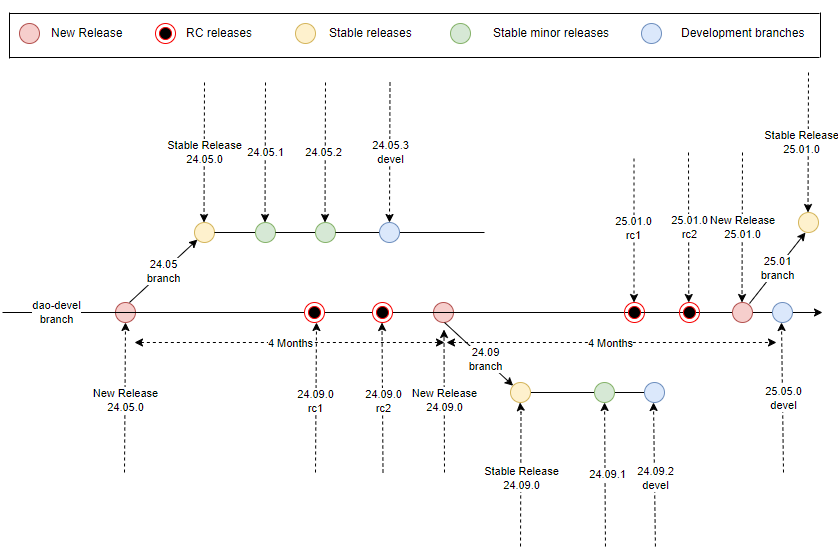

..  SPDX-License-Identifier: Marvell-MIT
    Copyright (c) 2024 Marvell.

DAO Release Process
===================

DAO release process is a structured procedure that involves the periodic
roll out of stable versions every ``Four months``. This systematic approach
ensures structured and efficient progression of updates and improvement.
It provides ample time for contributors to review, discuss, and enhance
their contributions.

The four-month span is strategically segmented in four stages:

**Stage 1**: The initial 45 days are dedicated to new proposals, including
RFCs and features.

**Stage 2**: Next 45 days targeted for API freeze. After approximately 90
days of release cycle, ``RC1`` release will be available.

**Stage 3**: Subsequently, a 15-day window will commence for the application
feature freeze, followed by roll out of the ``RC2`` release.

**Stage 4**: During the final 15 days, the emphasis will be on merging only
bug fixes, culminating in the availability of the final release.

Upon the completion of the four-month cycle, a stable release is diligently
prepared and made accessible to the user.

The merge window swings open immediately following the completion of a stable
release, maintaining the momentum of progress.

Stable releases are maintained in parallel, with essential patches being
backported to ensure a seamless and uninterrupted user experience.
This approach ensures that users of the stable release continue to benefit
from critical updates without compromising the stability of their systems.

Release Flow
------------

The following diagram provides a visual representation of our release cycle,
illustrating the key stages and timelines involved in the process:



Software Versioning
-------------------

A typical DAO software version adheres to the format:

.. code::

 <year>.<month>.<minor number>

where each component signifies a specific aspect of the release i.e. the
``year`` and ``month`` represent the release date, while the ``minor number``
indicates the iteration within that release cycle.

Eg. ``24.05.0`` signifies a release from May 2024.
The ‘0’ in the above version number signifies the initial stable release of the
cycle. This digit is systematically incremented whenever enhancements such as
hotfixes, significant features, or bug fixes are backported, reflecting the
evolution of the software within the stable release cycle

Package Format
--------------

The filename or syntax of a typical release binary is as follows, serving as a
standard format for each release:

.. code::

 dao-<platform>_<version>_<arch>.<package>

 Eg. dao-cn10k_24.05.0_arm64.deb
 where
      cn10k - targeted SOC
      24.05.0 - software version
      arm64 - architecture
      deb - Debian package

During the development phase of a new release, the generated package distinctly
includes the keyword ``devel`` in its name.
Eg. ``dao-cn10k-devel_24.09.0_arm64.deb``

This practice extends to stable releases as well, where the ``devel`` variant
signifies the dynamic branch that accommodates backported patches, thereby
reflecting the ongoing maintenance of the stable release.
Eg. ``dao-cn10k-devel_24.05.2_arm64.deb``

.. note::
 From package name ``dao-cn10k-devel_24.05.2_arm64.deb``, following can be
 interpreted:

 * Its a May 2024 release with initial release packaged as ``dao-cn10k_24.05.0_arm64.deb``

 * One minor release is also rolled out ``dao-cn10k_24.05.1_arm64.deb``.

 * The ongoing minor release, i.e. version 2, is currently in the development phase and has not yet been released. This is branch to which patches will be backported.

Stable Release Maintenance
---------------------------

Once a release is rolled out, parallel branches/tags are strategically created
with an  objective of maintaining DAO releases, incorporating backported fixes
over an extended duration.

This approach offers downstream consumers of DAO a stable foundation for
building applications or packages, ensuring reliability and consistency.

What changes should be backported
`````````````````````````````````

Stable releases are primarily characterized by their dedication to resolving
issues and preventing the introduction of new regressions. Simultaneously, they
uphold backward compatibility with the initial release of the stable version,
ensuring a seamless user experience across updates.

Minor bug fixes that bolster stability, patches for critical bugs are
prioritized as the first candidates for backporting.

In certain exceptional scenarios, it might be deemed acceptable to backport a
new feature to a stable release, thereby enhancing its functionality while
maintaining its stability.

.. note::
 DAO follows same `ABI Policy <https://doc.dpdk.org/guides/contributing/abi_policy.html>`_ as DPDK

Several factors influence the decision to backport a patch, such as:

* Should not break ABI/API

* Should not compromise on backward compatibility

* Scope of the code change

* It is fixing a performance regression that occurred previously.

Bumping a new stable release
````````````````````````````

Upon backporting all pertinent bug fixes, regression tests are executed.
If these tests yield positive results, the announcement of the new minor stable
release is made.

Following are some factors influencing new minor release

* After accumulating 10-15 minor bug fixes

* Critical bug fixes

* Change in dependent package version i.e. if dependent package eg DPDK is upgraded.

* Exceptional new features

Steps involved in rolling out a release
---------------------------------------

When the four-month cycle for a new release is nearing its end, or in the case
of a stable release, when any of the aforementioned criteria for rolling out a
new release are met, a series of steps are initiated to make the new release
available:

* Tag the release with YY.MM.n (year, month, number).

* Update the respective version number for upcoming development branches

* Execute all unit tests, integration tests, stability tests

* Update the release notes with new features, improvements

* Publish the new release
