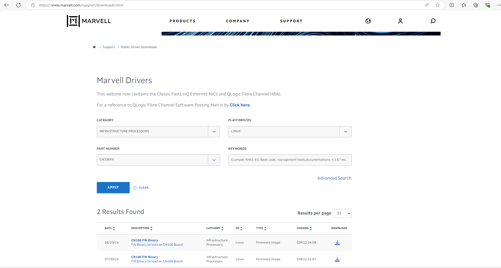

..  SPDX-License-Identifier: Marvell-MIT
    Copyright (c) 2024 Marvell.

Installing firmware image on target platform
********************************************

This document describes the procedure to install firmware image on target platform.

Downloading the firmware image
==============================

The firmware image can be download from Marvell's website:

`marvell portal <https://www.marvell.com/support/downloads.html>`_.

Select the following options to download the firmware image:

* ``Category``: Infrastructure Processors
* ``Platform/OS``: Linux
* ``Part Number``: CN106XX or CN103XX (based on target platform)

The firmware image is available in the form of an archive file. Extract the archive to get the
firmware image.

Two types of firmware images are available and both have different ways of loading:

* ``fw-update-<plat>-<version>.bin`` is loaded using bootimgup command,
	eg fw-update-cn10ka-SDK12.24.08.bin
* ``flash-<plat>-<version>.img`` is loaded using direct flashing to SPI/eMMC device via u-boot
	eg flash-cn10ka-SDK12.24.08.img

commands.

Verifying Boot Source
=====================

Power on the target platform and observe bootup logs. During the initial booting sequence,
lookout for prints such as ``SCP: Booting from`` and  ``Boot:`` to determine boot source
``SPI or MMC`` used for flashing the firmware image and to identify the partition image being
loaded.

From below output, it is clear that the boot source is ``SPI``, it has two partitions as per
log ``Boot:  SPI0_CS0,SPI1_CS0, using SPI0_CS0`` and image has been loaded from primary
partition as per log ``Booting from SPI0.CS0 (Primary image0)``.

If the boot source was ``MMC``, then the prints would be
``Boot:  EMMC_CS0,EMMC_CS0, using EMMC_CS0`` and ``Booting from EMMC0.CS0 (Primary image0)``.

From the print ``Boot:  SPI0_CS0,SPI1_CS0, using SPI0_CS0``, SPI0_CS0 corresponds to bus:cs
where primary partition is 0:0 and secondary partition is 1:0.i

From the output below, it is clear that the boot source is ``SPI``, with two partitions as
indicated by the log ``Boot: SPI0_CS0,SPI1_CS0, using SPI0_CS0``. The image has been loaded
from the primary partition, as shown by the log ``Booting from SPI0.CS0 (Primary image0``

If the boot source was ``MMC``, the logs would display ``Boot: EMMC_CS0,EMMC_CS0, using EMMC_CS0``
and ``Booting from EMMC0.CS0 (Primary image0)``

The log ``Boot: SPI0_CS0,SPI1_CS0, using SPI0_CS0`` indicates that ``SPI0_CS0`` corresponds to
<bus:cs>, where the primary partition is 0:0 and the secondary partition is 1:0.

.. code-block:: console

  SCP: SCP BL1 is Alive!
  SCP: 12.23.11.ge98e933e ge98e933e Wed, 01 Nov 2023 22:46:21 +0000
  SCP: Detected chip b9, platform 0
  SCP: Boot security state: new chip
  SCP: RST_LBOOT=0x8: CHIP_SOFT
  SCP: Previous RST_LBOOT=0x8: CHIP_SOFT
  SCP: Number of AP cores present::24 TAD's present::24
  SCP: Starting Firmware Loading (AP, MCP and ECP)
  SCP: Booting from SPI0.CS0 (Primary image0)
  SCP: SCP BL0 used: 12.5MHz(x1)
  SCP: SCP BL1: xSPI0.CS0 will use 25MHz x4
  SCP: Enabling CMD extensions, val = 0
  SCP: Loading ECP BL1...
  SCP: LDR: Invalid TIMH block at offset 0xd0000
  SCP: image loading failed [3]
  SCP: Trying SPI safe mode
  SCP: SCP BL1: xSPI0.CS0 will use 12.5MHz x1
  SCP: Re-loading image
  SCP: Loading MCP BL1...
  SCP: Loading AP BL1...
  SCP: copying AP_BL1 to 0 in LLC
  SCP: Starting up AP BL1
  SCP: Releasing Core0 out of reset

  Marvell CN10K SOC
  PASS: CRC32 verification
  Transferring to thread scheduler
  =======================
  Marvell CN10k Boot Stub
  =======================
  Firmware Version: 2023-11-28 13:43:26
  EBF Version: 11.23.11-5c465a98-dirty, Branch: ebf-release, Built: Tue, 28 Nov 2023 13:42:23 +0000

  Board Model:    crb106-pcie
  Board Revision: r1p1
  Board Serial:   WA-CN106-A1-PCIE-2P100-R2-151

  Chip:  0xb9 Pass B0
  SKU:   MV-CN10624-B0-AAP
  LLC:   49152 KB
  Boot:  SPI0_CS0,SPI1_CS0, using SPI0_CS0
  AVS:   Enabled

.. note::

 It is highly recommended to preserve the factory image in the secondary partition and always flash
 the primary partition. This allows for a fallback to the default factory image by booting from the
 secondary partition in case of any flashing issues

Flashing firmware image
=======================

The firmware image can be flashed using the following two methods:

Loading using ``bootimgup`` command
------------------------------------

Only ``.bin`` firmware image can be loaded using bootimgup command.

* Boot the target platform and stop at u-boot prompt.

.. _sf_probe:

* Detect SPI flash using ``sf probe`` command.

.. code-block:: console

  crb106-pcie> sf probe 0:0
  SF: Detected mx25um51245g with page size 256 Bytes, erase size 4 KiB, total 64 MiB

If partition 0 (primary) is to be flashed, use ``sf probe 0:0``, while if partition 1 (secondary)
is to be flashed, use ``sf probe 0:1``

.. _setting_up_env:

* Setting up board environment and TFTP server:

.. code-block:: console

  # Set ethernet adaptor, some common adaptors are ax88179_eth or r8152_eth or e1000#0 or rvu_pf#4
  # set ethact <ethernet adaptor>
  Eg.
  crb106-pcie> set ethact e1000#0

  # Obtain dynamic IP using dhcp for the board or assign static IP
  # setenv ipaddr <board IP>
  Eg
  crb106-pcie> dhcp
  or
  crb106-pcie> setenv ipaddr 10.28.35.116

  # Set TFTP server IP
  # setenv serverip <TFTP server IP>
  Eg.
  crb106-pcie> setenv serverip 10.28.35.121

  # Verify the tftp server is reachable from the board.
  # ping $serverip
  Eg.
  crb106-pcie> ping 10.28.35.121
  Waiting for RPM1 LMAC0 link status... 10G_R [10G]
  Using rvu_pf#1 device
  host 10.28.35.121 is alive

* Load firmware to DDR from the tftp server:

.. code-block:: console

  # tftpboot $loadaddr <Path to firmware image in TFTP server>

  Eg.
  crb106-pcie> tftpboot $loadaddr fw-update-cn10ka-SDK12.24.08.bin
  Waiting for RPM1 LMAC0 link status... 10G_R [10G]
  Using rvu_pf#1 device
  TFTP from server 10.28.35.121; our IP address is 10.28.35.116
  Filename 'fw-update-cn10ka-SDK12.24.08.bin'.
  Load address: 0x20080000
  Loading: ##################################################  6.5 MiB
           8.2 MiB/s
  done
  Bytes transferred = 6821888 (681800 hex)

.. _fw_integrity:

* Check downloaded firmware image integrity

.. code-block:: console

  # md5sum $loadaddr $filesize
  # sha1sum $loadaddr $filesize

  Eg.
  crb106-pcie> md5sum $loadaddr $filesize
  md5 for 20080000 ... 207017ff ==> cd842a6d319e39b2a73daca8fddc14f5
  crb106-pcie> sha1sum $loadaddr $filesize
  sha1 for 20080000 ... 207017ff ==> e5608368e737e3eb138e09033d5a5de0c61aec82

* Flash the firmware image using bootimgup command:

- When boot source is SPI:

.. code-block:: console

  Command: bootimgup -s spi bus:cs image_address image_size
  Where:
     -s - Overwrite SCP ROM area
     spi - SPI device
     bus:cs - Bus:Chip Select
     image_address - Image address
     image_size - Image Size

  From the boot reset logs, ensure you select the correct SPI boot source (bus:cs) in
  the bootimgup command.

  Example command if for spi 0:0 is as below
  crb106-pcie> bootimgup spi 1:0 $loadaddr $filesize
  Bootloader update SPI: 6821888 bytes

- When boot source is MMC:

On CN10K, bootimgup mmc command is not supported. Use mmc write/update operations to update firmware.

* Reboot the board and verify the board boots and the firmware version is correctly updated.

Loading using direct flashing to SPI/eMMC device via u-boot commands
--------------------------------------------------------------------

Only .img files can be loaded using direct flashing to SPI/eMMC device via u-boot commands.

* Boot the target platform and stop at u-boot prompt.

* Detect SPI flash.

Refer :ref:`sf probe command<sf_probe>` from the previous section.

* Setting up board environment

Refer :ref:`Setup board environment<setting_up_env>` for detailed steps.

* Check downloaded firmware image integrity

Refer :ref:`fw_integrity<fw_integrity>` from the previous section.

* Load firmware to DDR from the tftp server:

.. code-block:: console

  # tftpboot $loadaddr <Path to firmware image in TFTP server>

  Eg.
  crb106-pcie> tftpboot $loadaddr flash-cn10ka-SDK12.24.08.img
  Waiting for RPM1 LMAC0 link status... 10G_R [10G]
  Using rvu_pf#1 device
  TFTP from server 10.28.35.121; our IP address is 10.28.35.116
  Filename 'flash-cn10ka-SDK12.24.08.img'.
  Load address: 0x20080000
  Loading: ####################################################  12 MiB
           1.9 MiB/s
  done
  Bytes transferred = 12619593 (c08f49 hex)

* Update the firmware image using ``sf update`` command:

.. code-block:: console

  # sf update $loadaddr 0x0 $filesize

  Eg.
  crb106-pcie> sf update $loadaddr 0x0 $filesize
  device 0 offset 0x0, size 0xc08f49
  28672 bytes written, 12590921 bytes skipped in 1.629s, speed 12619593 B/s

* Alternative to ``sf update`` command, use ``sf erase`` and ``sf write`` commands:

.. code-block:: console

  # sf erase 0x0 $filesize
  # sf write $loadaddr 0x0 $filesize

  Eg.
  crb106-pcie> sf erase 0x0 $filesize
  SF: 12619593 bytes @ 0x0 Erased: OK

  crb106-pcie> sf write $loadaddr 0x0 $filesize
  device 0 offset 0x0, size 0xc08f49
  SF: 12619593 bytes @ 0x0 Written: OK

* Reboot the board and verify the board boots and the firmware version is correctly updated.
