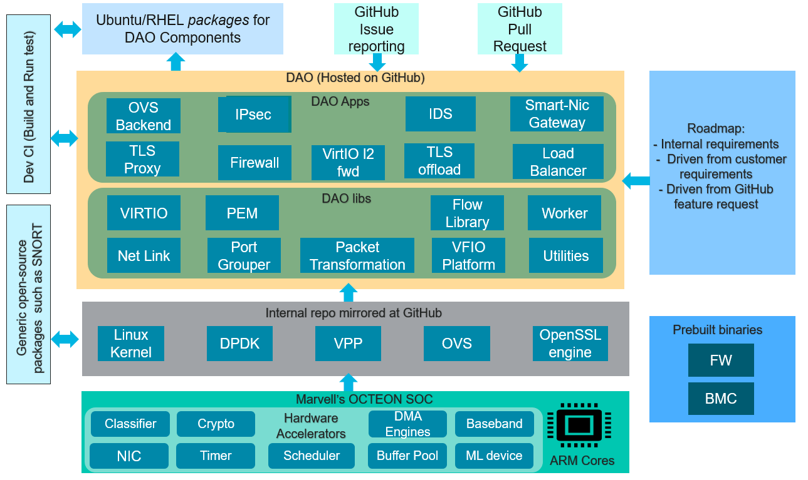

..  SPDX-License-Identifier: Marvell-MIT
    Copyright (c) 2024 Marvell.

Introduction
============

The DPU Accelerator Offload (DAO) empowers the capabilities of Marvell’s
Octeon, enabling application developers and Marvell’s technology partners
to achieve breakthrough networking, security and storage performance.
It sparks unparalleled innovation and expedites the progression of
software-defined data centers.

The DAO is equipped with a comprehensive set of libraries that serve as
a powerful resource for developers. These libraries are meticulously
designed to harness the full potential of Marvell’s Octeon hardware
accelerators, resulting in improved performance and efficiency.



Documentation Structure
-----------------------

Following page navigates through the structure of the DAO documentation,
which encompasses comprehensive information about the DAO toolkit from
Marvell. It equips you with everything necessary to develop Marvell’s
Octeon accelerated applications and the corresponding drivers for the host.

Getting started guide
`````````````````````

**System Requirement**

Minimum system requirements for compiling and running the DAO applications

:doc:`./gsg/system`

**Installing DAO**

Step-by-step guide for installing DAO packages on an Octeon platform.

:doc:`./gsg/install`

**Compiling from Sources**

Guide for developers to clone the sources and compile it as per their specific
need.

:doc:`./gsg/build`

Programming Guide
`````````````````

DAO programming guides offer a comprehensive understanding of DAO libraries
and their APIs, encompassing an introduction, architecture, API overview,
and other library-specific details. It also features code snippets that
demonstrate basic tasks achievable with DAO.
To fully grasp the API of a particular DAO library, it’s recommended to
review sample applications alongside the programming guide. These samples
serve as practical examples of how to implement individual features of a
given DAO library.

:doc:`./prog_guide/index`

Application Guide
`````````````````

Sample Applications are a higher-level reference code to demonstrate how
a full DAO-based program can be built.
Numerous sample applications integrate functionalities from multiple DAO
libraries, providing practical implementations for scenarios that users
often encounter.

:doc:`./applications/index`

How To Guides
`````````````

While certain topics may not be directly involved in the implementation of an
application, but they are essential for creating the environment in which the
application operates.
How-to guides can offer valuable instructions for setting up such environments,
ensuring the application runs smoothly and efficiently

:doc:`./howtoguides/index`
