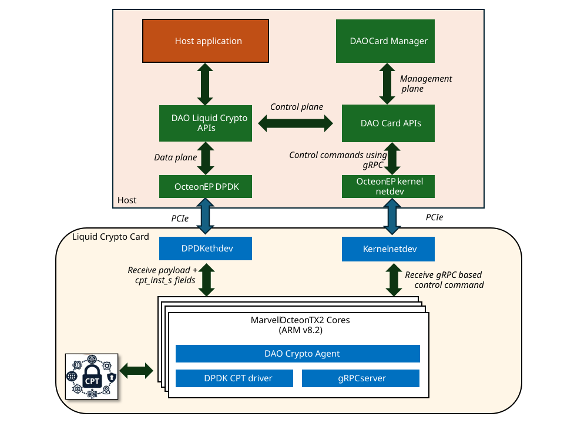

..  SPDX-License-Identifier: Marvell-MIT
    Copyright (c) 2025 Marvell.

*************
LiquidCrypto
*************

The LiquidCrypto is a specialized PCIe card designed specifically for cryptographic offload
operations. This high-performance hardware acceleration solution enables organizations to offload
compute-intensive cryptographic workloads from the main CPU to dedicated hardware, significantly
improving system performance and efficiency.

Architecture Overview
=====================

The LiquidCrypto card is powered by the Octeon 93xx SoC which has dedicated crypto hardware block
known as 'CPT' for cryptographic operations. The LiquidCrypto card uses network interface for
communication with the host system. While it uses DPDK-based network drivers for data plane
operations, the control path is implemented using gRPC-based APIs which internally uses kernel
netdev interface. Management plane operations such as firmware update and stats collection is also
implemented using gRPC.

Block Diagram
-------------

   LiquidCrypto Block Diagram

Software Components
-------------------

Data Plane
~~~~~~~~~~

The data plane of LiquidCrypto is implemented using DPDK-based network drivers. The data plane
is responsible for handling the actual data packets and performing cryptographic operations on them.

Crypto operations supported by the LiquidCrypto card include:

#. AES
#. ChaCha20
#. RSA
#. ECC
#. SHA

Crypto operations supported by the LiquidCrypto card are exposed to the user application
through DAO Liquid Crypto library. The library provides a set of APIs for performing
cryptographic operations using the LiquidCrypto card. The library abstracts the underlying
DPDK interface and provides a simple and easy-to-use API for developers.

For more details on the Liquid Crypto library, refer to the :doc:`../prog_guide/liquid_crypto_lib`
section.

Control Plane
~~~~~~~~~~~~~

The control plane of LiquidCrypto is implemented using gRPC-based APIs. The control plane is
responsible for managing the LiquidCrypto device instances, including device initialization,
configuration, and queue management. The Liquid Crypto library provides APIs that perform
control plane operations using gRPC-based APIs.

Management Plane
~~~~~~~~~~~~~~~~

The management plane of LiquidCrypto is responsible for managing the LiquidCrypto device
instances, including firmware updates and stats collection. The Liquid Crypto library provides
APIs that perform management plane operations using gRPC-based APIs.

Getting Started
================

Host Setup
----------

Host Machine Requirements
~~~~~~~~~~~~~~~~~~~~~~~~~

The host machine must support ACS (Access Control Services) in the PCIe root or downstream port
where the LiquidCrypto card is installed. ACS is essential for enabling IOMMU hardware to assign
unique IOMMU group IDs and ensure function-level isolation of PCIe devices.

Package Requirements
~~~~~~~~~~~~~~~~~~~~

The DAO Liquid Crypto library has the following package dependencies:

- **DPDK**: For data plane operations.
- **Marvell Octeon PCIe End Point driver**: To enable communication with the LiquidCrypto card.
- **gRPC**: For control and management plane operations.
- **libedit**: For command-line editing and history support.

Ensure these packages are installed on the host machine before proceeding.

Standard Package Installation
+++++++++++++++++++++++++++++

On Debian-based systems, the required packages can be installed using the following command:

.. code-block:: console

	sudo apt-get update
	sudo apt-get install build-essential meson ninja-build pkg-config libnuma-dev git doxygen cmake openssl-dev

On Red Hat-based systems, the following command can be used:

.. code-block:: console

    sudo dnf update
    sudo dnf install git
    sudo dnf install python3-pip
    sudo dnf install perl-CPAN
    sudo pip3 install meson
    sudo pip3 install ninja
    sudo pip3 install pyelftools
    sudo dnf install cmake
    sudo dnf install openssl-devel

.. note::

    * Ensure that the meson version is 0.61 or higher.

DPDK
+++++

The LiquidCrypto card uses DPDK for data plane operations. Ensure that the DPDK version is
compatible.

.. code-block:: console

    # Clone the DPDK repository
    git clone https://github.com/DPDK/dpdk.git
    cd dpdk

    # Checkout the specific version
    git checkout v24.11

    # Set up the build directory with the specified installation path. Below command will configure 'build' directory. To run meson with new options, it is recommended to clear this directory completely.
    meson setup build -Dmax_numa_nodes=1 --prefix=<PATH_TO_INSTALL_DIR>/dpdk

    # Build and install DPDK
    ninja -C build
    ninja -C build install

    # Verify that the required .pc files are generated. It can be generated in either of the below directories. Check which one has the libdpdk.pc file and add the same to PKG_CONFIG_PATH
    ls <PATH_TO_INSTALL_DIR>/dpdk/lib/x86_64-linux-gnu/pkgconfig/
    ls <PATH_TO_INSTALL_DIR>/dpdk/lib64/pkgconfig/

    # Expected output:
    # libdpdk-libs.pc  libdpdk.pc

    # Export the PKG_CONFIG_PATH environment variable
    export PKG_CONFIG_PATH=<PATH_TO_INSTALL_DIR>/dpdk/lib/x86_64-linux-gnu/pkgconfig/:$PKG_CONFIG_PATH
    # or
    export PKG_CONFIG_PATH=<PATH_TO_INSTALL_DIR>/dpdk/lib64/pkgconfig/:$PKG_CONFIG_PATH

Marvell Octeon PCIe End Point Driver
++++++++++++++++++++++++++++++++++++

From Standard kernel distribution

.. code-block:: console

    # Check if the module is already preset
    sudo modinfo octeon_ep

If not present, build the driver

.. code-block:: console

    git clone https://github.com/MarvellEmbeddedProcessors/pcie_ep_octeon_host.git
    cd pcie_ep_octeon_host
    make
    sudo insmod ./drivers/octeon_ep/octeon_ep.ko

gRPC
++++

The LiquidCrypto card uses gRPC for control and management plane operations. Ensure that the
gRPC version is compatible.

DAO provides a script for building the gRPC library. The script is located in the
'dep/scripts/host' directory of the DAO repository. To build the gRPC library, run the following command:

.. code-block:: console

    # Clone the DAO repository
    git clone https://github.com/MarvellEmbeddedProcessors/dao.git
    cd dao

    # gRPC
    ./dep/scripts/host/build-deps-grpc.sh <PATH_TO_GRPC_BUILD_DIR>

    # Update PATH, PKG_CONFIG_PATH & LD_LIBRARY_PATH with gRPC bins
    export PATH=<PATH_TO_GRPC_BUILD_DIR>/install/bin:$PATH
    export PKG_CONFIG_PATH=<PATH_TO_GRPC_BUILD_DIR>/grpc/third_party/re2/:$PKG_CONFIG_PATH
    export PKG_CONFIG_PATH=<PATH_TO_GRPC_BUILD_DIR>/install/lib/pkgconfig/:$PKG_CONFIG_PATH
    export PKG_CONFIG_PATH=<PATH_TO_GRPC_BUILD_DIR>/install/lib64/pkgconfig/:$PKG_CONFIG_PATH
    export LD_LIBRARY_PATH=<PATH_TO_GRPC_BUILD_DIR>/install/lib/:$LD_LIBRARY_PATH
    export LD_LIBRARY_PATH=<PATH_TO_GRPC_BUILD_DIR>/install/lib64/:$LD_LIBRARY_PATH

    # Update PKG_CONFIG_PATH with DPDK
    export PKG_CONFIG_PATH=<PATH_TO_INSTALL_DIR>/dpdk/lib/x86_64-linux-gnu/pkgconfig/:$PKG_CONFIG_PATH
    # or
    export PKG_CONFIG_PATH=<PATH_TO_INSTALL_DIR>/dpdk/lib64/pkgconfig/:$PKG_CONFIG_PATH

libedit
+++++++

The LiquidCrypto card uses libedit for command-line editing and history support. The package
can be installed using the following commands:

On Debian-based systems:

.. code-block:: console

    sudo apt-get install libedit-dev

On Red Hat-based systems, the following command can be used:

.. code-block:: console

    sudo dnf install libedit-devel

Build
-----

.. code-block:: console

    # Clone the DAO repository
    git clone https://github.com/MarvellEmbeddedProcessors/dao.git
    cd dao

    # Set up the build directory
    meson setup build

    # Build the project
    ninja -C build

    # The autotest binary will be generated in the following directory
    # build/tests/dao-liquid-crypto-autotest

    # The card manager binary will be generated in the following directory
    # build/app/dao-card-mgr

.. note::

    To enable debug build, configure the build directory using the following command:
    ``meson setup build --buildtype=debug``

Setting Up the LiquidCrypto Card
================================

The LiquidCrypto card must be set up before it can be used for cryptographic operations. The setup
process involves configuring the PCIe endpoint interface and initializing the card.

Configure PCIe Endpoint Interface
---------------------------------

.. code-block:: console

    # Make sure LiquidCrypto card is powered up

    # Remove the octeon_ep module
    sudo rmmod octeon_ep.ko

    # Insert the octeon_ep module
    sudo insmod octeon_ep.ko

    # Check dmesg logs to confirm if the PF driver load is successful
    # Example dmesg output:
    # [  323.239202] octeon_ep 0000:01:00.0: chip_id = 0xb200
    # [  323.239204] octeon_ep 0000:01:00.0: Setting up OCTEON CN93XX PF PASS2.0
    # [  323.239206] octeon_ep 0000:01:00.0: Octeon device using PCIE Port 0
    # [  323.239208] octeon_ep 0000:01:00.0: pf_srn=0 rpvf=8 nvfs=0 rppf=8
    # [  323.239224] octeon_ep: Loaded successfully !
    # [  323.239225] octeon_ep 0000:01:00.0: Control plane versions host: 10000, firmware: 10000:10000
    # [  323.343303] octeon_ep 0000:01:00.0: Heartbeat interval 1000 msecs Heartbeat miss count 20
    # [  323.551931] octeon_ep 0000:01:00.0: Device setup successful
    # [  323.555080] octeon_ep 0000:01:00.0 enp1s0f0: renamed from eth0
    # [  323.569766] octeon_ep 0000:01:00.0 enp1s0f0: Starting netdev ...
    # [  323.571429] octeon_ep 0000:01:00.0: Allocated 8 IOQ vectors
    # [  323.571672] octeon_ep 0000:01:00.0: MSI-X enabled successfully
    # [  323.573241] octeon_ep 0000:01:00.0 enp1s0f0: Started netdev ...
    # [  323.655226] octeon_ep 0000:01:00.0: Interrupt poll task stopped.
    # [  428.302798] pci 0000:01:00.2: [177d:b203] type 00 class 0x028000 PCIe Endpoint
    # [  428.302808] pci 0000:01:00.2: enabling Extended Tags
    # [  428.386406] octeon_ep_vf: Loading Marvell Octeon EndPoint NIC VF Driver ...
    # [  428.386428] octeon_ep_vf 0000:01:00.2: enabling device (0000 -> 0002)
    # [  428.386451] octeon_ep_vf 0000:01:00.2: chip_id = 0xb203
    # [  428.386453] octeon_ep_vf 0000:01:00.2: Setting up OCTEON CN93XX VF PASS2.0
    # [  428.386456] octeon_ep_vf 0000:01:00.2: setup vf mbox successfully
    # [  428.390287] octeon_ep_vf 0000:01:00.2: Device probe successful
    # [  428.394636] octeon_ep_vf 0000:01:00.2 enp1s0f0v0: renamed from eth0
    # [  428.414667] octeon_ep_vf 0000:01:00.2 enp1s0f0v0: Starting netdev ...
    # [  428.416014] octeon_ep_vf 0000:01:00.2: Allocated 8 IOQ vectors
    # [  428.416145] octeon_ep_vf 0000:01:00.2: MSI-X enabled successfully

    # Get the BDF of the device
    SDP_DEV_BDF=$(sudo dmesg | grep 'Setting up OCTEON CN93XX PF PASS2.0' | grep -oP '0000:[0-9a-fA-F]{2}:[0-9a-fA-F]{2}\.[0-9a-fA-F]')

    # Enable SR-IOV with 1 VF. BDF would be the one obtained in previous step.
    echo 1 | sudo tee /sys/bus/pci/devices/$SDP_DEV_BDF/sriov_numvfs
    # or
    echo 1 > /sys/bus/pci/devices/$SDP_DEV_BDF/sriov_numvfs

    # Allocate hugepages
    echo 1500 | sudo tee /sys/devices/system/node/node0/hugepages/hugepages-2048kB/nr_hugepages

    # Remove the EP VF driver
    sudo rmmod octeon_ep_vf

    # Load the vfio-pci module
    sudo modprobe vfio-pci

    # Allow VFIO to be used without an IOMMU.
    echo 1 | sudo tee /sys/module/vfio/parameters/enable_unsafe_noiommu_mode
    # or
    echo 1 > /sys/module/vfio/parameters/enable_unsafe_noiommu_mode

    # Bind the device to the vfio-pci driver
    echo "177d b203" | sudo tee /sys/bus/pci/drivers/vfio-pci/new_id
    # or
    echo "177d b203" > /sys/bus/pci/drivers/vfio-pci/new_id

    # Bring up the interface. The interface name may change from host to host
    sudo ifconfig enp1s0f0 192.168.1.2 up

Run the Card Manager
--------------------

The `dao_card_mgr` application is a user-space tool designed to manage DAO cards, including the
LiquidCrypto card. Before running any other applications, the LiquidCrypto card must be configured
using the card manager.

To configure the card, launch two instances of the `dao_card_mgr` application: one in client mode
and the other in server mode. The client instance allows users to issue configuration commands,
while the serv/er instance processes these commands to configure the LiquidCrypto card.

.. code-block:: console

    # Start the card manager in server mode
    ./build/app/dao-card-mgr -s
    # [lcore -1] DAO_INFO: Starting as server

    # In a separate terminal, start the card manager in client mode
    ./build/app/dao-card-mgr -c
    # [lcore -1] DAO_INFO: Starting as client
    # ?

    # Configure the card using 'card_init' in client. This command should be issued before
    # using the card for cryptographic operations.
    ? card_init
    ?

    # The card is now initialized and ready for use. You can issue other commands to perform
    # cryptographic operations.

    # Close the application on card using 'card_fini'.
    ? card_fini
    ?

.. note::

    * The 'card_init' command must always be the first command issued. No other commands or the
      `dao-liquid-crypto-autotest` should be executed prior to issuing 'card_init'.
    * The 'card_fini' command must always be the final command issued. After 'card_fini' is
      executed, no other commands or the `dao-liquid-crypto-autotest` should be run.
    * Once 'card_fini' has been issued, the DAO card must be rebooted before issuing 'card_init'
      again.

Run Tests
----------

To run the tests for the LiquidCrypto card, you can use the autotest binary generated during the
build process. The autotest binary is located in the `build/tests/` directory.

.. code-block:: console

    # Run the autotest binary
    ./build/tests/dao-liquid-crypto-autotest

    # if the above command complains about missing DPDK libraries like following
    # "./build/tests/dao-liquid-crypto-autotest: error while loading shared libraries: librte_kvargs.so.25: cannot open shared object file: No such file or directory"
    # set LD_LIBRARY_PATH to <PATH_TO_INSTALL_DIR>/lib64/ or <PATH_TO_INSTALL_DIR>/lib/x86_64-linux-gnu
    sudo LD_LIBRARY_PATH=<PATH_TO_INSTALL_DIR>/lib/x86_64-linux-gnu ./build_dao_host/tests/dao-liquid-crypto-autotest

Sample Output
-------------

.. code-block:: console

    [root@localhost dpu-offload]# ./build/tests/dao-liquid-crypto-autotest
    TEST: Starting liquid crypto autotest
    EAL: Detected CPU lcores: 32
    EAL: Detected NUMA nodes: 1
    EAL: Detected static linkage of DPDK
    EAL: Multi-process socket /var/run/dpdk/rte/mp_socket
    EAL: Selected IOVA mode 'PA'
    EAL: VFIO support initialized
    EAL: Using IOMMU type 8 (No-IOMMU)
    TEST: Liquid crypto version:
    TEST: Number of liquid crypto devices: 1
    TEST: Number of queue pairs for device 0: 8
    OTX_NET_EP: otx2_vf_setup_oq_regs():391 SDP_R[0] OQ ISM virt: 0x1003c0000, dma: 0x59c0003
    OTX_NET_EP: otx2_vf_setup_iq_regs():305 SDP_R[0] INST Q ISM virt: 0x1003c0004, dma: 0x59c0007
    OTX_NET_EP: otx2_vf_setup_oq_regs():391 SDP_R[1] OQ ISM virt: 0x1003c0040, dma: 0x59c0043
    OTX_NET_EP: otx2_vf_setup_iq_regs():305 SDP_R[1] INST Q ISM virt: 0x1003c0044, dma: 0x59c0047
    OTX_NET_EP: otx2_vf_setup_oq_regs():391 SDP_R[2] OQ ISM virt: 0x1003c0080, dma: 0x59c0083
    OTX_NET_EP: otx2_vf_setup_iq_regs():305 SDP_R[2] INST Q ISM virt: 0x1003c0084, dma: 0x59c0087
    OTX_NET_EP: otx2_vf_setup_oq_regs():391 SDP_R[3] OQ ISM virt: 0x1003c00c0, dma: 0x59c00c3
    OTX_NET_EP: otx2_vf_setup_iq_regs():305 SDP_R[3] INST Q ISM virt: 0x1003c00c4, dma: 0x59c00c7
    OTX_NET_EP: otx2_vf_setup_oq_regs():391 SDP_R[4] OQ ISM virt: 0x1003c0100, dma: 0x59c0103
    OTX_NET_EP: otx2_vf_setup_iq_regs():305 SDP_R[4] INST Q ISM virt: 0x1003c0104, dma: 0x59c0107
    OTX_NET_EP: otx2_vf_setup_oq_regs():391 SDP_R[5] OQ ISM virt: 0x1003c0140, dma: 0x59c0143
    OTX_NET_EP: otx2_vf_setup_iq_regs():305 SDP_R[5] INST Q ISM virt: 0x1003c0144, dma: 0x59c0147
    OTX_NET_EP: otx2_vf_setup_oq_regs():391 SDP_R[6] OQ ISM virt: 0x1003c0180, dma: 0x59c0183
    OTX_NET_EP: otx2_vf_setup_iq_regs():305 SDP_R[6] INST Q ISM virt: 0x1003c0184, dma: 0x59c0187
    OTX_NET_EP: otx2_vf_setup_oq_regs():391 SDP_R[7] OQ ISM virt: 0x1003c01c0, dma: 0x59c01c3
    OTX_NET_EP: otx2_vf_setup_iq_regs():305 SDP_R[7] INST Q ISM virt: 0x1003c01c4, dma: 0x59c01c7
     + ------------------------------------------------------- +
     + Test Suite : Liquid Crypto Unit Test Suite
     + ------------------------------------------------------- +
     + ------------------------------------------------------- +
     + Test Suite : Liquid Crypto Generic Test Suite
     + ------------------------------------------------------- +
     + TestCase [ 0] : Passthrough Operation (Single Queue) succeeded
     + TestCase [ 1] : Passthrough Operation (Multi Queue) succeeded
     + ------------------------------------------------------- +
     + Test Suite Summary : Liquid Crypto Generic Test Suite
     + ------------------------------------------------------- +
     + Tests Total :        2
     + Tests Skipped :      0
     + Tests Executed :     2
     + Tests Unsupported:   0
     + Tests Passed :       2
     + Tests Failed :       0
     + ------------------------------------------------------- +
     + ------------------------------------------------------- +
     + Test Suite : Liquid Crypto Asymmetric Test Suite
     + ------------------------------------------------------- +
     + TestCase [ 0] : RSA Sign succeeded
     + TestCase [ 1] : RSA Verify succeeded
     + TestCase [ 2] : RSA Verify Invalid Sign succeeded
     + TestCase [ 3] : RSA Public Encrypt succeeded
     + TestCase [ 4] : RSA Private Decrypt (CRT type) succeeded
     + TestCase [ 5] : RSA Private Decrypt Invalid Cipher succeeded
     + TestCase [ 6] : RSA Private Encrypt (Exponent type) succeeded
     + TestCase [ 7] : RSA Private Decrypt (Exponent type) succeeded
     + TestCase [ 8] : RSA Sign (2048 bits) succeeded
     + TestCase [ 9] : RSA Verify (2048 bits) succeeded
     + TestCase [10] : RSA Sign (4096 bits) succeeded
     + TestCase [11] : RSA Verify (4096 bits) succeeded
     + TestCase [12] : RSA Sign (8192 bits) succeeded
     + TestCase [13] : RSA Verify (8192 bits) succeeded
     + TestCase [14] : RSA Verify (256 bits) succeeded
     + TestCase [15] : RSA Private Encrypt (256 bits) succeeded
     + TestCase [16] : RSA Private Decrypt (256 bits) succeeded
    [lcore  0] DAO_ERR: Invalid modulus length. mod_len should be at least 34 and at most 1024 bytes.
     + TestCase [17] : RSA Sign Unsupported Mod succeeded
    [lcore  0] DAO_ERR: Invalid modulus length. mod_len should be at least 34 and at most 1024 bytes.
     + TestCase [18] : RSA CRT Decrypt Unsupported Mod succeeded
    [lcore  0] DAO_ERR: Invalid modulus length. mod_len should be at least 17 and at most 1024 bytes.
     + TestCase [19] : RSA Public Encrypt Unsupported Mod succeeded
    [lcore  0] DAO_ERR: Invalid argument. MSW of modulus must be non-zero.
     + TestCase [20] : RSA Public Encrypt Unsupported MSW succeeded
    [lcore  0] DAO_ERR: Invalid modulus length. mod_len must be even.
    [lcore  0] DAO_ERR: Invalid modulus length. mod_len should be at least 34 and at most 1024 bytes.
    [lcore  0] DAO_ERR: Invalid modulus length. mod_len should be at least 17 and at most 1024 bytes.
    [lcore  0] DAO_ERR: Invalid modulus length. mod_len should be at least 17 and at most 1024 bytes.
    [lcore  0] DAO_ERR: Invalid message length. msg_len should be at most 117 bytes.
     + TestCase [21] : RSA segment size calculation succeeded
     + ------------------------------------------------------- +
     + Test Suite Summary : Liquid Crypto Asymmetric Test Suite
     + ------------------------------------------------------- +
     + Tests Total :       22
     + Tests Skipped :      0
     + Tests Executed :    22
     + Tests Unsupported:   0
     + Tests Passed :      22
     + Tests Failed :       0
     + ------------------------------------------------------- +
     + ------------------------------------------------------- +
     + Test Suite : Liquid Crypto Symmetric Test Suite
     + ------------------------------------------------------- +
     + TestCase [ 0] : AES-128-CBC Encrypt succeeded
     + TestCase [ 1] : AES-128-CBC Decrypt succeeded
     + TestCase [ 2] : AES-192-CBC Encrypt succeeded
     + TestCase [ 3] : AES-192-CBC Decrypt succeeded
     + TestCase [ 4] : AES-256-CBC Encrypt succeeded
     + TestCase [ 5] : AES-256-CBC Decrypt succeeded
     + ------------------------------------------------------- +
     + Test Suite Summary : Liquid Crypto Symmetric Test Suite
     + ------------------------------------------------------- +
     + Tests Total :        6
     + Tests Skipped :      0
     + Tests Executed :     6
     + Tests Unsupported:   0
     + Tests Passed :       6
     + Tests Failed :       0
     + ------------------------------------------------------- +
     + ------------------------------------------------------- +
     + Test Suite Summary : Liquid Crypto Unit Test Suite
     + ------------------------------------------------------- +
     + Liquid Crypto Generic Test Suite : 2/2 passed, 0/2 skipped, 0/2 failed, 0/2 unsupported
     + Liquid Crypto Asymmetric Test Suite : 22/22 passed, 0/22 skipped, 0/22 failed, 0/22 unsupported
     + Liquid Crypto Symmetric Test Suite : 6/6 passed, 0/6 skipped, 0/6 failed, 0/6 unsupported
     + ------------------------------------------------------- +
     + Sub Testsuites Total :      3
     + Sub Testsuites Skipped :    0
     + Sub Testsuites Passed :     3
     + Sub Testsuites Failed :     0
     + ------------------------------------------------------- +
     + Tests Total :       30
     + Tests Skipped :      0
     + Tests Executed :    30
     + Tests Unsupported:   0
     + Tests Passed :      30
     + Tests Failed :       0
     + ------------------------------------------------------- +

Running Stress Tests
====================

The LiquidCrypto card supports stress testing to assess its performance and reliability under heavy
workloads. These tests are designed to simulate real-world scenarios, ensuring the card operates
efficiently and consistently even under extreme conditions.

The tests can be initiated only from serial console and can be performed only if there is
physical access to the card and it is connected via micro USB cable for serial communication.

To run the stress tests, the LiquidCrypto card must be in a specific mode that allows
stress testing.

To enable stress testing mode, follow these steps:

#. Connect the LiquidCrypto card to a host machine via micro USB cable.
#. Open a terminal and connect to the card using a serial communication tool (e.g., `minicom`).
#. Once connected, issue the below command on the card to enable stress testing mode:

   .. code-block:: console

    # sed -i.bak -e 's/^[^#]/#&/' -e 's/^#ARGUMENT=skip/ARGUMENT=skip/' /root/lc_service/config/lc_env

#. Reboot the LiquidCrypto card to apply the changes.
#. After rebooting, the card will be in stress testing mode.

   .. code-block:: console

    # sed -i.bak -e 's/^[^#]/#&/' -e 's/^#ARGUMENT=run_stress_test/ARGUMENT=run_stress_test/' -e 's/^#NUM_ITR=.*/NUM_ITR=5/' /root/lc_service/config/lc_env

Card Firmware
=============

Partitioning and Configuration
------------------------------

Building Card Firmware
----------------------
