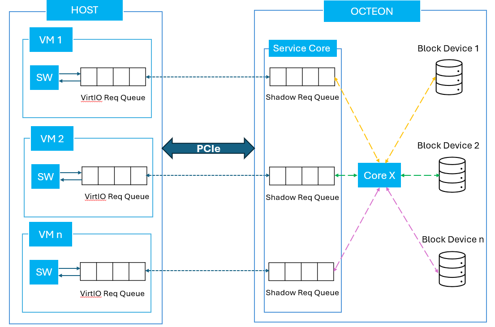
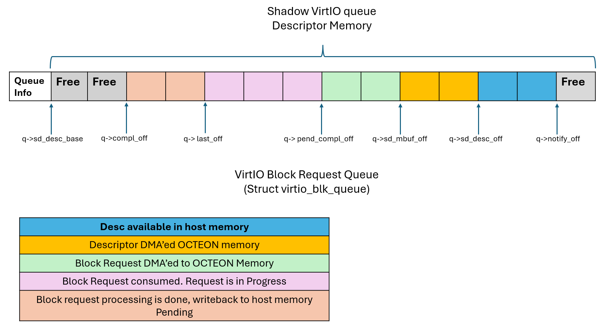

..  SPDX-License-Identifier: Marvell-MIT
    Copyright (c) 2025 Marvell.

********************
VirtIO Block Library
********************

Virtio Block library utilizes the VirtIO library, a component of DAO, to provide VirtIO block functionality for supported applications. The VirtIO block library offers APIs for block I/O applications running on OCTEON. It enables the provisioning of OCTEON block devices as VirtIO block devices to the host/VMs on host.

Features
--------

Currently, Virtio Block emulation supports the VirtIO 1.3 specification, offering the following features:

VirtIO Common Feature Bits
~~~~~~~~~~~~~~~~~~~~~~~~~~~

- VIRTIO_F_RING_PACKED
- VIRTIO_F_ANY_LAYOUT
- VIRTIO_F_IN_ORDER
- VIRTIO_F_ORDER_PLATFORM
- VIRTIO_F_IOMMU_PLATFORM
- VIRTIO_F_NOTIFICATION_DATA

VirtIO Block Feature Bits
~~~~~~~~~~~~~~~~~~~~~~~~~~

VirtIO Block Specification supports the following features. Depending on the underlying block device type, the feature set varies:

- VIRTIO_BLK_F_SIZE_MAX
- VIRTIO_BLK_F_SEG_MAX
- VIRTIO_BLK_F_BLK_SIZE
- VIRTIO_BLK_F_FLUSH
- VIRTIO_BLK_F_DISCARD
- VIRTIO_BLK_F_TOPOLOGY
- VIRTIO_BLK_F_WRITE_ZEROES
- VIRTIO_BLK_F_GEOMETRY
- VIRTIO_BLK_F_RO
- VIRTIO_BLK_F_CONFIG_WCE
- VIRTIO_BLK_F_MQ
- VIRTIO_BLK_F_LIFETIME
- VIRTIO_BLK_F_SECURE_ERASE
- VIRTIO_BLK_F_ZONED

Notes on Supported Features
~~~~~~~~~~~~~~~~~~~~~~~~~~~~

- Only Packed virtqueues (VIRTIO_F_RING_PACKED) are supported.
- Modern devices are supported; legacy devices are not supported.
- The implementation requires extra data (besides identifying the virtqueue) in device notifications (VIRTIO_F_NOTIFICATION_DATA). This is a mandatory feature to be enabled by Host/Guest.
- Using VIRTIO_F_ORDER_PLATFORM is mandatory for proper functioning of smart NIC as it ensures memory ordering between Host and Octeon DPU.
- Current implementation of VirtIO block supports only in-order processing of the requests.
- Zoned block devices are not supported.

VirtIO Emulation Architecture Overview
--------------------------------------

This design fosters a scalable architecture with an emulation software core serving two crucial roles: the service core and worker core. In the diagram below, Core X refers to a worker core, and each worker core works on its own shadow virtio request queue.

The service core acts as the overseer, managing the virtio queue descriptors exchanged between the host and FW. Its responsibilities include determining the queue depth, tracking head and tail pointers, and marking buffers as available or in-use. Meanwhile, the worker cores leverage the services provided by the service core, effectively facilitating the movement of requests/responses between the host and FW.

The above figure depicts virtio-blk library's internal architecture. Each portion of the descriptor area follows several stages of processing one after the other. The process is triggered by notification data update to move the tail/avail index to the end of available descriptors. This triggers the service core calling `dao_virtio_blkdev_desc_manage()` to initiate a DMA fetch of descriptor data.

VirtIO Block Device Usage
-------------------------

This section covers how to identify, initialize, and use a VirtIO block device.

VirtIO Block Device Identification
~~~~~~~~~~~~~~~~~~~~~~~~~~~~~~~~~~

Each VirtIO block device is designated by a unique device index starting from 0 in all functions. Currently, this library supports a maximum of 64 VirtIO block devices, one-to-one mapped to a PEM VF. VirtIO `devid[11:0]` indicates VF number, while `devid[15:12]` indicates PF number corresponding to the VF. A VirtIO device is always connected to Host VF. Host PF doesn’t have a VirtIO device representation in the library.

VirtIO Block Device Initialization
~~~~~~~~~~~~~~~~~~~~~~~~~~~~~~~~~~

Initialization of a VirtIO block device typically includes the following operations:

1. Create and initialize a block device with the block device library based on the type of block device required using the `dao_blk_dev_create()` API.
2. Initialize the base VirtIO device using the `virtio_dev_init()` API, which populates the VirtIO capabilities to be available to the host.
3. Configure the device with parameters in `dao_virtio_blkdev_conf`.

Below is the signature of the `dao_virtio_blkdev_init()` API:

.. literalinclude:: ../../../lib/virtio_blk/dao_virtio_blkdev.h
   :language: c
   :start-at: struct dao_virtio_blkdev_conf
   :end-before: End of structure dao_virtio_blkdev_conf.

.. code-block:: c

   int dao_virtio_blkdev_init(uint16_t devid, struct dao_virtio_blkdev_conf *conf);

VirtIO Queues
~~~~~~~~~~~~~

Application is expected to get the active virt queues count using `dao_virtio_blkdev_queue_count` and equally distribute the block request queues among all the subscribed lcores.

VirtIO Block Data Path
~~~~~~~~~~~~~~~~~~~~~~

The data path of a VirtIO block application typically consists of the following steps executed in a continuous loop:

1. Dequeue a block IO request from the VirtIO queue.
2. Process the block IO request.
3. Request completion marking.

Request Dequeue
~~~~~~~~~~~~~~~

As part of the data path loop, worker cores continuously poll for VirtIO block requests on the input request queue. The typical request dequeue process is shown below:

1. Poll for new block IO request on the input queue using `dao_virtio_blk_dequeue_burst(uint16_t devid, uint16_t qid, void **vbufs, uint16_t nb_bufs)`:
   - `devid` and `qid` are the virtio device ID and queue ID on which the core polls for the IO request.
   - It internally involves DMA of IO requests, DMA of data buffer (needed by write request).
   - As part of this call, the library reads multiple requests available in the request queue and dequeues maximum requests as per the `nb_bufs` argument.

2. `vbufs` points to the raw buffer where request data and metadata are stored for further processing of the IO request:
   - Metadata (per `vbuf`) includes `virtio_blk_hdr` (per IO request) and segment information needed for each request.
   - Each `vbuf` in `vbufs` array corresponds to a single block IO request.

3. After this, the core processes the IO requests corresponding to each `mbuf` dequeued as part of step (2). The processing of IO request is explained as part of virtio-blockio application.

Request Completion Marking
~~~~~~~~~~~~~~~~~~~~~~~~~~~

Completion marking of the block IO request means that the request submitted by the driver is completed and the response is ready to be returned. In such cases, once the request processing is completed, the block IO app calls `dao_virtio_blk_process_compl(uint16_t devid, uint16_t qid, void **vbufs, uint16_t nb_compl=1)`.

As part of this, the following operations are executed:

1. For read requests, the DMA of data and block IO status from OCTEON to host memory is issued. For other requests, block IO request status is updated from OCTEON to Host memory.
2. Fetch DMA status and update the shadow `mbuf` offset, so that the service core can mark the descriptors as used based on the shadow `mbuf` offset.

VirtIO Descriptors Management
~~~~~~~~~~~~~~~~~~~~~~~~~~~~~~

The virtio blk library provides an API for managing virtio descriptors. It performs the following operations:

1. Determine the number of descriptors available by polling on virt queue notification address.
2. Issue DMA using DPDK DMA library to copy the descriptors to shadow queues.
3. Pre-allocate buffers for actual block IO request data. Worker cores check the shadow queue for the available descriptors and issue DMA for the data using these buffers.
4. Fetch all DMA completions.
5. Mark used virtio descriptors as used in Host descriptor memory.

The `dao_virtio_blk_desc_manage()` API is used to manage the virtio descriptors. Application is expected to call this from a service core as frequently as possible to shadow descriptors between Host and Octeon memory.

.. code-block:: c

   dao_virtio_blk_desc_manage(uint16_t dev_id, uint16_t qp_count);

The parameter `qp_count` specifies the active virtio queue count. Below is the sample code to get `qp_count`:

.. code-block:: c

   virt_q_count = dao_virtio_blkdev_queue_count(virtio_devid);
