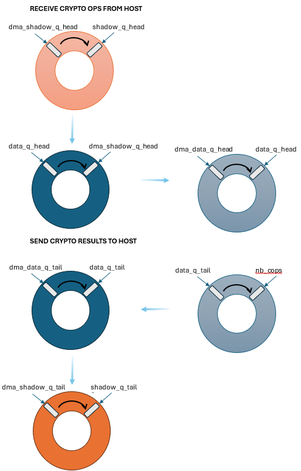

..  SPDX-License-Identifier: Marvell-MIT
    Copyright (c) 2025 Marvell.

*********************
VirtIO Crypto Library
*********************

VirtIO-crypto library is the virtualization solution used in CN10K for crypto
accelerator.

Features
--------
Currently, VirtIO emulation device supports VirtIO 1.3 specification, where it offers
below features.

VirtIO Common Feature Bits:
~~~~~~~~~~~~~~~~~~~~~~~~~~~
* VIRTIO_F_RING_PACKED
* VIRTIO_F_VERSION_1
* VIRTIO_F_IN_ORDER

VirtIO-crypto Feature Bits:
~~~~~~~~~~~~~~~~~~~~~~~~~~~
* VIRTIO_CRYPTO_F_REVISION_1

Here are some notes about virtio-crypto features:

* modern devices are supported, legacy devices are not supported.
* only packed virtqueues(virtio_f_ring_packed) are supported.

VirtIO-crypto Services:
~~~~~~~~~~~~~~~~~~~~~~~
* VIRTIO_CRYPTO_SERVICE_AKCIPHER

At the moment, only AKCIPHER service is supported. The AKCIPHER service
is used for asymmetric crypto operations. Following algorithms are supported:

* VIRTIO_CRYPTO_AKCIPHER_RSA

VirtIO-crypto device identification
-----------------------------------
The virtio crypto device is represented by a virtio device identifier. The virtio device identifier
is used to send and receive the crypto operations to and from the virtio crypto device.
Each virtio crypto device is designated by a unique device index starts from 0, in all functions.
Currently, this library supports maximum of 128 virtio crypto devices, one to one mapped
to a PEM VF. VirtIO devid[11:0] indicates VF number while devid[15:12] indicates PF number
within that VF. A virtio device is always connected to Host VF. Host PF doesn't have
a virtio device representation in the library.

Device initialization
---------------------
The initialization of each virtio crypto device includes the following operations:

* Initialize base virtio device using ``virtio_dev_init()`` API, which populates the virtio
  capabilities to be available to host.
* Populates default values to ``struct virtio_crypto_config``.

The ``dao_virtio_cryptodev_init`` API is used to initialize a VirtIO crypto device.

.. code-block:: c

   int dao_virtio_cryptodev_init(uint16_t devid, struct dao_virtio_cryptodev_conf *conf);

The ``devid`` parameter is the virtio device identifier, which is used to identify the
virtio crypto device.

The ``dao_virtio_cryptodev_conf`` structure is used to pass the configuration parameters
shown below.

.. literalinclude:: ../../../lib/virtio_crypto/dao_virtio_cryptodev.h
   :language: c
   :start-at: struct dao_virtio_cryptodev_conf
   :end-before: End of structure dao_virtio_cryptodev_conf.

The ``dao_virtio_cryptodev_fini`` API is used to finalize a VirtIO crypto device.
It is expected to be called when the application is exiting or when the device is
no longer needed. It cleans up the resources allocated for the device and unregisters
the device from the DPDK crypto framework.

.. code-block:: c

   int dao_virtio_cryptodev_fini(uint16_t devid);

The application ``vc_offload`` is a sample application that shows how to use virtio crypto library.

Sample code to set dao_virtio_cryptodev_conf parameters:

.. code-block:: c

	memset(&cryptodev_conf, 0, sizeof(cryptodev_conf));
	cryptodev_conf.pem_devid = pem_devid;
	cryptodev_conf.dma_vchan = dma_vchan;
	cryptodev_conf.pool = qp_mempool;
	cryptodev_conf.cdev_id = cryptodev_id;

	/* Initialize virtio crypto device */
	rc = dao_virtio_cryptodev_init(virtio_devid, &cryptodev_conf);
	if (rc)
		rte_exit(EXIT_FAILURE, "Failed to init virtio device\n");

User callback APIs
------------------
The application is expected to register callbacks to take the appropriate actions for
each control command. VirtIO crypto library triggers the corresponding callback function
when it receives the control command.

The ``dao_virtio_cryptodev_cb_register`` API is used to register the user callback APIs.

.. code-block:: c

   void dao_virtio_cryptodev_cb_register(struct dao_virtio_cryptodev_cbs);

The ``dao_virtio_cryptodev_cbs`` structure is used to pass various callback functions
in the above API. The following callbacks can be registered currently,

.. literalinclude:: ../../../lib/virtio_crypto/dao_virtio_cryptodev.h
   :language: c
   :start-at: struct dao_virtio_cryptodev_cbs
   :end-before: End of structure dao_virtio_cryptodev_cbs.

Following are the callback functions that can be registered:

* ``status_cb``: This callback is invoked when the virtio crypto device status changes.
  At present, it is invoked when the virtio crypto device driver is initialized or if
  the device is reset.
* ``sym_sess_create_cb``: This callback is invoked when a request for symmetric session
   creation is received. The application can use this callback to create a symmetric session
   and return the session ID.
* ``sym_sess_destroy_cb``: This callback is invoked when a symmetric session is to be destroyed.
  The application can use this callback to free the symmetric session resources.
* ``asym_sess_create_cb``: This callback is invoked when a request for asymmetric session
   creation is received. The application can use this callback to create an asymmetric session
   and return the session ID.
* ``asym_sess_destroy_cb``: This callback is invoked when an asymmetric session is to be destroyed.
  The application can use this callback to free the asymmetric session resources.

To unregister the user callback functions, the application can call
the ``dao_virtio_cryptodev_cb_unregister()`` API.

.. code-block:: c

   void dao_virtio_cryptodev_cb_unregister(void);

VirtIO Crypto Queue Overview
----------------------------

VirtIO crypto device has two types of queues, control and data queues. The control queue is used
to send control commands to the virtio crypto device. The data queues are used to send and receive
crypto operations. The control queue is a single queue, while the data queues are multiple queues.

Control queue is processed by the service core which initializes the virtio crypto device and
register the user callback APIs.
The data queues are processed by the worker cores which send and receive the crypto operations
to and from the virtio crypto device.
Internally, the virtio crypto device uses state variables to manage the descriptors,
as in above figure.

The state variables in orange are used to move the descriptors between the host and
the virtio crypto device and these are updated only by the service core.
The state variables in blue are used to convert descriptors to crypto ops for DPDK crypto device
to later process and these are managed by the worker cores.

Once the descriptors are ready for processing in ``dma_data_q_head``, the worker cores convert them
to crypto operations and update the ``data_q_head`` state variable. When the crypto operations are
completed, the worker cores update the ``data_q_tail`` state variable to indicate that
the crypto operations are ready for DMA transfer.
Similarly, when the crypto operations that were managed in ``data_q_tail`` are completed,
the worker cores issue DMA to copy the descriptors to the host memory and
update the ``dma_data_q_tail`` state variable.

Service core takes care of copying the descriptors back and forth between the host and
the virtio crypto device, as managed in ``shadow_q_head`` and ``shadow_q_tail`` state variables.

Queue count
-----------
Application is expected to get the active data virt queues count using
``dao_virtio_cryptodev_data_queue_cnt_get`` and equally distribute the crypto queues
among all the subscribed lcores.

.. code-block:: c

   virt_q_count = dao_virtio_cryptodev_data_queue_cnt_get(virtio_devid);

VirtIO Descriptors Management API
---------------------------------
The virtio crypto library provides an API for managing virtio descriptors, it does following
operations:

* Determine the number of descriptors available by polling on virt queue notification
  address.
* Issue DMA using DPDK ``dmadev`` library to copy the descriptors to shadow queues.
* Pre-allocate mbufs for actual packet data. Worker cores checks the shadow queue for
  the available descriptors and issue DMA for actual packet data using these mbufs.
* Fetch all DMA completions.
* Mark used virtio descriptors as used in Host descriptor memory.

The ``dao_virtio_crypto_desc_manage()`` API is used to manage the virtio descriptors.
Application is expected to call this from a service core as frequently
as possible to shadow descriptors between Host and Octeon memory.

.. code-block:: c

   int dao_virtio_crypto_desc_manage(uint16_t dev_id, uint16_t qp_count);

The ``devid`` parameter is the virtio device identifier and ``qp_count`` parameter specifies
the active data virt queue count.

Host receive API
-----------------
The host receive API enqueues the crypto ops from the host.
This enqueuing includes following operations:

* Prepares the descriptors for DMA.
* When DMA is completed, convert the descriptors to crypto ops.

.. code-block:: c

   uint16_t dao_virtio_crypto_host_rx(uint16_t devid, uint16_t qid,
                                      struct rte_crypto_op **cops, uint16_t nb_cops);

The ``devid`` parameter is the virtio device identifier and the ``qid`` parameter is
the virt queue identifier.

The ``nb_cops`` parameter is the number of operations to process which are supplied
in the ``cops`` array of structure ``rte_crypto_op``.

The receive function returns the number of operations it actually received for processing.
This API is expected to be executed by worker cores.

Host transmit API
-----------------
The host transmit API dequeues the processed crypto ops and transmit them to the host.
This dequeueing includes the following operations:

* Issue DMA for completed crypto ops.
* Fetch DMA status and update the shadow queue tail for service core to process the descriptors.

.. code-block:: c

   uint16_t dao_virtio_crypto_host_tx(uint16_t devid, uint16_t qid,
                                      struct rte_crypto_op **cops, uint16_t nb_cops);

It uses the same format as the receive API but the ``nb_cops`` and ``cops`` parameters are
now used to specify the max processed operations the user wishes to retrieve and
the location in which to store them.

The API call returns the actual number of processed operations returned, this can never be larger
than ``nb_cops``.
