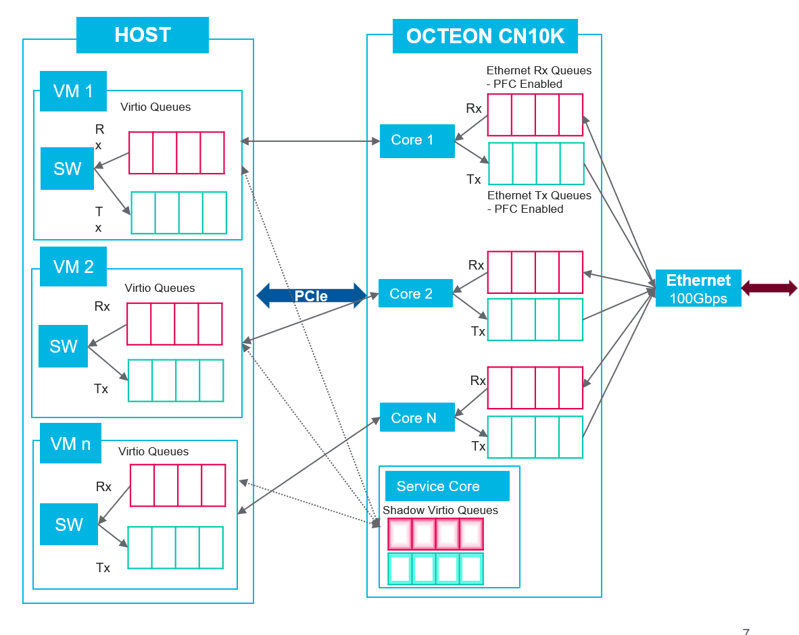

..  SPDX-License-Identifier: Marvell-MIT
    Copyright (c) 2024 Marvell.

******************
VirtIO Net Library
******************

VirtIO-net library is the virtualization solution used in CN10K for networking.
This model emulates SMART NICs for VM and front end virtio network driver.

Features
--------

Currently, VirtIO emulation device supports VirtIO 1.2 specification, where it offers
below features.

VirtIO Common Feature Bits:
~~~~~~~~~~~~~~~~~~~~~~~~~~~
* VIRTIO_F_RING_PACKED
* VIRTIO_F_VERSION_1
* VIRTIO_F_ANY_LAYOUT
* VIRTIO_F_IN_ORDER
* VIRTIO_F_ORDER_PLATFORM
* VIRTIO_F_NOTIFICATION_DATA

VirtIO-net Feature Bits:
~~~~~~~~~~~~~~~~~~~~~~~~
* VIRTIO_NET_F_CTRL_VQ
* VIRTIO_NET_F_MQ
* VIRTIO_NET_F_RSS
* VIRTIO_NET_F_CTRL_RX
* VIRTIO_NET_F_STATUS
* VIRTIO_NET_F_MAC
* VIRTIO_NET_F_CSUM
* VIRTIO_NET_F_GUEST_CSUM
* VIRTIO_NET_F_MTU

Here are some notes about VirtIO-net features:

* Modern devices are supported, legacy devices are not supported.
* Only Packed virtqueues(VIRTIO_F_RING_PACKED) are supported.
* Use the buffers in the same order in which they have been
  made available(VIRTIO_F_IN_ORDER).
* Expects extra data(besides identifying the virtqueue) in device notifications(
  VIRTIO_F_NOTIFICATION_DATA). This is a mandatory feature to be enabled by Host/Guest.
* Using VIRTIO_F_ORDER_PLATFORM is mandatory for proper functioning of smart NIC as
  it ensures memory ordering between Host and Octeon DPU.

VirtIO Emulation Architecture Overview
--------------------------------------

This design fosters a scalable architecture with an emulation software core serving two crucial roles:
the service core and worker core.

The service core acts as the overseer, managing the virtio queue descriptors exchanged between
the host and FW. Its responsibilities include determining the queue depth, tracking head and tail
pointers, and marking buffers as available or in-use. Meanwhile, the worker cores leverage
the services provided by the service core, effectively facilitating the movement of packets
between the host and FW.

.. figure:: ./img/Virtio_net_internal.png

Internally the above figure depicts virtio-net library architecture. Each portion of descriptor
area follows several stages of processing one after the other. The process is triggered by
notification data update to move the tail/avail index to end of available descriptors.
This triggers service core calling ``dao_virtio_netdev_desc_manage()`` to initiate a DMA fetch of
descriptor data. As depicted in the figure, ``q->sd_desc_off`` follows ``notify_offset``, 
``q->sd_mbuf_off`` in dequeue queue follows ``q->sd_desc_off`` while in enqueue queue,
``q->last_off`` follows ``q->sd_desc_off`` and soon.

Once descriptor data is fetched, the service core updates ``q->sd_desc_off`` so that worker cores
can process the descriptors and then further initiate Packet data transfer between Host packet buf
and Octeon DPDK mbuf memory. 

Once the worker cores have consumed a descriptor data, they move ``q->last_off`` for
dequeue queue(Host Tx queue) or ``q->sd_mbuf_off`` for enqueue queue(Host Rx queue) in local data
structure so that service core via ``dao_virtio_netdev_desc_manage()`` takes that info and
pushes descriptor updates from shadow memory back to Host descriptor ring. Basically number of
descriptors to mark complete is nothing but the distance between ``q->compl_off`` and the 
next offset i.e ``q->last_off`` or ``q->sd_mbuf_off``.

VirtIO-net device identification
--------------------------------
Each virtio net device is designated by a unique device index starts from 0, in all functions.
Currently, this library supports maximum of 64 virtio net devices, one to one mapped to a PEM VF.
VirtIO devid[11:0] indicates VF number while devid[15:12] indicates PF number within that VF. A
virtio device is always connected to Host VF. Host PF doesn't have a virtio device representation
in the library.

Device initialization
---------------------

The initialization of each virtio net device includes the following operations:

* Initialize base virtio device using ``virtio_dev_init()`` API, which populates the virtio
  capabilities to be available to host.
* Populates default values to ``struct virtio_net_config``.

The ``dao_virtio_netdev_init()`` API is used to initialize a VirtIO net device.

.. code-block:: c

   int dao_virtio_netdev_init(uint16_t devid, struct dao_virtio_netdev_conf *conf)

The ``dao_virtio_netdev_conf`` structure is used to pass the configuration parameters shown below.

.. literalinclude:: ../../../lib/virtio_net/dao_virtio_netdev.h
   :language: c
   :start-at: struct dao_virtio_netdev_conf
   :end-before: End of structure dao_virtio_netdev_conf.

The application ``virtio-l2fwd`` is a sample application that shows how to use virtio net library.

Sample code to set dao_virtio_netdev_conf parameters:

.. code-block:: c

	/* Populate netdev conf */
	memset(&netdev_conf, 0, sizeof(netdev_conf));
	netdev_conf.auto_free_en = virtio_netdev_autofree;
	netdev_conf.pem_devid = pem_devid;
	netdev_conf.pool = per_port_pool ? v_pktmbuf_pool[virtio_devid] : v_pktmbuf_pool[0];
	netdev_conf.dma_vchan = virtio_netdev_dma_vchans[virtio_devid];
	netdev_conf.mtu = 0;
	if (virtio_map[virtio_devid].type == ETHDEV_NEXT) {
		struct rte_eth_link eth_link;

		portid = virtio_map[virtio_devid].id;
		netdev_conf.reta_size = eth_dev_info[portid].reta_size;
		netdev_conf.hash_key_size = eth_dev_info[portid].hash_key_size;
		overhd = eth_dev_get_overhead_len(eth_dev_info[portid].max_rx_pktlen,
						  eth_dev_info[portid].max_mtu);
		rte_eth_link_get(portid, &eth_link);
		netdev_conf.link_info.status = eth_link.link_status;
		netdev_conf.link_info.speed = eth_link.link_speed;
		netdev_conf.link_info.duplex = eth_link.link_duplex;
		/* Register link status change interrupt callback */
		rte_eth_dev_callback_register(portid, RTE_ETH_EVENT_INTR_LSC,
					      lsc_event_callback,
					      (void *)(uint64_t)virtio_devid);

		/* Populate default mac address */
		rte_eth_macaddr_get(portid, (struct rte_ether_addr *)netdev_conf.mac);
	} else {
		netdev_conf.reta_size = 128;
		netdev_conf.hash_key_size = 48;
		/* Link status always UP */
		netdev_conf.link_info.status = 0x1;
		netdev_conf.link_info.speed = RTE_ETH_SPEED_NUM_UNKNOWN;
		netdev_conf.link_info.duplex = 0xFF;
	}

	if (max_pkt_len)
		netdev_conf.mtu = (max_pkt_len - overhd);
	netdev_conf.auto_free_en = virtio_netdev_autofree;

	/* Save reta size for future use */
	virtio_netdev_reta_sz[virtio_devid] = netdev_conf.reta_size;

	/* Initialize virtio net device */
	rc = dao_virtio_netdev_init(virtio_devid, &netdev_conf);
	if (rc)
		rte_exit(EXIT_FAILURE, "Failed to init virtio device\n");

User callback APIs
------------------

The application is expected to register callbacks to take the appropriate actions for each control command. VirtIO net library triggers the corresponding callback function when it receives the control command.

The API dao_virtio_netdev_cb_register is used to register the user callback APIs.

.. code-block:: c

   void dao_virtio_netdev_cb_register(struct dao_virtio_netdev_cbs);

The ``dao_virtio_netdev_cbs`` structure is used to pass the cbs. The following callbacks can be registered currently,

.. literalinclude:: ../../../lib/virtio_net/dao_virtio_netdev.h
   :language: c
   :start-at: struct dao_virtio_netdev_cbs
   :end-before: End of structure dao_virtio_netdev_cbs.

Queue count
-----------

Application is expected to get the active virt queues count using ``dao_virtio_netdev_queue_count`` and equally distribute the rx and tx queues among all the subscribed lcores.

Link status update
------------------

The API ``dao_virtio_netdev_link_sts_update`` is used to update the virtio net port
link info in ``virtio_net_config`` to be available to host. Below is same code to update
netdev link status through DPDK lsc event callback.

.. code-block:: c

   static int
   lsc_event_callback(uint16_t port_id, enum rte_eth_event_type type __rte_unused, void *param,
                      void *ret_param __rte_unused)
   {
        struct dao_virtio_netdev_link_info link_info;
        uint16_t virtio_devid = (uint64_t)param;
        struct rte_eth_link eth_link;

        rte_eth_link_get(port_id, &eth_link);
        link_info.status = eth_link.link_status;
        link_info.speed = eth_link.link_speed;
        link_info.duplex = eth_link.link_duplex;
        dao_virtio_netdev_link_sts_update(virtio_devid, &link_info);

        return 0;
   }

VirtIO descriptors Management API
---------------------------------

The virtio net library provides an API for managing virtio descriptors, it does following
operations:

* Determine the number of descriptors available by polling on virt queue notification
  address.
* Issue DMA using ``DPDK DMA library`` to copy the descriptors to shadow queues.
* Pre-allocate mbufs for actual packet data. Worker cores checks the shadow queue for
  the available descriptors and issue DMA for actual packet data using these mbufs.
* Fetch all DMA completions.
* Mark used virtio descriptors as used in Host descriptor memory.

The ``dao_virtio_net_desc_manage()`` API is used to manage the virtio descriptors.
Application is expected to call this from a service core as frequently
as possible to shadow descriptors between Host and Octeon memory.

.. code-block:: c

   dao_virtio_net_desc_manage(uint16_t dev_id, uint16_t qp_count);

The parameter qp_count specifies the active virt queue pair count. Below is the sample code
to get qp_count.

.. code-block:: c

        virt_q_count = dao_virtio_netdev_queue_count(virtio_devid);
        qp_count = virt_q_count/2;

Enqueue Burst API
-----------------

The burst enqueue API, enqueues the packet buffers to the host. It uses virtio net device identifier
and host Rx virt queue identifier to schedule the processing on. The ``nb_mbufs`` parameter is the
number of operations to process which are supplied in the ``mbufs`` array of ``rte_mbuf`` structures.
The enqueue function returns the number of operations it actually enqueued for processing. This API
is expected to execute by worker cores.

.. code-block:: c

   uint16_t dao_virtio_net_enqueue_burst(uint16_t devid, uint16_t qid,
                                         struct rte_mbuf **mbufs, uint16_t nb_mbufs)

Enqueueing includes following operations:

* Adds ``virtio_net_hdr`` to the supplied mbuf's packet data.
* Prepares the descriptors and DMA of descriptors to the host RX queue.

Dequeue Burst API
-----------------

The dequeue API, dequeues the packet buffers from the host. It uses the same format as the enqueue
API of processed but the ``nb_mbufs`` and ``mbufs`` parameters are now used to specify the max
processed operations the user wishes to retrieve and the location in which to store them.
The API call returns the actual number of processed operations returned, this can never be larger
than ``nb_mbufs``.

.. code-block:: c

   uint16_t dao_virtio_net_dequeue_burst(uint16_t devid, uint16_t qid,
                                         struct rte_mbuf **mbufs, uint16_t nb_mbufs)

Dequeueing includes following operations:

* Issue DMAs for mbufs.
* Fetch dma status and update the shadow mbuf offset, so that service core can mark the descriptors
  as used based on the shadow mbuf offset.
