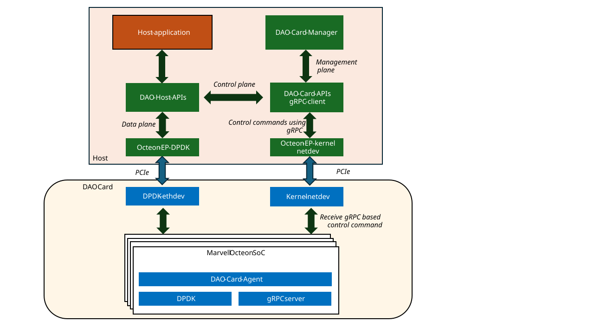

..  SPDX-License-Identifier: Marvell-MIT
    Copyright (c) 2025 Marvell.

DAO Card Manager
================

DAO Card Manager is a user-space application designed to manage DAO cards and provide a
comprehensive interface for configuring and monitoring DAO-supported offload cards. It delivers
management services, allowing users to configure card settings, monitor operational status, and
efficiently manage card resources. This facilitates streamlined deployment, maintenance, and
optimization of DAO cards in supported environments.

Supported Platforms
-------------------

DAO Card Manager is supported on the following platforms:

- **LiquidCrypto (LC)**

Architecture
-------------

DAO Card Services are implemented on top of gRPC protocol. DAO Card Library offers a set of APIs
that allows users to interact with DAO cards. DAO Card Manager offers a user-friendly interface for
management operations in DAO Card Library.

Using DAO Card Manager
----------------------

Build
~~~~~

DAO Card Manager will get built as part of the DAO build process. DAO Card Manager gets built
only if DAO is built for host environment and all the dependencies are met.

.. code-block:: console

    $ meson setup build
    $ ninja -C build
    $ ls build/app/dao-card-mgr

Launching Card Manager
~~~~~~~~~~~~~~~~~~~~~~

DAO Card Manager follows a client-server architecture. The same application 'dao_card_mgr' can be
run as a server or as a client. The server establishes gRPC connection with the card and listens for
incoming requests from card manager clients.

To launch DAO Card Manager as a server, use the following command:

.. code-block:: console

    $ ./build/app/dao-card-mgr -s
    $ [lcore -1] DAO_INFO: Starting as server

To launch DAO Card Manager as a client, use the following command:

.. code-block:: console

    $ ./build/app/dao-card-mgr -c
    $ [lcore -1] DAO_INFO: Starting as client
    $ ?

Once the client is launched, various commands can be executed to manage DAO cards.

.. note:: Root Privileges (Enforced)

   ``dao_card_mgr`` performs a hard check at startup and will exit immediately if the effective
   user ID is not ``root``. This is because several commands (e.g. *card_boot_source*,
   *card_app_update*,  *card_fw_update*, *card_failsafe_update*, *card_mcu_update*) require
   unloading / reloading kernel modules and configuring network interfaces as part of the reboot or
   bring-up sequence. These operations fundamentally require full root privileges; partial
   capabilities are not accepted.

   Action recommended: always run both the server and client instances of ``dao_card_mgr`` as ``root``.
   Invoking the program as a non-root user will terminate immediately with an explanatory message.

Environment Variables
----------------------

The following environment variables can be used to control the behavior of DAO Card Manager.

.. note:: Server-Side Configuration

   These environment variables must be set on the **server** side (where ``dao_card_mgr -s`` is
   running), not on the client side. The server process is responsible for all card management
   operations including module loading/unloading and boot processes. Setting these variables on
   the client side will have no effect.

OCTEON_EP_UNLOAD_BEFORE_BOOT
~~~~~~~~~~~~~~~~~~~~~~~~~~~~~

**Description:**

Some Linux distributions require the ``octeon_ep`` kernel module to be unloaded before executing
card boot operations and reloaded afterward to ensure proper driver initialization. When this
environment variable is set, the card manager will:

1. Unload the ``octeon_ep`` module before calling the boot executable
2. Execute the boot process
3. Reload the ``octeon_ep`` module after boot completion

This behavior is particularly useful for distributions where the module may interfere with the boot
process or where a clean module state is required after firmware updates.

**Usage:** Set this environment variable to any non-empty value to enable the feature.

**Default:** Not set (disabled)

**Example:**

.. code-block:: console

    # Enable module unload/reload around boot operations
    $ export OCTEON_EP_UNLOAD_BEFORE_BOOT=1
    $ ./build/app/dao-card-mgr -s

    # Disable the feature (default behavior)
    $ unset OCTEON_EP_UNLOAD_BEFORE_BOOT
    $ ./build/app/dao-card-mgr -s

**Note:** This setting affects all boot-related operations including ``card_boot_source``,
``card_app_update``, ``card_fw_update``, and ``card_failsafe_update`` commands.

OCTEON_EP_KO_PATH
~~~~~~~~~~~~~~~~~

**Description:**

When loading the ``octeon_ep`` kernel module, the card manager can use either ``insmod`` with a
specific module path or ``modprobe`` to load from the system's module directory. Setting this
variable allows you to specify a custom location for the kernel module.

**Usage:** Set this environment variable to the absolute path of the kernel module.

**Default:** If not set, the system will fall back to using ``modprobe octeon_ep``

**Example:**

.. code-block:: console

    # Use a specific module path
    $ export OCTEON_EP_KO_PATH=/usr/local/lib/modules/octeon_ep.ko
    $ ./build/app/dao-card-mgr -s

    # Use system modprobe (default)
    $ unset OCTEON_EP_KO_PATH
    $ ./build/app/dao-card-mgr -s

Management Services
-------------------

Configuration
~~~~~~~~~~~~~

DAO Card Manager provides a set of commands to manage DAO cards. The following commands are
available:

* ``card_init``

   This command initializes the DAO card and prepares it for operation. It sets up the card's
   initial state and ensures it is ready to handle requests. Note that this command must be executed
   before any other commands can be run on the card.

* ``card_info``

   This command retrieves information about the DAO card, including its capabilities, status,
   and configuration. It provides essential details that help users understand the current state
   of the card.

* ``card_boot_source <main|failsafe> <file_path>/mrvl-oct-boot``

   This command immediately boots the DAO card to the specified source image. The first argument
   selects the boot mode: ``main`` for the standard image, ``failsafe`` for the recovery image. The
   second argument specifies the full path to the ``mrvl-oct-boot`` binary used to perform the boot
   operation.

   After issuing this command, the card manager reloads the firmware and waits for the card to
   become ready before returning to the CLI prompt.

**Example:**
   .. code-block:: console

      card_boot_source main /tmp/mrvl-oct-boot
      card_boot_source failsafe /tmp/mrvl-oct-boot

* ``card_reboot``

   This command reboots the DAO card using its current boot source. Unlike ``card_boot_source``,
   this command automatically detects whether the card is currently running from the main (MMC) or
   failsafe (SPI) image and reboots using the same source.

   The command performs the following operations:

   1. Unloads the ``octeon_ep`` kernel module to ensure a clean state
   2. Reloads the driver and waits for card readiness

   This is useful when you want to restart the card without changing the boot source, such as
   after configuration changes or to recover from runtime issues while maintaining the current
   firmware image.

**Example:**
   .. code-block:: console

      card_reboot

* ``card_fini``

   This command finalizes the DAO card, cleaning up resources and preparing it for shutdown.
   It is important to run this command before stopping the card manager to ensure that all
   resources are properly released. No commands can be run on the card after this command
   is executed. Card reboot is required to reinitialize the card.

.. _diagnostics:

Diagnostics
~~~~~~~~~~~

DAO Card Manager provides diagnostic commands to help users monitor and troubleshoot DAO cards. The
following commands are available for diagnostics:

* ``card_stats``

   This command retrieves statistics from the DAO card, including per LC-core packet counts and
   other operational metrics. It helps users monitor the card's performance and diagnose issues
   such as packet drops or uneven load distribution.

* ``card_dmesg``

   Retrieves a truncated tail (recent portion) of the card kernel dmesg log through the gRPC
   service. If the deployed server version does not support the RPC the manager reports an
   "unsupported" error.
   Output size is capped (currently ~64KB) to avoid excessive transfer.

* ``card_applog``

   Fetches the current application (crypto agent) log contents. If the log file is not present, an
   empty result is returned (treated as success). Intended for quick inspection without direct file
   access to the card filesystem.

* ``card_temperature``

    This command retrieves sensor readings from the DAO card (temperature and voltage rails as
    exposed by the underlying firmware / hardware monitoring subsystem). Internally it invokes the
    card-side gRPC "Sensors" RPC which executes the standard Linux ``sensors`` utility and returns
    its consolidated multi-line output.

    The client truncates output to fit its internal buffer; the server currently caps captured
    output (e.g. at ~16KB) to guard against pathological sizes. If truncation occurs the text
    "[truncated]" may appear at the end of the output.

**Example:**
    .. code-block:: console

      Card sensors output:
      scmi_sensors-virtual-0
      Adapter: Virtual device
      vdd_core:     761.00 mV
      vdd_sys:      861.00 mV
      vdd_ddr:        1.20 V
      Thrml_Margin:  +48.2 C
      Chip_Temp:     +51.8 C
      Chip_1s_Pwr:   16.56 W

* ``card_image_version``

    This command retrieves both image and application version information from the DAO card.
    It provides essential version details that help users understand the current software versions
    running on the card, which is useful for compatibility checking, troubleshooting, and
    update planning.

    The command returns:

    * **Image version**: The current operating system version running on the card (read from ``/etc/image_version`` on the card)
    * **App version**: The current application version running on the card (from ``DAO_CARD_VERSION``)

    Both versions are retrieved via a single efficient gRPC call to the card.

**Example:**
    .. code-block:: console

      card_image_version
      Image version: 25.10.0
      App version: 25.09.0

    This command is particularly useful when:

    * Planning application updates to verify compatibility
    * Troubleshooting version-related issues
    * Auditing deployed software versions
    * Determining update requirements

    The command supports backward compatibility - if the card's server doesn't support version
    retrieval, it will display appropriate messages indicating the limitation.

Above options are supported on all DAO cards where the underlying firmware exposes the respective RPCs.

.. _firmware_management:

Firmware Management
~~~~~~~~~~~~~~~~~~~

DAO Card Manager also supports firmware management for DAO cards. The following commands are
available for managing firmware:

* ``card_app_update <file_path>/app.tar <file_path>/mrvl-oct-boot``

   This command updates only the application partition of the DAO card firmware. The ``<filename>``
   argument specifies the full path to the file to upload. The second argument specifies the full
   path to the ``mrvl-oct-boot`` binary used to perform the boot operation.
   Use this command to update DAO applications in the firmware without updating the complete
   firmware.

**Example:**
   .. code-block:: console

      card_app_update /tmp/app.tar /tmp/mrvl-oct-boot

   Supported only when the card is booted with the 'main' image. After a successful update, the
   manager automatically reloads the firmware helper (``mrvl-oct-boot``) and waits
   (up to ~20 seconds) for the card to become ready before returning to the CLI prompt.

Enhanced Compatibility Check for App Updates
~~~~~~~~~~~~~~~~~~~~~~~~~~~~~~~~~~~~~~~~~~~~~

The ``card_app_update`` command includes an enhanced compatibility checking system that validates
app update packages against the current image version before installation. This prevents
incompatible updates and ensures system stability.

**Compatibility Matrix File Format**

App update packages would include a compatibility matrix file at ``lc_service/compatibility_matrix.txt``
that specifies compatible image versions:

.. code-block:: text

   # Compatibility Matrix for App Updates
   # This file specifies compatible image versions for app updates

   [Image_VERSIONS]
   25.10.0
   25.09.1
   25.09.0

**Version Sources**

* **Current Image version**: Retrieved from card via gRPC (server reads ``/etc/image_version``)
* **App version information**: Retrieved via gRPC from card (uses ``DAO_CARD_VERSION``)
* **Compatibility matrix**: From tar file at ``lc_service/compatibility_matrix.txt``

**Compatibility Logic**

The compatibility check follows this process:

1. Extract app update tar file to temporary directory
2. Read ``lc_service/compatibility_matrix.txt`` from extracted content
3. Parse ``[Image_VERSIONS]`` section for compatible versions
4. Check if current image version is listed as compatible
5. Allow update only if image version is compatible, otherwise reject with error

**Backward Compatibility Support**

To ensure proper version control and prevent incompatible updates:

* **Unknown image version**: Update is **rejected** if image version is unknown or cannot be determined
* **Missing compatibility matrix**: Allows update with warning (assumes compatible)
* **Valid image version**: Update proceeds only if image version matches compatibility matrix

This ensures that app updates are only applied to compatible image versions, preventing
potential system failures from incompatible combinations.

**Using card_image_version Command**

The ``card_image_version`` command retrieves both image and app version information from the card:

.. code-block:: console

   card_image_version

This command displays:

* **Image version**: Current operating system version on the card
* **App version**: Current application version running on the card

Both versions are retrieved via a single gRPC call for efficiency.

   This command is supported on LiquidCrypto (LC) cards.

* ``card_app_fallback``

   This command switches the application images used by the 'main' image on LiquidCrypto card.
   This command is useful for recovery scenarios when an application image updated using
   ``card-app_update`` fails to start.
   The command is only supported when the card is booted from the 'failsafe' image.

   If the card is not in SPI boot mode, the command will return an error.

* ``card_fw_update <file_path>/main_fw.tar <file_path>/mrvl-oct-boot``

   This command updates the complete DAO card firmware. The ``<filename>`` argument specifies the
   full path to the firmware file to upload. The second argument specifies the full path to the
   ``mrvl-oct-boot`` binary used to perform the boot operation.
   Use this command to update all firmware partitions, including the application and system
   partitions (i.e: kernel and root filesystem).

**Example:**
   .. code-block:: console

      card_fw_update /tmp/main_fw.tar /tmp/mrvl-oct-boot

   Supported only when the card is booted with the 'failsafe' image. After a successful update the
   manager reloads using the provided boot binary (``mrvl-oct-boot``) targeting the 'main' image and
   waits for readiness.
   If the card was already in 'main' boot mode this command is rejected (permission error).

   This command is supported on LiquidCrypto (LC) cards.

* ``card_failsafe_update <file_path>/failsafe_fw.img <file_path>/mrvl-oct-boot``

   This command updates the failsafe image on the DAO card. The ``<filename>`` argument specifies
   the full path to the failsafe image file to upload. The second argument specifies the full path
   to the ``mrvl-oct-boot`` binary used to perform the boot operation.

  **Example:**
   .. code-block:: console

      card_failsafe_update /tmp/failsafe_fw.img /tmp/mrvl-oct-boot

   Supported only when the card is booted with 'main' image. The update can take approximately 10 to
   12 minutes. After a successful update the manager reloads into the 'failsafe' context and waits
   for readiness before returning. The command verifies the integrity of the uploaded image using a
   checksum before flashing.

   This command is supported on LiquidCrypto (LC) cards.

* ``card_mcu_update <file_path>/mcu_fw.bin``

   Updates the MCU / controller firmware component packaged for the card. Use this for low-level
   controller microcode / support processor updates that do not require full firmware replacement.

   **Example:**
   .. code-block:: console

      card_mcu_update /tmp/mcu_fw.bin

   Only allowed in 'main' boot mode; denied in 'failsafe'. If an MCU update script fails, the CLI
   reports an aborted error status.

For more details on partition layout of LiquidCrypto (LC) cards, see
:ref:`LiquidCrypto Partitioning <liquidcrypto_partitioning>`.
