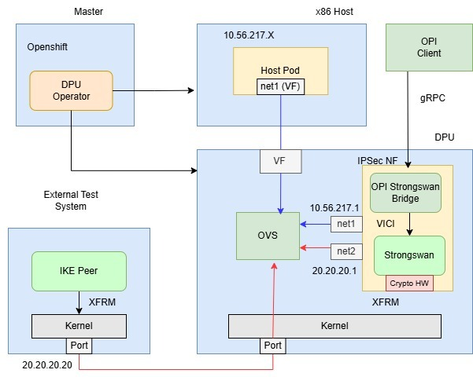

..  SPDX-License-Identifier: Marvell-MIT
    Copyright (c) 2026 Marvell.

***********************************************************
Zero-Overhead Kubernetes Encryption: IPsec Offload on Marvell OCTEON
***********************************************************

Executive Summary
================================
Enterprises and service providers increasingly rely on **IPsec** to secure traffic across hybrid cloud, edge, and data center environments. But at scale,
software-only IPsec can become a bottleneck: encryption/decryption, integrity checks, and key management consume CPU cycles, reduce workload density, and can
introduce latency jitter under load.

The Challenge: IPsec Without Kubernetes-Native Orchestration
^^^^^^^^^^^^^^^^^^^^^^^^^^^^^^^^^^^^^^^^^^^^^^^^^^^^^^^^^^^^
Traditionally, deploying and managing IPsec in enterprise environments has been operationally complex:

- **Manual, error-prone configuration**: IPsec tunnels require careful coordination of pre-shared keys, certificates, SPD/SAD entries, and routing—often across multiple teams and systems.
- **No declarative lifecycle management**: Scaling, upgrading, or recovering IPsec gateways typically involves custom scripts, downtime, and manual intervention.
- **Tight coupling to infrastructure**: IPsec services are often baked into VMs or bare-metal hosts, making them difficult to migrate, version, or audit.
- **Lack of observability and integration**: Without Kubernetes-native tooling, monitoring, logging, and policy enforcement are fragmented and inconsistent.
- **Resource contention**: Software-based IPsec competes with application workloads for CPU and memory, leading to unpredictable performance under load.

The Solution: IPsec as a Kubernetes-Native Network Function on Marvell DPU
^^^^^^^^^^^^^^^^^^^^^^^^^^^^^^^^^^^^^^^^^^^^^^^^^^^^^^^^^^^^^^^^^^^^^^^^^^
This white paper describes a production-oriented pattern to **offload IPsec cryptography to Marvell OCTEON hardware** and **operationalize it using the DPU Operator**:

- **strongSwan** as the IPsec VPN **control plane** inside the same network function (IKE, tunnel negotiation, policy/SA programming)
- The Linux **XFRM** framework for IPsec policy/state and packet processing integration
- Marvell **CPT** (Crypto Processing Technology) for hardware crypto acceleration
- The open-source **DPU Operator** to deploy and manage the IPsec NF on the DPU

Why DPU Operator Changes the Game
^^^^^^^^^^^^^^^^^^^^^^^^^^^^^^^^^
The **DPU Operator** brings Kubernetes-native simplicity to IPsec deployment and management:

- **Declarative deployment**: Define your IPsec network function as a Custom Resource (CR)—no manual tunnel configuration or scripting required.
- **Automated lifecycle management**: The operator handles deployment, scaling, upgrades, and health monitoring, reducing operational burden.
- **Consistent, repeatable patterns**: Deploy the same IPsec blueprint across clusters, regions, or edge sites using GitOps workflows.
- **Seamless integration**: Leverage Kubernetes RBAC, secrets management, observability, and policy frameworks for IPsec just like any other workload.
- **Hardware acceleration made easy**: The operator abstracts the complexity of offloading crypto to Marvell CPT—users get hardware-accelerated IPsec without needing to understand the underlying details.

The outcome is a repeatable blueprint for Kubernetes/OpenShift deployments that centralize secure tunneling on the DPU, freeing host CPU resources for
applications while maintaining strong, consistent security at Line rate.

Solution Overview
=================

What is strongSwan?
^^^^^^^^^^^^^^^^^^^
**strongSwan** is a widely used, open-source IPsec VPN implementation supporting IKEv2 and modern cryptographic suites. It is commonly used to build secure
site-to-site tunnels, remote access VPNs, and secure overlays between networks.

What is XFRM (Linux IPsec framework)?
^^^^^^^^^^^^^^^^^^^^^^^^^^^^^^^^^^^^^
Linux IPsec is implemented through the **XFRM** framework, which:

- Maintains IPsec **policies** (SP) and **security associations** (SA)
- Applies ESP/AH transforms to matching traffic
- Integrates with the kernel networking stack to process packets according to IPsec state

In this architecture, strongSwan programs XFRM policies and SAs, and the data path applies the transforms.

Why deploy IPsec as a DPU-hosted Network Function?
^^^^^^^^^^^^^^^^^^^^^^^^^^^^^^^^^^^^^^^^^^^^^^^^^^
At scale, consolidating IPsec termination on the DPU helps:

- Reduce encryption overhead on worker nodes
- Improve predictability by isolating security functions from application compute
- Standardize secure ingress/egress points for multi-tenant and edge environments

What is DPU Operator?
^^^^^^^^^^^^^^^^^^^^^
The **DPU Operator** (`openshift/dpu-operator <https://github.com/openshift/dpu-operator>`_) is an open-source Kubernetes operator that brings DPU-hosted network functions into the Kubernetes ecosystem:

- **Kubernetes-native**: Deploy, manage, and monitor DPU workloads using familiar CRs, kubectl, and GitOps workflows
- **Declarative lifecycle management**: Define your network function once; the operator handles provisioning, upgrades, and health checks
- **Hardware abstraction**: Leverage DPU acceleration (crypto, networking) without writing platform-specific code
- **Multi-vendor friendly**: Designed for portability across DPU platforms and Kubernetes distributions
- **Open source & community-driven**: Developed in collaboration with Red Hat, Marvell, and the broader community

Architecture Diagram & Design
=============================
The pattern deploys a **single DPU-hosted Network Function** running **strongSwan**, managed by DPU Operator. In this composition:

- **strongSwan** provides the IPsec **control plane** (IKE) and programs the required policies/SAs
- **Linux networking stack** provides the **data plane** for packet I/O and forwarding

Look-aside IPsec crypto offload (XFRM → CPT)
^^^^^^^^^^^^^^^^^^^^^^^^^^^^^^^^^^^^^^^^^^^^
In this design, **Linux provides the data plane** for the network function, while XFRM applies IPsec policy/state and the heavy
cryptographic operations are offloaded to dedicated hardware (CPT):

#. strongSwan negotiates tunnels (IKE) and installs XFRM policies/SAs.
#. Matching packets are classified by XFRM and prepared for ESP processing.
#. Crypto operations for ESP (encrypt/decrypt + integrity) are offloaded to **CPT**.
#. Packets are returned to the networking pipeline and forwarded as encrypted/decrypted traffic.

   IPsec offload on Marvell OCTEON DPU: Linux data plane + strongSwan control plane with XFRM look-aside crypto to CPT, deployed via DPU Operator.

Highlights: What OCTEON + CPT Adds
==================================
- **Hardware crypto acceleration (CPT)**: increases IPsec encryption/decryption capacity while reducing CPU overhead.
- **Better workload density**: frees host cores for application pods by placing the security function on the DPU.
- **Operational consistency**: standardizes secure tunneling as a managed network function in Kubernetes/OpenShift.

How To Use
===========
Install DPU Operator on the Cluster
^^^^^^^^^^^^^^^^^^^^^^^^^^^^^^^^^^^
This solution deploys the IPsec network function (strongSwan) on the DPU using the open-source **DPU Operator**:
`openshift/dpu-operator <https://github.com/openshift/dpu-operator>`_.

At a high level, the workflow is:

#. Prepare a cluster with Marvell DPU hardware attached and reachable (single-cluster or two-cluster topology).
#. Deploy the DPU Operator components.
#. Label eligible nodes and create the top-level operator configuration CR.
#. Apply a ``ServiceFunctionChain`` CR to deploy the IPsec network function onto the DPU.

With the DPU Operator, what was once a complex, multi-step manual process becomes a simple, declarative Kubernetes workflow—making hardware-accelerated IPsec accessible to any platform team.

Key Takeaways
=============
#. IPsec at scale can create a significant CPU “security tax” on Kubernetes worker nodes.
#. Deploying **strongSwan** as a DPU-hosted NF provides a clean separation of security and application compute.
#. Linux **XFRM** integrates IPsec policy/SA handling, while **CPT** accelerates cryptographic processing to improve efficiency and predictability.
#. The open-source **DPU Operator** operationalizes this pattern using Kubernetes-native resources.

**Contact**
===========
`DAO <mailto:dao@marvell.com>`_

