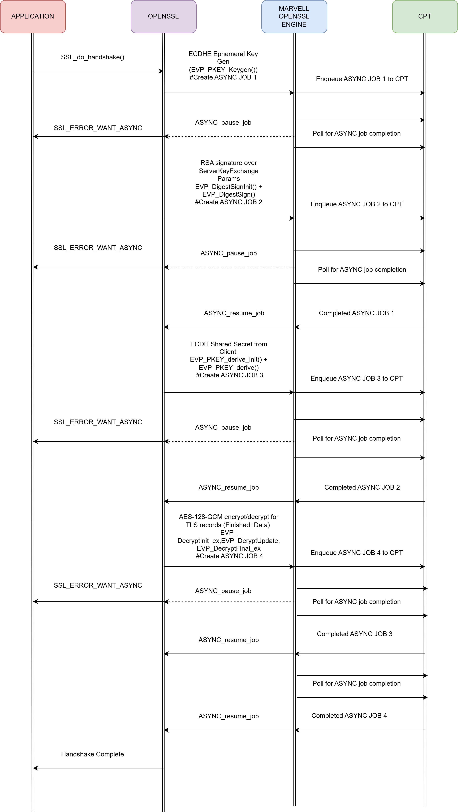
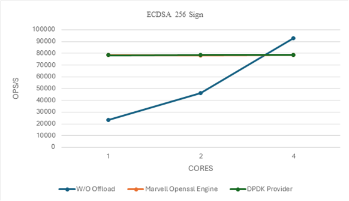
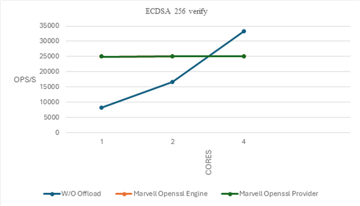
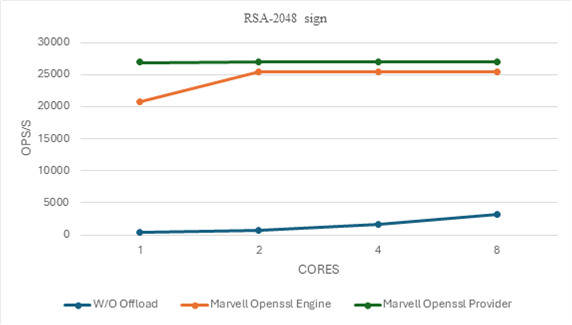
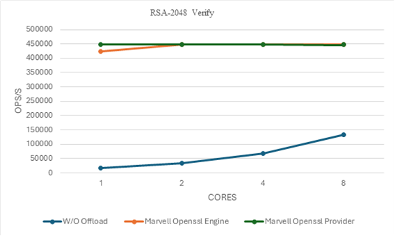
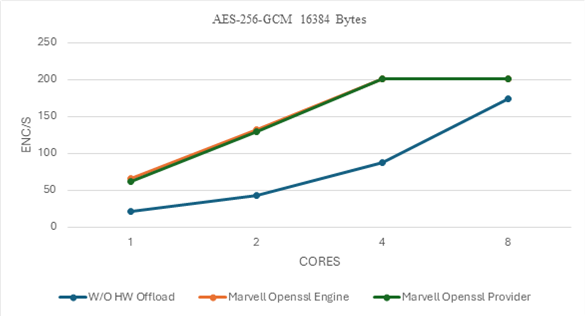

.. SPDX-License-Identifier: Marvell-MIT
   Copyright (c) 2025 Marvell

*************************************
Accelerated OpenSSL Solution Library
*************************************

Executive Summary
=================
Secure web services, VPN infrastructures, and high-throughput networking systems are designed to process large volumes of cryptographic workloads with high efficiency and low latency. When cryptographic workloads—such as AES encryption, RSA key exchange, or TLS handshakes—are executed entirely in software, they can place substantial demands on CPU resources, leading to increased latency, reduced throughput, and scalability limitations under heavy traffic conditions.

The **Marvell OpenSSL Engine** addresses these challenges by offloading cryptographic workloads to dedicated hardware accelerators integrated into Marvell OCTEON processors. This approach significantly enhances performance and efficiency across a wide range of cryptographic operations—including encryption, decryption, key exchange, and hashing—while substantially reducing CPU utilization. By isolating these processes within secure hardware, it strengthens system security and ensures consistent, low-latency performance. The Marvell OpenSSL Engine integrates seamlessly with OpenSSL-based applications, making it an ideal solution for building scalable, secure, and high-performance systems.

Performance Outcomes:
^^^^^^^^^^^^^^^^^^^^^
- **8x** faster RSA-2048 signature generation and **3x** faster verification.
- **4x** higher ECDSA P-256 sign/verify throughput.
- **3x** higher TLS bulk encryption throughput with AES-256-GCM (typical TLS record sizes).
- Peak power consumption of just **23W**.

This makes it ideal for secure web servers, VPN gateways, storage encryption, and high-performance networking equipment that demand both performance and efficiency.

Solution Overview
=================

OpenSSL is an open-source library providing SSL/TLS protocol stack and a suite of cryptographic functions—including encryption, digital signatures, and hashing—for securing network communications.

Cryptographic operations—encryption, decryption, hashing, and signing—are computationally intensive and can bottleneck security protocols such as TLS and IPsec, as well as encrypted storage systems. OpenSSL addresses this via its extensibility frameworks: Engine (prior to openssl-3.0) and Provider (openssl-3.0 and later), enabling custom or hardware acceleration of cryptographic algorithms.
OpenSSL supports hardware cryptographic offload through two mechanisms:

Engine Framework (OpenSSL < 3.0)
^^^^^^^^^^^^^^^^^^^^^^^^^^^^^^^^
The **Marvell OpenSSL Engine** leverages the OpenSSL Engine framework to offload cryptographic operations—such as AES-GCM, AES-CBC, RSA, and ECC—to the OCTEON CPT hardware accelerator, a dedicated crypto processing unit integrated into OCTEON SoCs that implements high-performance, low-latency cryptographic primitives in hardware. It supports asynchronous operation, ensuring efficient CPU utilization by freeing processor cycles while the hardware executes cryptographic tasks.

Provider Framework (OpenSSL ≥ 3.0)
^^^^^^^^^^^^^^^^^^^^^^^^^^^^^^^^^^
The Provider framework offers improved extensibility and maintainability, aligning with OpenSSL's modern architecture for secure, high-throughput applications. The **Marvell OpenSSL Provider** integrates the CPT accelerator with OpenSSL 3.x, supporting asynchronous offload of cryptographic primitives including RSA, ECC, AES-GCM, and AES-CBC.

Key Benefits
^^^^^^^^^^^^^

- Offloads TLS encryption and handshake processing to dedicated hardware, minimizing CPU involvement.
- Frees CPU cores to handle application logic and network processing, improving overall system throughput.
- Delivers up to 75K ECDSA P-256 signatures/s and 25K verifications/s per core on CN106XX.
- Achieves 25K RSA-2048 signatures/s and 400K verifications/s per core on CN106XX.
- Processes up to 200 Gbps AES-256-GCM for 16 KB blocks, corresponding to typical TLS record sizes on CN106XX.

Architecture & Design
=====================

Workflow
^^^^^^^^^
The following workflow illustrates how the TLS 1.2 handshake is executed on the server side using the Marvell OpenSSL engine in an asynchronous manner with the ECDHE-RSA-AES128-GCM-SHA256 cipher suite.

Marvell OpenSSL Engine leverages OpenSSL's async framework to offload cryptographic operations to CPT (Crypto Processing Technology) hardware, enabling non-blocking handshake and high performance.

#. The application initiates the handshake with SSL_do_handshake().
#. When OpenSSL encounters a cryptographic operation, it calls the Marvell OpenSSL engine.
#. OpenSSL (libcrypto) creates an ASYNC_JOB and assigns it to the engine.
#. The engine uses this job context to enqueue the crypto request to CPT hardware for execution.
#. After submission, OpenSSL signals the application with SSL_ERROR_WANT_ASYNC, indicating the handshake is paused while CPT processes the job.
#. The application polls for completion; when CPT finishes, the engine updates the job status and OpenSSL resumes the handshake via ASYNC_resume_job.
#. This process repeats for all major handshake steps, which are offloaded to CPT:
      - ECDHE ephemeral key generation – CPT accelerates elliptic curve key generation.
      - RSA signature for ServerKeyExchange – CPT performs modular exponentiation and signing.
      - ECDH shared secret derivation – CPT computes the shared secret using hardware acceleration.
#. Multiple jobs can be queued in CPT for parallel execution, reducing latency.

The handshake completes after all jobs finish, and subsequent record protection for application data uses AES-128-GCM encryption/decryption offloaded to CPT asynchronously.

Performance Highlights
======================

Performance of RSA-2048, ECDSA P-256, and AES-256-GCM (16 KB block size) was measured using OpenSSL speed, comparing software-only execution on ARMv9 Neoverse N2 cores with hardware offload via the Marvell OpenSSL Engine and Provider, highlighting significant throughput and efficiency gains.

**Metric:** Software Only with CPT Offload Improvement

ECDSA Performance Insights
^^^^^^^^^^^^^^^^^^^^^^^^^^
- With offloading, ECDSA over 256-bit prime field elliptic curve sign and verify operations reach performance levels that would otherwise require multiple cores without offloading.
- Specifically, one core with offloading achieves throughput comparable to four cores without offloading.
- This demonstrates a 4x efficiency gain, highlighting the effectiveness of hardware acceleration for elliptic curve operations.

**Note:** At 4 cores, the CPT hardware limit for ECDSA operations is reached, causing performance to peak at this value.

RSA-2048 Performance Insights
^^^^^^^^^^^^^^^^^^^^^^^^^^^^^
- With offloading, RSA-2048 sign operations consistently achieve ~26,935 ops/sec across all core counts.
- Without offloading, performance scales linearly from ~391 ops/sec (1 core) to ~3,133 ops/sec (8 cores).
- For verify, offloading delivers ~447,000 ops/sec regardless of core count.
- Without offloading, verify performance increases from ~16,762 ops/sec (1 core) to ~134,163 ops/sec (8 cores).
- One core with offloading matches the performance of eight cores without offloading for both sign and verify, showing 8x gain for sign and 3x gain for verify.

**Note:** For RSA operations, the CPT hardware reaches its peak performance of 26.5K ops/sec at just 1 core.

AES-256_GCM Performance insights
^^^^^^^^^^^^^^^^^^^^^^^^^^^^^^^^
For a block size of 16K bytes, Marvell CPT offload via OpenSSL engine and provider delivers 3x higher throughput than software-only mode at low core counts. With just 4 cores, both offload modes saturate the CPT hardware limit (~202 Gbps), while software mode requires 8 cores to approach similar performance. The 16KB size, aligned with TLS record limits, better showcases bulk encryption acceleration.

System Configuration
^^^^^^^^^^^^^^^^^^^^^

+---------------------+--------------------------------+
| Board Model         | crb106-pcie                    |
+---------------------+--------------------------------+
| Board Serial        | WA-CN106-A1-PCIE-2P100-135     |
+---------------------+--------------------------------+
| Chip                | 0xb9 Pass B0                   |
+---------------------+--------------------------------+
| SKU                 | MV-CN10624-B0-AAP              |
+---------------------+--------------------------------+
| CORECLK             | 2500 MHz                       |
+---------------------+--------------------------------+
| MESHCLK             | 1900 MHz                       |
+---------------------+--------------------------------+
| SCLK                | 1200 MHz                       |
+---------------------+--------------------------------+
| DFICLK              | 800 MHz                        |
+---------------------+--------------------------------+
| Ubuntu version      | 24.04                          |
+---------------------+--------------------------------+
| OpenSSL Version     | OpenSSL-3.3.3                  |
+---------------------+--------------------------------+
| DPDK Version        | DPDK-24.11                     |
+---------------------+--------------------------------+

Integration & Setup
===================

Developers can seamlessly enable OpenSSL cryptographic acceleration using DAO-supported repositories.

To perform performance benchmarking using the Marvell OpenSSL Engine and Provider, follow the documentation below:

#. `<https://github.com/MarvellEmbeddedProcessors/marvell-openssl-engine/tree/main/doc/openssl_engine>`_

DAO Components
==============

#. `Marvell OpenSSL Engine <https://github.com/MarvellEmbeddedProcessors/marvell-openssl-engine>`_
#. `Marvell DPDK <https://github.com/MarvellEmbeddedProcessors/marvell-dpdk>`_

Deplpoyment Scenarios
=====================

#. **Cloud Data Center TLS Offload** - Hardware accelerators offload TLS record encryption and decryption, delivering significantly lower latency and higher throughput while freeing CPU cycles for application workloads.
#. **Financial Transaction Signing** - Secure hardware modules handle key management and digital signing, ensuring tamper resistance, reduced response latency, and compliance with cryptographic standards.
#. **VPN and IPsec Gateway Acceleration** - Crypto accelerators offload IPsec encryption/decryption and key exchange, achieving wire-speed secure tunneling and improved power efficiency for network gateways.
#. **Edge and CDN TLS Termination** - SmartNICs and DPUs offload bulk cipher and handshake operations, allowing high-volume encrypted traffic to be processed efficiently with sub-millisecond latency.
#. **AI Cluster Data Plane Protection** - Inline DPU or NIC-based crypto offload secures high-speed interconnect traffic with minimal latency overhead, ensuring data confidentiality in large-scale AI workloads.

Learn More
==========

#. `DAO documentation  <marvellembeddedprocessors.github.io/dao>`_
#. `OpenSSL Engine repository <github.com/MarvellEmbeddedProcessors/marvell-openssl-engine>`_
#. `Contact <dao@marvell.com>`_

