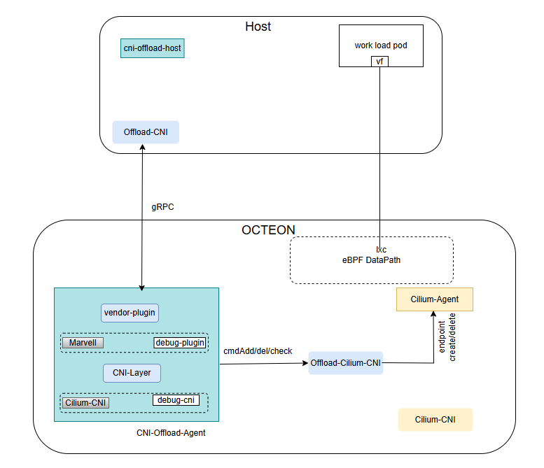

..  SPDX-License-Identifier: Marvell-MIT
    Copyright (c) 2026 Marvell.

*******************************************************************
The DPU-Native Cluster: Offloading Kubernetes Primary Networking to Marvell OCTEON
*******************************************************************

Executive Summary
=================
Kubernetes networking implemented through CNI plugin consumes a significant portion of host CPU cycles. Every packet traversing the cluster passes through
the CNI data path for routing, policy enforcement, encryption, and observability. In traditional deployments, this data path is **tightly coupled to the
host CPU**, meaning networking overhead directly competes with application workloads for compute resources.

By offloading CNIs like **Cilium** (with its eBPF-based data path) to a **Marvell OCTEON DPU**, organizations can:

- **Reclaim host CPU cycles** for revenue-generating application workloads
- **Accelerate the data path in hardware** for wire-speed packet processing, crypto, and policy enforcement
- **Improve workload density** by running more Pods per node without networking bottlenecks
- **Enable future acceleration** for hardware-assisted service mesh, encryption, and telemetry

While this white paper demonstrates offload with Cilium, the architecture is **CNI plug-in Agnostic** any CNI plug-in (Calico, Flannel, etc.) can be offloaded to
the DPU with minimal adaptation.

The outcome is a repeatable blueprint where the kubelet still calls ``cniAdd``, but the heavy lifting—veth creation, eBPF program execution, policy
enforcement—happens entirely on the DPU. Host CPUs are freed for applications, paving the way for richer in-fabric visibility, offloaded service meshes,
and zero-trust enforcement at wire speed.

Solution Overview
=================

What is Container Network Interface (CNI)?
^^^^^^^^^^^^^^^^^^^^^^^^^^^^^^^^^^^^^^^^^^
The **CNI specification** is intentionally minimal—four JSON verbs (``ADD``, ``DEL``, ``CHECK``, ``VERSION``) that a binary must implement. When the kubelet
launches a Pod, it passes the Pod's namespace, network-namespace FD, and a blob of configuration to the plug-in; the plug-in returns an IP, routes, and
optional metadata.

Because Kubernetes never looks behind that curtain, any data-plane technology—iptables, eBPF, OVS, SR-IOV, hardware offload—can be dropped in as long as it
speaks the CNI API. This abstraction is what makes CNI offload possible without modifying Kubernetes core.

What is Cilium CNI?
^^^^^^^^^^^^^^^^^^^
**Cilium** is the most widely adopted CNI in production Kubernetes environments, deployed at every major hyperscaler. Key capabilities include:

- **eBPF data path**: High-performance packet processing without kernel module modifications
- **L3-L7 policy enforcement**: Network policies, HTTP-aware rules, and service mesh integration
- **Deep observability**: Hubble provides real-time flow visibility and metrics
- **Identity-based security**: Workload identity for zero-trust networking

Cilium's production burn-in and comprehensive feature set make it the default choice for CNI offload demonstration.

Why Offload the Primary CNI to a DPU?
^^^^^^^^^^^^^^^^^^^^^^^^^^^^^^^^^^^^^
A **DPU (Data Processing Unit)** adds an isolated NIC-attached SoC that can run Linux, offload switching, crypto, and telemetry—without stealing host
resources. Offloading the primary CNI to the DPU provides:

- **Zero host CPU overhead**: All packet processing, policy enforcement, and observability run on the DPU
- **Improved workload density**: More host cores available for application Pods
- **Consistent security posture**: Policy enforcement happens at wire speed with hardware acceleration
- **Simplified operations**: No secondary network to manage; existing Kubernetes workflows unchanged

Architecture Diagram & Design
=============================
The architecture deploys CNI components across host and DPU, connected via PCIe Endpoint and SR-IOV for high-performance packet I/O.

   Kubernetes CNI offload: Cilium data path on OCTEON DPU with SR-IOV packet I/O and gRPC control plane.

Highlights: What OCTEON Adds
============================
When Cilium runs on **OCTEON** platforms, Marvell acceleration enhances CNI performance:

- **Dedicated packet processing**: DPU cores handle all eBPF execution, freeing host CPUs
- **Hardware crypto acceleration (CPT)**: Wire-speed encryption for encrypted overlay networks and service mesh mTLS
- **Predictable latency**: Isolated DPU processing eliminates contention with application workloads
- **Enhanced observability**: Telemetry collection and export without host CPU impact
- **Higher workload density**: More host cores available for revenue-generating applications

How To Use
==========
The complete source code, deployment instructions, and configuration guides for this solution are available in the open-source repository:

`MarvellEmbeddedProcessors/k8s-cni-offload <https://github.com/MarvellEmbeddedProcessors/k8s-cni-offload>`_

The repository includes:

- **Host-side components**: ``cni-offload-host`` DaemonSet and ``offload-cni`` binary
- **DPU-side components**: ``cni-offload-agent`` and Cilium integration
- **Deployment manifests**: Kubernetes YAML files for both host and DPU clusters
- **Configuration examples**: Sample CNI configurations and gRPC settings
- **Build instructions**: Steps to compile and package all components

At a high level, the deployment workflow is:

#. Prepare a Kubernetes cluster with Marvell DPU hardware attached via PCIe Endpoint.
#. Install the host-side kernel drivers (``octeon_ep.ko``, ``octeon-ep_vf.ko``).
#. Deploy ``cni-offload-host`` DaemonSet to install the CNI shim on worker nodes.
#. On the DPU, deploy Cilium and the ``cni-offload-agent`` DaemonSet.
#. Configure SR-IOV for high-performance packet I/O between host Pods and DPU.
#. Verify connectivity by deploying test Pods and observing network traffic on the DPU.

Refer to the repository README and documentation for detailed step-by-step instructions.

Key Takeaways
=============
#. **Zero-patch offload**: The entire Cilium data path runs on the DPU without modifications to Kubernetes, CRI, or the node OS.
#. **Minimal host footprint**: Only a thin gRPC shim runs on the host; all packet processing and policy enforcement happen on the DPU.
#. **Upstream-friendly**: The offload architecture requires minimal Cilium changes, making upstream rebases trivial.
#. **Extensible pattern**: The same architecture can be adapted to offload other CNIs (Calico, etc.) to the DPU.
#. **Production-ready components**: Leverages battle-tested Cilium, SR-IOV, and PCIe Endpoint technologies.

This PoC is a first step toward making the DPU the default home for Kubernetes primary networking, freeing host CPUs for applications and paving the way for
richer in-fabric visibility, offloaded service meshes, and zero-trust enforcement at wire speed with OCTEON's crypto acceleration capabilities.

Contact
=======
`DAO <mailto:dao@marvell.com>`_
