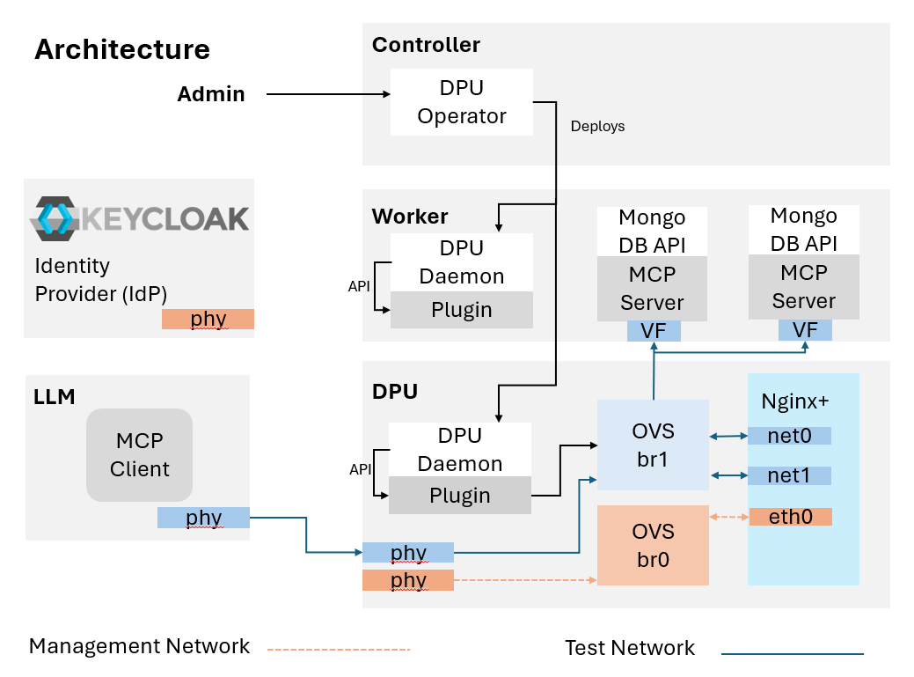

..  SPDX-License-Identifier: Marvell-MIT
    Copyright (c) 2026 Marvell.

*****************************************************************************************************
Agentic AI at Scale: Secure, Session-Aware MCP Deployments with Accelerated NGINX on Marvell OCTEON
*****************************************************************************************************

Executive Summary
================================
As **Model Context Protocol (MCP)** emerges as a backbone for agentic AI, deploying MCP at production scale in Kubernetes introduces a new set of
infrastructure challenges that stretch standard deployment patterns.

MCP sessions are **stateful**, require **session pinning** to backend server pods, and can drive **massive rates of TLS handshakes and OAuth/JWT
processing**. At scale, this MCP “infra-tax” can dominate the compute budget, reduce backend pod density, and make latency less predictable.

Large-scale providers increasingly address this by isolating compute-intensive ingress/security functions onto specialized software and hardware
infrastructure. In this white paper, we present a **production-ready, open-source blueprint** developed collaboratively by **Marvell, Red Hat, and F5**
showing how **NGINX Plus** deployed onto an **OCTEON DPU** using the **open-source DPU Operator** can:

- Terminate and enforce **line-rate TLS security** at the edge
- Centralize **OAuth/JWT validation** (and cache JWKS) at the proxy layer
- Perform **session-aware load balancing** for stateful MCP traffic
- Improve connection density and free host CPU for MCP servers

Solution Overview
=================

What is MCP (Model Context Protocol)?
^^^^^^^^^^^^^^^^^^^^^^^^^^^^^^^^^^^^^
MCP is a protocol used by agentic systems to interact with “MCP servers” that provide tools, context, and data access. MCP traffic is typically
**session-oriented**: a session is established and subsequent requests must remain pinned to the same backend to preserve continuity.

What is NGINX Plus?
^^^^^^^^^^^^^^^^^^^
**NGINX Plus** is the commercial edition of NGINX with advanced capabilities for production traffic management such as:

- API-driven observability and control (NGINX Plus API)
- Advanced load balancing primitives (including session persistence / stickiness)
- Integrated security controls commonly used at the edge

In this blueprint, NGINX Plus is deployed as a **reverse proxy** to offload and centralize:

- **TLS termination**
- **OAuth/JWT validation** (including JWKS retrieval + caching)
- **MCP session-aware load balancing** (affinity)

What is DPU Operator?
^^^^^^^^^^^^^^^^^^^^^
The **DPU Operator** (`openshift/dpu-operator <https://github.com/openshift/dpu-operator>`_) is an open-source Kubernetes operator that brings DPU-hosted network functions into the Kubernetes ecosystem:

- **Kubernetes-native**: Deploy, manage, and monitor DPU workloads using familiar CRs, kubectl, and GitOps workflows
- **Declarative lifecycle management**: Define your network function once; the operator handles provisioning, upgrades, and health checks
- **Hardware abstraction**: Leverage DPU acceleration (crypto, networking) without writing platform-specific code
- **Multi-vendor friendly**: Designed for portability across DPU platforms and Kubernetes distributions
- **Open source & community-driven**: Developed in collaboration with Red Hat, Marvell, and the broader community

Architecture Diagram & Design
=============================
Below is a conceptual deployment view (logical planes). The key principle is that the **DPU hosts the edge/security layer**, so the host CPU can be
reserved for backend workloads.

   MCP-ready Kubernetes edge architecture: NGINX Plus offload on OCTEON DPU via DPU Operator.

System Architecture
^^^^^^^^^^^^^^^^^^^
The system integrates:

- **NGINX Plus** as the high-performance reverse proxy and security/traffic-control layer
- **Keycloak** as the centralized Identity Provider (IdP)
- **MongoDB-based MCP servers** as the backend application tier

NGINX Plus terminates TLS, enforces OAuth policies, validates JWTs, and distributes load across MCP servers while preserving MCP session affinity.

MCP Session Load Balancing
^^^^^^^^^^^^^^^^^^^^^^^^^^
MCP is stateful and requires consistent session handling by backend servers. **NGINX Plus performs session-aware load balancing** by detecting the MCP
session ID and maintaining affinity between the client and the assigned backend server.

When a session is initiated, NGINX Plus selects an MCP backend server and binds subsequent session traffic to that server, ensuring stability,
scalability, and predictable performance.

OAuth Processing Flow
^^^^^^^^^^^^^^^^^^^^^
OAuth 2.0 authentication is orchestrated through Keycloak, with NGINX Plus enforcing token validation at the edge. Incoming client requests are intercepted
by NGINX Plus, which validates the bearer token using JSON Web Keys (JWKS) retrieved from the IdP.

The processing flow includes:

- **Token Retrieval** — A client obtains an access token from Keycloak using client-credentials (or other supported grant types).
- **Token Submission** — The token is forwarded with each request to NGINX Plus.
- **JWT Validation** — NGINX verifies signature, expiration, issuer, audience, and other claims using cached JWKS.
- **Authorized Routing** — Valid requests are routed to MCP servers; invalid tokens return standard OAuth error responses.

This design centralizes authentication at the proxy layer and reduces security-processing overhead in backend services.

TLS Termination Overview
^^^^^^^^^^^^^^^^^^^^^^^^
NGINX Plus provides TLS termination for inbound client connections. TLS handshakes, certificate validation, and cipher negotiation are handled at the proxy,
offloading cryptographic overhead from backend MCP servers. Once decrypted and validated, traffic is processed according to authentication and routing
policies.

Centralized TLS termination simplifies certificate management, strengthens security posture, and enforces consistent policy across application traffic.

Highlights: What OCTEON + CPT Adds
===================================
When the NGINX Plus runs on **OCTEON** platforms, Marvell acceleration can help reduce the “infra-tax” of security at scale:

- **Dedicated crypto acceleration (CPT)** to improve TLS handshake and bulk crypto efficiency
- **Predictable latency under load** by isolating and provisioning the edge layer on the DPU
- **Higher backend density** by freeing host CPU cycles otherwise consumed by TLS/OAuth processing

How To Use (Deployment Guide)
=============================

Install DPU Operator on the Cluster
^^^^^^^^^^^^^^^^^^^^^^^^^^^^^^^^^^^
This solution deploys NGINX Plus as a DPU-hosted network function using the open-source **DPU Operator**:
`openshift/dpu-operator <https://github.com/openshift/dpu-operator>`_.

At a high level, the workflow is:

#. Prepare a cluster with Marvell DPU hardware attached and reachable (single-cluster or two-cluster topology).
#. Deploy the DPU Operator components.
#. Label eligible nodes and create the top-level operator configuration CR.
#. Apply a ``ServiceFunctionChain`` CR to deploy the NGINX Plus network function onto the DPU.

Key Takeaways
=============
#. MCP-ready Kubernetes ingress requires both **session affinity** and **high-rate security processing**.
#. Deploying NGINX Plus as a DPU-hosted network function centralizes TLS/OAuth/JWT processing and reduces backend “infra-tax”.
#. This open-source blueprint uses the **DPU Operator** to operationalize the pattern on DPU-capable OpenShift clusters.

Contact
=======
`DAO <mailto:dao@marvell.com>`_

